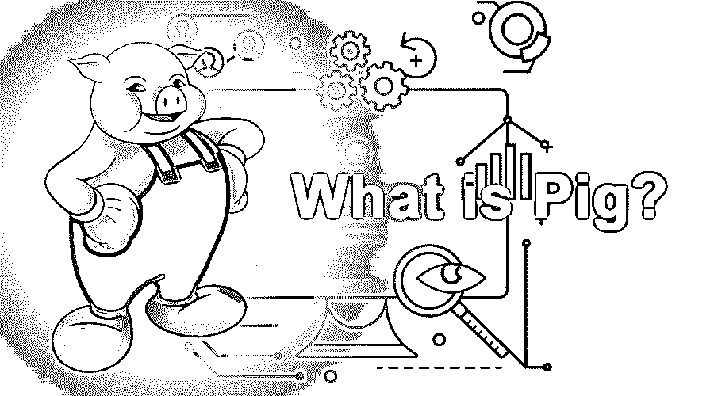
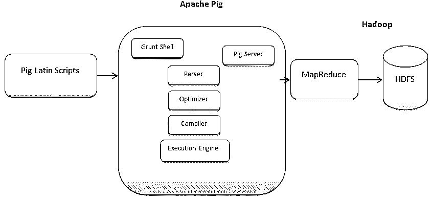

# 猪是什么？

> 原文：<https://www.educba.com/what-is-pig/>

## 猪是什么？

Pig 是一项开源技术，是 Hadoop 生态系统的一部分，用于处理大量非结构化数据。Apache 软件基金会对此进行管理。它有一种被称为 pig Latin scripts 的高级脚本语言，可以帮助程序员专注于数据级操作。它隐式地管理数据计算的 map-reduce 过程。它有效地与 [Hadoop 分布式文件系统](https://www.educba.com/what-is-hdfs/) (HDFS)交互。它被实现为大数据管道中的一个[提取转换和加载](https://www.educba.com/etl-process/) (ETL)组件。它支持多种运算符和用户定义函数(UDF ),适用于大数据实施中的复杂数据处理场景。

### 理解猪

这种技术允许您编写高级但极其细粒度的脚本，允许您在模式未知或不一致的情况下处理数据。它是一种运行在 Hadoop 之上的开源技术，是极其活跃和[流行的 Hadoop 生态系统](https://www.educba.com/hadoop-ecosystem/)的一部分。

<small>Hadoop、数据科学、统计学&其他</small>

它可以很好地处理非结构化和不完整的数据，因此您不必对所有内容都采用传统的规则和列布局。它定义良好，可以直接在 HDFS (Hadoop 分布式文件系统)中的文件上工作。

当您希望将数据从数据源放入数据仓库时，这将是您的首选技术。

例如，在您可以使用它来生成用于制定业务决策的漂亮图表之前，数据通常如何流动的可视化管道。

原始数据来自各种来源，如传感器、手机等。然后，您将使用它来执行一个 [ETL 操作](https://www.educba.com/etl-interview-questions/)。ETL 代表提取、转换和加载；一旦执行了这些操作，清除的数据将存储在另一个数据库中。这种数据库的一个例子是 HDFS，它是 Hadoop 的一部分。Hive 是一个数据仓库，它将运行在这样的文件系统之上。Hive 是您用来进行分析、生成报告和提取见解的工具。

ETL 是数据处理中非常重要的一步，目的是清理原始数据并以正确的形式存储在数据库中。提取是指从原始源中提取缺少字段和值的非结构化、不一致的数据的操作。Transform 代表为了清理或获取数据而对数据进行的一系列操作。

有用的集合信息的预先计算、匹配特定格式的字段处理，所有这些都是转换字段的数据清理的一部分。

最后，它执行加载操作，将这些干净的数据存储在数据库中，以便进一步分析。Pig 执行的标准操作的一个例子是清理日志文件。

### 解释猪的建筑

在[架构](https://www.educba.com/pig-architecture/)中有很多部分，更喜欢:

*   解析器(Parser):解析器处理 Pig 脚本，并检查脚本的语法、意志类型检查以及各种各样的检查。此外，它们的结果可能是 DAG(有向无环图),这通常表示猪拉丁索赔以及逻辑运算符。

此外，脚本中的逻辑运算符将像节点一样显示，数据流也将从边到 DAG 显示。

*   **优化器:**之后，逻辑计划(DAG)通常会超出逻辑优化器。它执行额外的逻辑优化，包括投影和提升 low。
*   **编译器:**同样，编译器在一组 [MapReduce 作品](https://www.educba.com/what-is-mapreduce/)中编译增强的逻辑计划。
*   **执行引擎:**最终，所有的 MapReduce 工作将在一个排序的序列中被提交到 Hadoop。最终，这将生成所需的结果，尽管这些 MapReduce 工作将使用 Hadoop 来执行。
*   MapReduce: MapReduce 最初是谷歌设计的一种处理网页的方式，以支持谷歌搜索。MapReduce 将计算分布在集群中的多台机器上。MapReduce 利用了数据处理中固有的并行性。现代系统，如传感器，甚至脸书状态更新，产生数百万条原始数据记录。

这一级别的活动可以分两个阶段进行准备:

1.  地图
2.  减少

您决定要在这些阶段中实现什么逻辑来处理您的数据。

*   **HDFS (Hadoop 分布式文件系统):** Hadoop 支持无限容量的大规模数据存储和分析。开发人员正在使用 Pig、Hive、HBase 和 Spark 等应用程序从 HDFS 检索数据。

### 特征

它具有以下不同的特性:

*   **编程的简单性:** Pig Latin 的[堪比 SQL](https://www.educba.com/what-is-sql/) ，因此开发人员创建 Pig 脚本相当简单。如果你对 SQL 语言有所了解，学习猪拉丁语是非常简单的，因为它就像 SQL 语言一样。
*   **丰富的操作符集合:**它包括各种丰富的操作符集合，能够执行诸如连接、过滤、排序等过程。
*   **优化可能性:**在这种情况下，任务本身可以立即增强任务的性能；因此，开发人员必须专注于这种语言的语义。
*   **可扩展性:**利用可访问的操作符，用户可以简单地开发他们的函数来读取、处理和写入数据。
*   **用户自定义函数(UDF 的):**通过使用 UDF 制作公司 Pig 提供的服务，我们可以在包括 Java 在内的多种开发语言上生成用户自定义函数，并在 Pig 脚本中调用或嵌入所有这些函数。

### 猪有什么用？

它用于检查和执行职责，包括临时处理。它可以用于:
对大量原始数据集合的分析偏好数据处理以获得搜索网站。如雅虎，谷歌有利于评估通过谷歌和雅虎搜索引擎收集的数据。处理大型数据集合，如 web 记录、在线信息流等。就连脸书的状态更新也会产生数百万条原始数据记录。

### 这项技术如何帮助你在职业生涯中成长？

许多组织正在以令人难以置信的速度实现 Apache Pig。

这意味着养猪行业的职业每天都在增加。在过去的几年里，Apache Hadoop 的开发取得了巨大的进步。Hadoop 元素就像 Hive，HDFS， [HBase](https://www.educba.com/what-is-hbase/) ，MapReduce 等等。

尽管此时 Hadoop 产品已经进入了第二个十年，但在之前的三到四年中，它们的认知度已经出现了爆炸式增长。

大量的软件公司正在不可思议地普遍应用 Hadoop 集群。这绝对是大数据最好的部分。瞄准专家可以在这项优秀的技术中变成有经验的人。

### 结论

阿帕奇猪的专业知识在市场上需求量很大，可以继续扩大。通过简单地理解这些概念，并在 Hadoop 技能方面获得最好的 Apache Pig 的经验，专家们可以完美地从事他们的 Apache Pig 职业。

### 推荐文章

这是一个什么是猪的指南？在这里，我们讨论了基本概念，架构，以及猪和职业发展的特点。您也可以浏览我们推荐的其他文章，了解更多信息——

1.  [HBase 命令](https://www.educba.com/hbase-commands/)
2.  什么是 ASP.Net 网络服务？
3.  [什么是区块链技术？](https://www.educba.com/what-is-blockchain-technology/)
4.  [Hadoop 的优势](https://www.educba.com/advantages-of-hadoop/)
5.  [Pig 数据类型|示例](https://www.educba.com/pig-data-types/)

