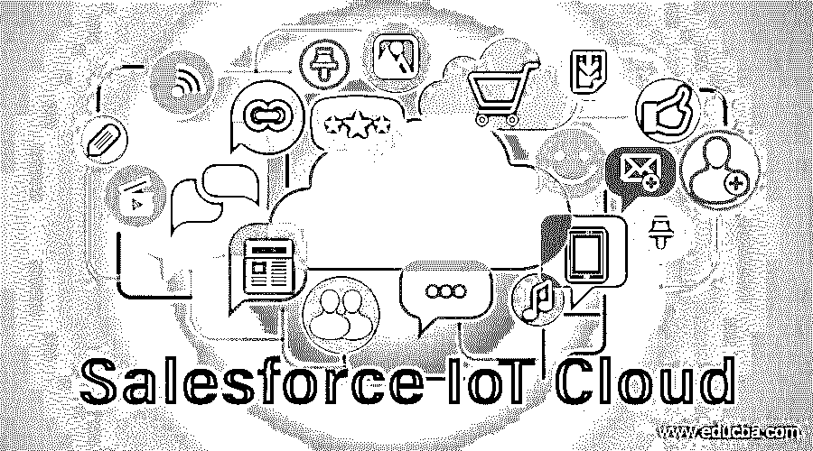

# Salesforce 物联网云

> 原文：<https://www.educba.com/salesforce-iot-cloud/>

## Salesforce 物联网云简介

物联网云是 Salesforce 物联网云客户成功平台的源泉，提供了客户个性化体验，并为其公司带来了更高的投资回报率，实现了强大的客户关系管理；它还具有各种功能，如 Apache Kafka(每秒处理高读写的消息系统)、Apache Storm(实时大数据)、Apache Spark(分布式大规模数据流)和 Apache Cassandra(分布式数据库管理系统)。

### 什么是 Salesforce 物联网云？

*   日常用户可以从我们的客户端获取信息以及关于 salesforce 物联网云的静态信息。现在，Salesforce 拥有了其[物联网云，该云用于](https://www.educba.com/iot-cloud-platforms/)将重点放在为所有客户端创建、记录和参与关于用户和客户的所有个性化体验上。
*   物联网云是 Salesforce 物联网云客户成功平台的核心，该平台具有客户个性化体验和日常活动，可以使公司在强制时间采取必要的行动。Salesforce IoT 被设置为业务指标，以便重要的行动依赖于客户和实时场景，如汽车故障或路由器故障，网络互联可以立即采取。该指标适用于所有客户，物联网云定义的属性将基于以前的经验、综合事件和客户范围生成各种行动步骤。
*   Salesforce 是他们公司的额外优势，因为它可以提高投资回报率。该公司有强大的客户关系管理。Salesforce 的[理念是从与相关设备链接的大数据云中获取数据，并帮助公司拥有可靠的 CRM 来设计、构建和定制用户喜欢的应用程序。为了保存和处理这些所需的数据，Salesforce 提供了一个名为 Salesforce IoT Platform 的平台，该平台由一个名为 Thunder 的事件处理引擎提供支持，该引擎是一个开源工具。它被设计用于获取和过滤数据，并实时对任何单个事件做出反应。](https://www.educba.com/uses-of-salesforce/)

### Salesforce 物联网云的功能

云的一些独特特性是，

<small>Hadoop、数据科学、统计学&其他</small>

*   Apache Kafka 是一个每秒可以处理大量读写的消息传递系统。
*   Apache Storm 是一个[实时大数据](https://www.educba.com/what-is-big-data/)和实例处理平台。
*   [Apache Spark 是一个分布式](https://www.educba.com/apache-spark-architecture/)大规模数据流和数据批处理框架。
*   Apache Cassandra 是一个分布式数据库管理系统。

这些设备的工作被馈送到 Kafka，Spark 获取并转储 Casandra，然后 Strom 使用来自 Kafka 的数据来解决实时事件。

### 传感器数据和客户环境压力

从客户那里收集数据是解决实时问题的第一步，也是最好的一步。对于[评估数据分析](https://www.educba.com/what-is-data-analytics/)，考虑从相关设备收集的信息以及考虑客户位置、采购订单和退货历史、案例历史、搜索引擎和其他参数是有意义的。关于这一点，Salesforce 物联网云开发了一项重要功能，仅关注客户环境。原始数据从数据池中获取，用于数据分析和深度学习。数据仓库用于收集经过过滤和预处理的数据。根据场景从数据流中过滤数据由 Thunder 完成。

### 爱因斯坦分析

Salesforce 应用 Einstein Analytics，这是一种完全部署在云中的业务分析软件，用于改进数据处理。这种数据分析有助于 CRM 管理员暴露任何庞大的数据集、相关的 ERP 记录、网站日志、[传感器数据以及更多](https://www.educba.com/sensor-device/)。爱因斯坦方法自动选择正确的可视化方式，用于数据预测、图表、图解和其他指标和报告，使用户容易阅读和理解。

### 与业务应用程序的整合

Salesforce 物联网云可用作存储数据和处理数据的独立服务，并具有[路由器](https://www.educba.com/what-is-router/)和连接器以与其他 Salesforce 产品或第三方用户集成。这种集成检查不同来源和多源公司系统之间有用数据的流动。爱因斯坦分析给出了报告，并通过使用所有这些资源和设备以及所有这些数据给出了合适的结论。

### 操作的消息通知

来自消费者和相关事物的数据可以用于增加客户管理。传感器接收有关信息的数据，并向客户发送有关服务和更新的通知。

除此之外，流程编排、发现新价格和创新业务模式也得到有效利用和部署。

### Salesforce 物联网云的优势

*   Salesforce 通过提供值得信赖的性能、可靠的支持、主动服务和即时解决方案来发展强大的关系。
*   根据客户需求在 CRM 中提供高质量的产品和资料，更好地为客户服务。
*   通过支持物联网的设备快速传输数据，即时获取更多所需信息。
*   从连接到云的所有资源[获取输入数据，比如 AWS](https://www.educba.com/what-is-aws/) 。轻松访问、管理和跟踪设备的性能和地理位置及其交互。
*   拥有用户友好的工具，易于过滤、搜索、查找和获取 JSON、TSV 和 CSV 数据格式的数据。
*   交通视图选项是用于查看物联网及其相关设备的最佳功能。

### Salesforce 物联网云的成本

Salesforce 每天向一个平台收取 50 万英镑的活动费用。它对利用的几个事件收费 6000 美元，而不是对用户数量收费。

在给出物联网设备的实时场景和[行为时，Salesforce](https://www.educba.com/iot-devices/) [物联网有助于提高](https://www.educba.com/iot-projects/)客户体验。商业价值基于实际用户；如果用户将物联网设备数据与客户端上下文相关联，以获得有趣和引人入胜的体验，这将非常有用。

### 推荐文章

这是 Salesforce 物联网云指南。在这里，我们讨论什么是 salesforce 物联网云及其各种功能、优势和成本。您也可以阅读以下文章，了解更多信息——

1.  [云安全工具](https://www.educba.com/cloud-security-tools/)
2.  [物联网框架](https://www.educba.com/iot-framework/)
3.  [云计算提供商](https://www.educba.com/cloud-computing-providers/)
4.  [什么是 Salesforce 技术](https://www.educba.com/what-is-salesforce-technology/)

