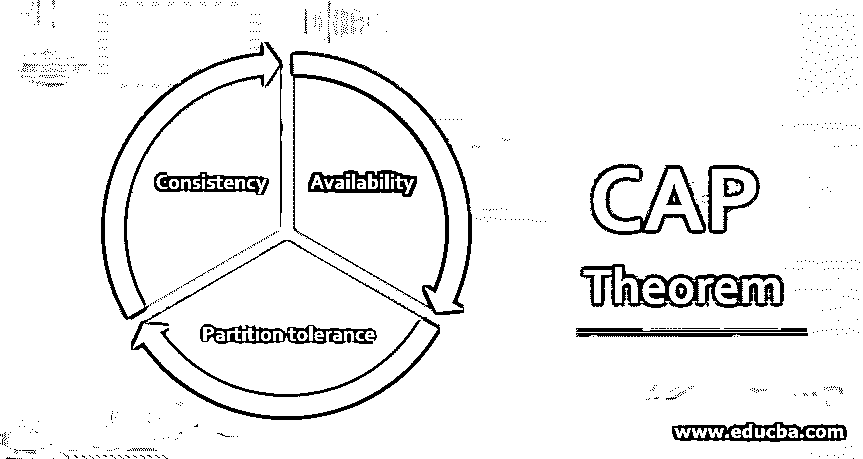
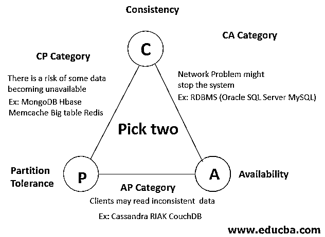

# CAP 定理

> 原文：<https://www.educba.com/cap-theorem/>

## CAP 定理介绍

一致性、可用性和分区容错是现代分布式数据系统的三个主要方面。CAP 定理是 Eric Brewer 在 2000 年提出的，用来解决维护基于网络的数据库系统的标准方法。在 Pb 级数据的时代，开发和维护分布式数据系统以维持负载变得非常重要。在本文中，我们将看到 CAP 定理的关键点，它与 ACID 有何不同，以及它为什么对当前的技术前景如此重要。

<small>Hadoop、数据科学、统计学&其他</small>

### CAP 定理的要点

CAP 定理的三个方面是一致性、可用性和分区容差。让我们首先分别讨论所有这些，然后我们将把这些部分连接起来。

#### 1.一致性

根据这个定理，分布式系统的所有连接节点同时看到相同的值，并且部分事务将不被保存。假设在一个事务中有多个步骤，并且由于某些故障，一些中间操作被破坏，现在如果部分连接的节点读取被破坏的值，数据将是不一致的和误导的。所以根据上限原则，我们不会允许这样的交易。事务不能部分执行。永远都是‘要么全有，要么全无’。如果在事务执行过程中出现问题，整个事务都需要回滚。

#### 2.有效性

根据这一点，连接或分布式系统应始终保持运行。无论特定节点是否可用，系统中的每个客户端请求都应该有响应。尽管在实际场景中，它纯粹基于流量要求。这里的关键点是，每个正常工作的节点都必须在合理的时间内返回对所有读写请求的响应。

#### 3.分区容差

根据分区容差策略，如果网络的一个子部分被破坏，整个分布式系统不会崩溃。一个具有分区容忍度系统应该能从局部愤怒中快速恢复。在实际场景中，分区容差不能作为一个可选的标准，它应该完全保持。因此，遵循上限定理总是成为高一致性和高可用性之间的选择。

### 为什么 CAP 定理很重要？

在 2005 年的互联网热潮之后，数据的规模日益呈指数级增长。在早期阶段，为了保持不断变化的数据规模并合理规划容量，唯一的选择是纵向增加容量，这意味着添加更多的机器或增加机器的容量。但是它并不总是可行的和划算的。相反，新概念是水平增加容量，这意味着利用分布式计算。为了使网络标准化，我们需要维护 CAP 定理的原理。

我们不能同时维持 CAP 定理的所有三个原理。理论上，我们只能维护 CA、CP 或 AP。

*   **一致性和可用性:**这些系统具有高一致性和非常短的停机时间，但是没有强制执行分区容错选项。例如，网络问题可以瘫痪[整个分布式 RDBMS 系统。](https://www.educba.com/what-is-rdbms/)
*   **一致性和分区容差:**这些系统坚持高一致性和分区容差，但存在一些数据不可用的风险。 [Ex。MongoDB](https://www.educba.com/what-is-mongodb/) 。
*   **可用性和分区容差:**这些系统坚持高可用性和分区容差，但存在读取不一致数据的风险。 [Ex。卡珊德拉](https://www.educba.com/what-is-cassandra/)。

### CAP 定理和酸的性质有什么不同？

在我们了解这些区别之前，让我们先简要了解一下酸的性质:

#### 1.原子数

对数据的所有更改都作为单个操作执行。也就是说，要么全部执行，要么不执行，要么执行所有操作中的一个。例如，在一个应用程序中，我们将资金从一个帐户转移到另一个帐户，原子性属性确保，如果从一个帐户成功地进行了借记，那么相关联的贷记也在另一个帐户中进行。

#### 2.一致性

对于每个事务，系统应该从一个一致状态转移到另一个一致状态。

#### 3.隔离

所有事务都应该独立于其他事务执行。在并发事务执行期间，来自并行执行的事务的中间事务结果应该是互斥的。一个模块的故障不应该影响另一个事务。

#### 4.持久性

在每一次成功的事务之后，在数据库中所做的更改应该是持久的。即使系统包含或以某种方式失败，成功提交或中止的操作仍然应该持续。现在我们可以看到，这些术语在技术上指的是不同的东西。它们的关联方式是，根据 CAP 定理，保证 ACID 事务的[分布式数据库系统](https://www.educba.com/distributed-database-system/)必须选择一致性而不是可用性(即它是一个 CP 系统)。

另一方面，如果分布式数据库根据 CAP 定理选择可用性而不是一致性(假设它是 AP 系统)，它就不能严格遵循 ACID 原则的属性。

### 结论

在本文中，我们已经看到了 CAP 定理的原理，以及为什么它在当前的上下文中仍然重要。我们还看到了 CAP 定理与另一个数据库设计原则(ACID)是如何不同或相关的。在大多数实际使用案例中，分区容差原则需要始终遵循，它成为高可用性和高一致性之间的一个选择。

### 推荐文章

这是 CAP 定理的指南。在这里，我们讨论介绍，关键点的上限定理，如何上限定理不同于酸的性质？您也可以浏览我们推荐的其他文章，了解更多信息——

1.  [贝叶斯定理](https://www.educba.com/bayes-theorem/)
2.  卡桑德拉是 NoSQL 吗？
3.  [NOPAT 公式](https://www.educba.com/nopat-formula/)
4.  [Python 中的 NLP](https://www.educba.com/nlp-in-python/)

