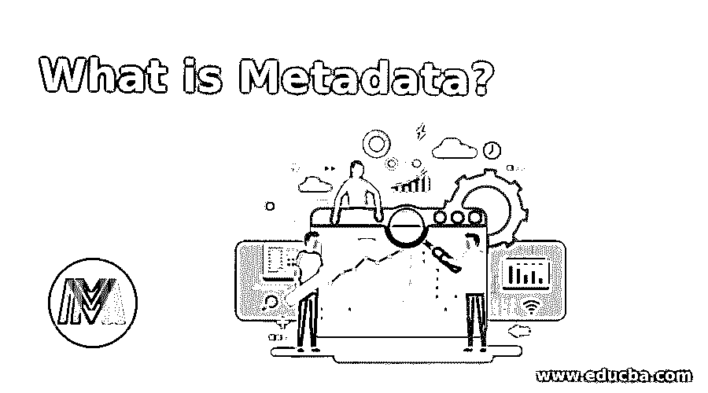
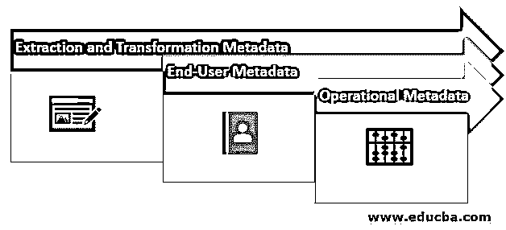

# 什么是元数据？

> 原文：<https://www.educba.com/what-is-metadata/>

## 元数据的定义

元数据是指数据或标识其他数据的数据。在技术圈，前缀“元”通常意味着“一个潜在的概念或解释”。它使查找数据和与数据交互变得更加容易，因此用户可以过滤或搜索不同的记录。作者、创建日期、更改日期和文件大小是一些基本示例。它用于照片、视频、网页、平板电脑等非结构化数据。在网页上也可以找到元标签形式的元数据。Meta 标签也用于定义网页中的元数据和关键字。这些数据可能被搜索引擎用来帮助解释一个页面的内容。

可以手动或自动构建元数据。由于用户可以插入相关信息，因此通过手工制作可以提高准确性。自动生成可以更加通用，通常只显示简单的细节，如文件大小、文件扩展名，例如文件是何时生成的。

<small>Hadoop、数据科学、统计学&其他</small>

### 元数据的类型

在数据仓库中，元数据分为三个主要部分:

#### 1.提取和转换元数据

关于从源系统中移除数据的数据包含在提取和转换元数据中，包括用于业务目的的频率提取、提取方法和数据提取规则。此类别还提供了数据暂存区中所有转换的详细信息。

#### 2.最终用户元数据

数据中心管理图是最终用户。它允许最终用户查找数据持有信息。最终用户帮助最终用户使用他们公司的行话，并根据他们对服务的总体看法来搜索信息。

#### 3.操作元数据

我们知道，来自组织的不同操作系统的数据来自数据仓库。这些来源包括许多数据结构。为数据存储选择了各种字段大小和数据元素类型。我们划分细节，合并来自不同源文件的文档因素，并处理各种编码方案和字段长度，以便为细节仓库从源系统中选择信息。当我们向最终用户提供信息时，我们必须能够将其连接回源数据集。操作数据源的所有细节都可以在操作元数据中找到。

### 元数据是如何使用的？

文档元数据提供了关于创建时间、最后更新时间的信息，如作者和文档大小。网页元数据用于定义网站，并促进搜索引擎和其他计算机对网站的解释。视频和照片元数据是照片数据，包括图像中的位置、分辨率和其他有用信息。视频和照片元数据**。**

### 目的

对于最常见的资源发现之一，它可以与成功的编目形成对比，后者包括识别资源，根据标准描述它们，组合相关资源并区分不同的资源。这也是协调电子资源的有效方式；基于网络的资源的一个重要用途是。通常，资源链接被标识和创建为具有硬编码 HTML 名称和资源的静态网页。但是，使用是创建这样的网页是一种比较成功的技术。出于网络目的，可以使用软件工具提取内容并重新格式化。

### 元数据交换倡议

元数据交换的建议旨在将行业提供商和消费者聚集在一起，以解决存储、存储和管理中的许多严重问题和顾虑。元数据交换标准的目的是建立一个可扩展的机制，允许销售者共享和带来“专利”元数据。创始成员同意最初的目标:

*   建立独立于制造商、行业定义和维护的通用访问和应用编程(API)框架。
*   使用户能够通过符合其独特设置标准的交换工具来监控和管理访问和管理。
*   定义一个简单、清晰的实施架构，通过最大限度地减少变更来促进合规性并加快采用。
*   开发一种方法和过程来随着时间的推移更新和改进它，而不仅仅是保留和创建一个交换标准规范。

### 利益

以下是给出的益处:

*   它提供了一系列通过企业进行处理的工具。
*   它提高了运营效率，简化了处理和说明知识的方式。
*   这为可以交换和重用元数据的案例创建提供了规范。
*   它为处理数据库中的组织信息资产提供了一种有价值的方法。
*   它提供了一个关系模型来与异构 RDBMS 交换知识。

### 推荐文章

这是一个什么是元数据的指南？.在这里，我们还讨论了元数据的介绍和类型，以及如何使用元数据？.您也可以看看以下文章，了解更多信息–

1.  背对背
2.  [对象存储与块存储](https://www.educba.com/object-storage-vs-block-storage/)
3.  [Maven 知识库](https://www.educba.com/maven-repository/)
4.  [SQL 中的多维数据集](https://www.educba.com/cube-in-sql/)
5.  [SQL 元数据指南](https://www.educba.com/metadata-in-sql/)

