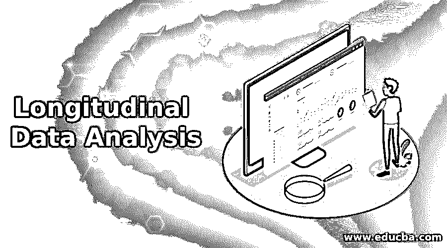

# 纵向数据分析

> 原文：<https://www.educba.com/longitudinal-data-analysis/>

## 纵向数据分析介绍

纵向数据分析(LDA)被称为 board knowledge，它包括一套工具——带有算法的技术，可用于分析和查看使用模式和知识，在完全不同的时间点测量和分析一个或多个等效数据变量，换句话说，在完全不同的时间点跟踪等效样本，这被称为纵向数据分析。

在整个生命中，有不同种类的主题，连同身体和精神状态，连同各种活动和因素，我们能够通过观察/可视化它们，通过考虑分析参数来获得必要的洞察力。它可以被认为是横截面知识，它另外提供了对知识的详细分析，这提供了对在不同时间戳上收集的完全不同的样本的等效调查。

<small>Hadoop、数据科学、统计学&其他</small>

### 什么是纵向数据分析？

纵向分析是指在多个不同的随访时间戳收集实验/参与者或受试者结果以及可能的治疗或暴露的调查。

例如，如果一些受试者区域单元给予安慰剂效应(假治疗具有真实的治疗结果，这种现象被称为安慰剂效应),而其他受试者给予各种其他真实药物，那么这两组受试者进行比较，以查看在最终结果中不同时间戳和修改的结果和测量是否在完全不同的方面进行分析，这被认为是纵向数据分析的结果。这被认为是一项前瞻性纵向分析研究的最佳结果。

### 纵向数据分析的重要性

*   在医学研究实例中，甚至可以在不同时间标记和每月测量中对 HIV 患者进行跟踪监测，如 CD4 计数，或根据受试者免疫状况的特性而加载或收集的生物体。
*   这组在不同范式单元中获得的结果是用具有有效分析推理的特殊数学规则处理的。
*   通常通过纵向分析方法测量的第二个必要结果是，该研究涉及样本的时间段，直到像不健康这样的关键临床事件发生。

### 为什么我们需要纵向信息分析？

*   参与者的随访，由于不完整的随访，或研究参与者的“退出”,存在偏见的危险。如果 square measure 跟踪到研究计划结束的受试者从世卫组织停止跟踪的受试者中提取问题，那么一个简单的分析可能提供似乎不能代表第一个目标人群的总结。
*   相关信息的分析，纵向信息的应用数学分析需要可以适当考虑反应测量的受试者内相关性的策略。如果这种相关性没有被注意到，那么像应用数学测试或置信区间这样的推论将是完全无效的。
*   时变协变量尽管纵向风格提供了将暴露变化与感兴趣的结果变化相关联的机会，但是结果和暴露之间的反馈将很难确定关系的方向。例如，在药物对特定健康指标的影响的副学士学位实证研究中，患者当前的健康状况可能会影响未来的药物暴露或剂量。
*   虽然科学的兴趣在于药物对健康的影响，但这种情况在暴露和结果之间具有相互影响，并且一旦试图将药物对健康的影响与健康对药物暴露的影响分开，就提出了分析问题。

### 纵向研究的好处

下面给出了一些好处:

*   对于已经了解分析和基本回归技术的研究人员来说，护理反应谱分析的一个优点是，它被概念化为多变量分析纵向设置的延伸。
*   第二个优点是，由于操纵允许平均响应随时间的脉冲模式，以及方差结构，由于模型错误设定，偏差的潜在风险最低。
*   然而，反应谱分析包括各种潜在的缺点，使其不具吸引力或不适合分析许多纵向研究的数据。
*   首先，它不适合处理不合时宜的测量，这是许多纵向研究的标准缺点。第二，分析的结果为委员会提供了一段时间内修改模式的集群变化的模式说明。
*   通常，一个巨大的群体-时间交互影响需要进一步的分析，以提供大量的信息描述，但群体在他们的修改模式上存在分歧。
*   一个相关的问题是，全向逐时扫视的交互作用可能需要相对较低的功率来观察整个事物中的群集变化，即在关联的极其吝啬的方法中总结了随时间的平均响应之间的修改。
*   最后，操纵期望在模型中估计所有概率的相当大数量的参数，用于均值和协方差。特别地，方差参数的数量随着实况的数量呈指数增长。
*   因此，与测量场合的数量相比，受试者的数量相对较大，因此机动计划在这种情况下很有吸引力。
*   纵向分析与医疗数据分析一起使用时，可以衡量一段时间内发生的新病例。
*   在整个前瞻性(期望成为特定事物)分析中，参与者或受试者可以在多次随访中记录其无保护状态。
*   测量结果的个体变化。纵向研究和分析的主要优势在于在个体水平上测量结果和结果的变化的灵活性和多样性。纵向研究提供了一些未来事件发生的分析方面，似乎在可能性的修改的个人模式。

### 结论

纵向知识也称为纵向数据分析的结果，它为涉及干预或暴露效果的逻辑思维提供了具有广泛方面的独特分析机会。暴露条件的变化可能与结果随时间的变化和条件的变化相关。然而，纵向知识的分析需要考虑长期测量的主题内相关性的方法。

### 推荐文章

这是纵向数据分析指南。在这里，我们讨论纵向数据分析的重要性，分析的需要和好处的介绍。您也可以看看以下文章，了解更多信息–

1.  [什么是定性数据分析](https://www.educba.com/what-is-qualitative-data-analysis/)
2.  [探索性数据分析](https://www.educba.com/exploratory-data-analysis/)
3.  [统计数据分析技术](https://www.educba.com/statistical-data-analysis-techniques/)
4.  什么是数据？

