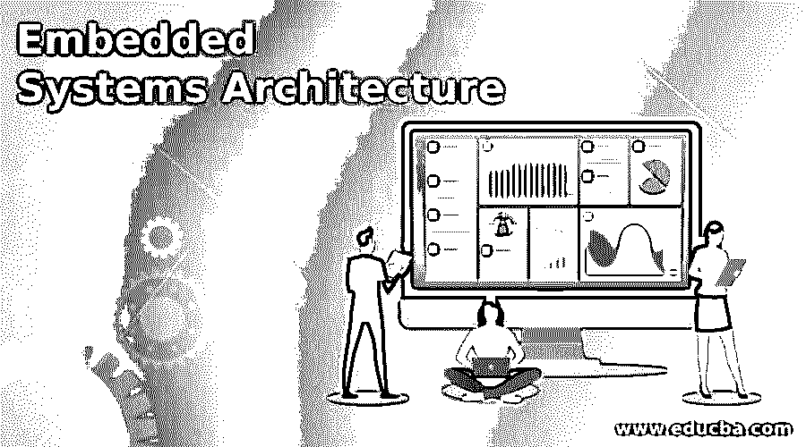

# 嵌入式系统架构

> 原文：<https://www.educba.com/embedded-systems-architecture/>

## 嵌入式系统架构介绍

下面的文章提供了嵌入式系统架构的概要。嵌入式系统可以被认为是基于微控制器的系统，在软件和控制系统上运行，可以用来执行某些特定的任务。广义的嵌入式系统是指由嵌入在硬件系统中的软件组成的硬件系统。嵌入式系统可以是独立的系统，也可以是任何大型系统的一部分。嵌入式系统可以由软件控制，软件用来区分嵌入式系统。嵌入式系统作为电子设备被广泛使用，因为它们便宜且易于使用。

### 嵌入式系统体系结构

嵌入式系统的字面意思是驻留在另一个系统中的系统。嵌入式是硬件系统，软件驻留在其中。嵌入式系统可以被认为是用来执行某些特定任务的微处理器。

<small>Hadoop、数据科学、统计学&其他</small>

嵌入式系统基本上有三种类型的组件:

*   硬件系统
*   应用软件
*   RTOS(实时操作系统)

硬件系统是包含可用于设计嵌入式系统的组件的系统。组件的尺寸保持较小，从而嵌入式系统的整体尺寸可以保持较小。软件系统是驻留在硬件系统中的应用程序，可用于执行某些特定的任务。一次一个应用程序可以驻留在系统中，使得任务的处理速度变得更快并且可以得到准确的结果。嵌入式系统中使用的软件仅专用于这种类型的系统，不能用作其他计算设备的通用软件，因为硬件组件是不同的，这会产生配置不匹配的问题。实时操作系统是一种实用程序类型的软件，帮助处理器以最小延迟的顺序方式运行任务。实时监控系统可以直接控制嵌入式系统的完整运行。

在下面的描述中，为嵌入式系统架构定义了基本结构:

*   **传感器:**传感器是将物理量转换成电信号的装置。A-D 转换器用作传感器装置的转换工具。
*   **A-D 转换器:**是一种将模拟信号转换成数字信号的器件。
*   **处理器:**处理器是一种可以用来处理输出并将结果存储到存储器中的设备。对于嵌入式系统，主要组件是处理器。因为处理器用于接收输入、处理输入并产生输出。
*   **数模转换器:**是一种用于将数字信号转换成模拟信号的器件。
*   **执行器:**执行器是一种将实际结果与数模转换工具产生的结果进行比较的装置。

### 嵌入式系统的优势

由于嵌入式系统是软件系统和硬件系统的结合，它们被广泛地用作电子系统，可以用在照相机、自动售货机、车辆、汽车、飞机、移动电话和许多其他地方。它们被用于各个部门，如医疗部门、农业部门和商业部门。

#### 1.嵌入式系统的大小

与计算机系统等其他计算产品相比，嵌入式系统的尺寸非常小。由于嵌入式系统是专门为一些特定的用例设计的，所以用于设计系统的组件很小，这减小了嵌入式系统的整体尺寸。因为这个系统是为特定任务设计的，所以不能用于其他目的。组件的大小直接影响嵌入式系统的大小。

#### 2.准确(性)

与计算机系统和其他计算产品相比，嵌入式系统的性能和准确性非常高。由于系统是为执行特定操作而设计的，因此精度是需要考虑且不能忽视的重要因素。嵌入式系统应用于医疗领域，准确性是关键因素。计算中还使用了嵌入式系统，嵌入式系统的计算结果应该是正确的，精度要求很高。

#### 3.力量

由于嵌入式系统的尺寸非常小，所以与计算机系统相比，嵌入式系统的功耗也非常低。计算机系统的功耗约为 60 W 和 230 AC，嵌入式系统的功耗小于 1 W 和 3.3V

#### 4.价格

嵌入式系统在市场上可以以很低的价格买到。与其他计算设备相比，嵌入式系统的价格非常低。由于嵌入式系统在其硬件结构中使用非常少的组件，这直接影响了系统的成本，使得嵌入式系统便宜且易于使用。

#### 5.轻便

嵌入式系统的另一个主要优点是系统的可移植性。由于嵌入式系统的尺寸非常小，所以系统可以很容易地从一个地方移植到另一个地方。这一优点使得该系统具有突出的用途，因为它可以从一个地方携带到另一个地方。

#### 6.速度

由于嵌入式系统是为执行某些特定任务而设计的，并且在系统仅执行一个任务时，处理速度非常快。这是因为闪存是用来快速读取数据的。这一优势使得嵌入式系统在教育、企业等处理速度非常重要的领域得到了更多的应用。

### 结论

嵌入式系统由硬件系统和软件系统组成。每种类型的嵌入式系统都是为某些特定的任务而设计的。嵌入式系统广泛应用于医疗、企业、教育等各个领域，根据不同的需求有不同的应用。嵌入式系统的诸多优点使得它越来越重要，越来越普及。

### 推荐文章

这是嵌入式系统架构指南。在这里，我们讨论嵌入式系统架构的介绍以及各自的优势。您也可以看看以下文章，了解更多信息–

1.  [什么是嵌入式系统？](https://www.educba.com/what-is-embedded-systems/)
2.  [大数据架构](https://www.educba.com/big-data-architecture/)
3.  [rabbitq 体系结构](https://www.educba.com/rabbitmq-architecture/)
4.  [卡夫卡式建筑](https://www.educba.com/kafka-architecture/)

