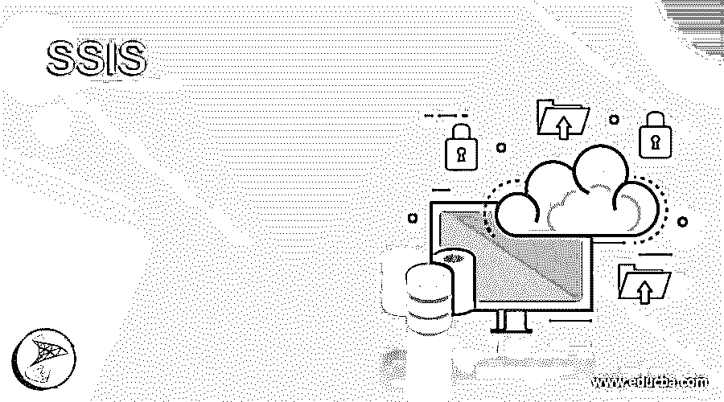

# SSIS

> 原文：<https://www.educba.com/ssis/>

## SSIS 简介

SQL Server Integration Services(简称为 SSIS)是一种工具，用于执行与数据库相关的操作，如提取、转换和加载数据。数据的提取、加载和转换涉及数据的清理、合并和聚合等任务。它是一个灵活流畅的工具，是 SQL Server 数据库的一个组件。它被广泛使用，是执行 ETL 操作最流行的工具之一。SSIS 提供了非常广泛的选择，如从 JSON、Excel 文件、数据库(Oracle、SQL Server)等来源提取数据的能力，通过 FTP、IP 和电子邮件发送数据。

### 为什么我们需要 SSIS 的用法

顾名思义，SQL Server Integration services 为 SQL Server 数据库提供了一整套服务。使用 SSIS 可以从任何来源提取数据。SSIS 能够从 JSON、Excel 文件、CSV 文件、XML 文件和 Oracle DB 等其他数据库中提取数据。除了提取之外，还可以使用该工具合并不同来源的数据。上述两个功能有助于开发人员在使用 SSIS 将数据加载到任何数据库之前，能够组织、清理和系统化数据。

<small>Hadoop、数据科学、统计学&其他</small>

SQL Server Integration Services 是一个具有大量选项集的图形用户界面，用户可以在其中构建自动化解决方案，而无需大量编码。将不同的任务框拖放到工作流中，并运行该流程以生成结果。除了为开发者提供一个简单解决方案的平台，SSIS 的另一个优势是速度。一个巨大的数据集可以在几秒或几分钟内从一个数据源加载到另一个数据源。编码的消除让开发人员摆脱了许多其他的编码工作，如 IDE 插件的维护、代码升级、编码最佳实践等。使用工具箱中可用的各种组件可以自由地创建自动化流程。

这是一个很好的工具，是当前最好的工具之一，用于数据仓库的填充，考虑到这一点，这个平台自动化了数据加载、提取和转换的过程。为分析、识别和处理数据提供的易用性和各种功能是开发人员使用 SSIS 的驱动力。

### SSIS 的工作

SQL Server 集成服务是一个由五个主要组件组成的平台，即控制流、数据流、任务、包和参数。在这里，控制流可以被称为 SSIS 的发电站。控制流是开发人员安排自动化步骤的地方，即完成一项工作所需的各种任务。控制流也是决定执行顺序的地方。根据任务/组件需要发生的顺序，可以在类似流程的结构中拖放它们。

SSIS 的下一个主要组成部分是数据流。顾名思义，数据流是所有数据相关操作发生的部分。这是可以从任何来源(JSON、XML、Excel、DB 表等)提取数据的地方。如果需要对数据进行任何转换，比如添加文本、修改提取的日期或任何类型的过滤，这也会发生在数据流中。最后，数据流是定义加载数据的目的地的地方。整个 ETL 发生在数据流中，一旦成功完成，控制返回到数据流之后的下一个任务/容器的控制流。

SSIS 工具的下一个组成部分是任务。它是一个工作单元或一组指令。这里唯一的区别是它是一个拖放选项，一旦在控制流中被调用，就可以配置和修改它。数据流是 SSIS 的任务。一些其他任务是执行 SQL 任务(用于直接从控制流执行 SQL 查询)、文件系统任务(读取、写入、操纵文件)、发送邮件任务(发送电子邮件)、FTP 任务(使用 FTP 建立到目的地的连接以提取或加载数据)、XML 任务等。这些任务也可以分组。一组任务称为一个容器。该容器可以以三种方式工作，即序列容器(一组按顺序排列并可以一起修改的任务)，循环容器(一组任务，在循环中运行，直到给定条件为真)，以及每个循环容器。

SSIS 的另一个组成部分是一揽子计划，也称为 SSIS 一揽子计划。完整的控制流称为包，它是一组按照总统约束顺序排列的任务。总统约束只不过是一个任务在进入下一个任务之前所满足的最小条件。控制流与数据流相结合构成一个包。这个包被保存和部署。当为此包安排一个作业时，这意味着这些步骤(任务)将运行以实现包中定义的流的目标。

最后，还有一些参数，它们可以被视为变量。这些是包中要完成的各种任务所需的值。它们可以是硬编码的，或者由用户在运行时提供。

### SSIS 的优势

SQL Server 集成服务的一些主要优势包括:

*   对编码没有要求。拖放技术用于创建工作流
*   需要最少的维护。这些包是自动化的，并在计划的作业上运行
*   SQL Server 和 Visual Studio 通过该平台紧密集成
*   实施不需要时间，流程很快。

### SSIS 的缺点

*   严重依赖 SQL Server。如果数据库关闭，包可能会失败。
*   与第三方服务的集成是不可靠的。

### 结论

这篇文章非常简要地介绍了 SSIS。如果有人愿意使用 SSIS 进行开发，他们必须确保对 SQL Server 数据库有很深的了解，并对自动化有基本的了解。

### 推荐文章

这是 SSIS 旅游指南。在这里，我们讨论为什么我们需要 SSIS 与使用以及工作，优点和缺点。您也可以看看以下文章，了解更多信息–

1.  [SSIS 面试问题](https://www.educba.com/ssis-interview-questions/)
2.  [SQL ALL](https://www.educba.com/sql-all/)
3.  [SQL 排名函数](https://www.educba.com/sql-ranking-function/)
4.  [MySQL 分区](https://www.educba.com/mysql-partition/)

