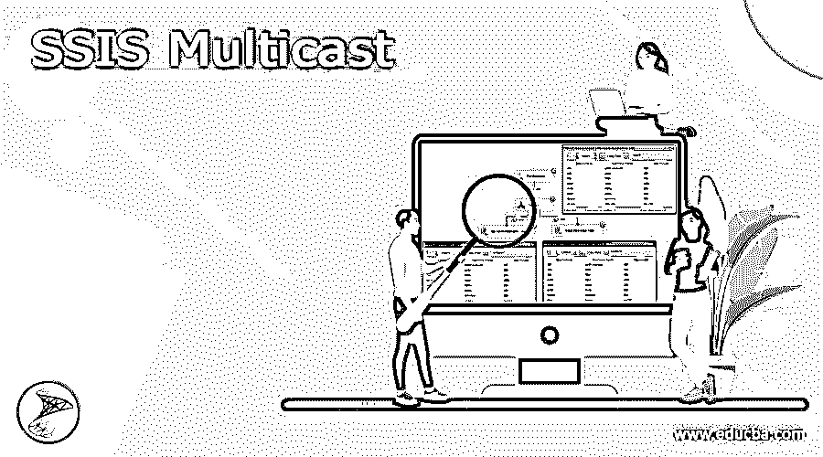
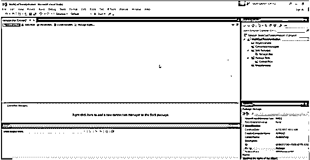
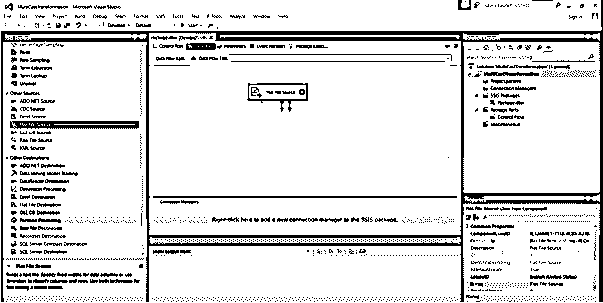
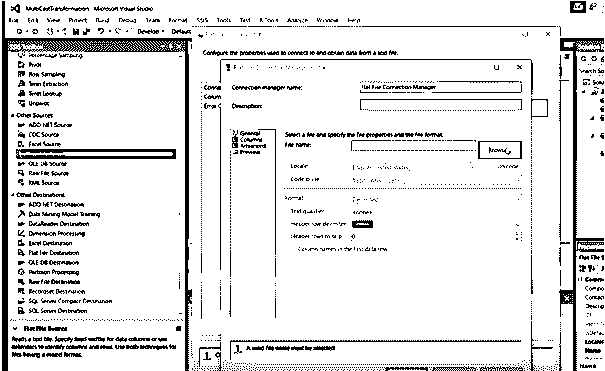
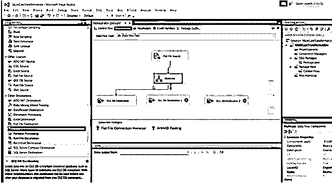
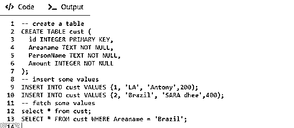
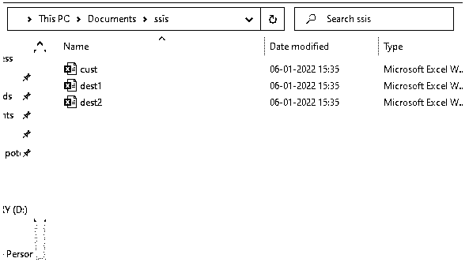
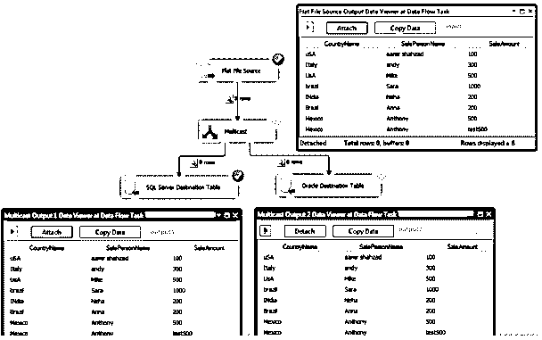

# SSIS 多播

> 原文：<https://www.educba.com/ssis-multicast/>

## 什么是 SSIS 多播？

SSIS 的多播转换将数据分发到多个目标路径，甚至没有任何先决条件或更改。换句话说，它接受一个输入，并在将数据传递给许多输出之前创建数据的概念性副本。多播转换使得从单个数据源获得输入数据的多个逻辑副本成为可能，这是为了对每个数据集应用不同的转换逻辑，甚至是为了使每个数据集面向不同的使用者。多播转换是一种同步转换，这意味着信息在发送到目的地之前不会被阻塞。

### 如何使用 SSIS 多播？

使用多播转换将每一行定向到每个输出。因为多播转换创建了源数据的完美副本，所以每个接收者将接收与源相同数量的记录。假设我们需要 TXT、CSV 和 SQL 表格式的输入数据的几个副本。这些数据的多个副本可用于许多不同的转换。当我们希望同时对几乎相同的数据集应用许多转换时，SSIS 多播转换就派上了用场。例如，如果我们要对同一个数据集应用两种修改。然后，使用 SSIS 多播转换，将数据复制两次。之后，我们可以对每个副本进行各种更改。

<small>Hadoop、数据科学、统计学&其他</small>

**工作要求:**

SQL Server Integration Services 扩展安装在 Visual Studio 中。SQL Server 安装在本地或远程。

### 创建 SSIS 多播

对于相同的数据，多播转换会创建许多管道。

若要检查和更改每个转换输出的属性，请打开“多播转换编辑器”对话框。

该软件包利用了以下 SSIS 功能:

1.完成 SQL 任务
2。OLE DB 连接管理器(OLE DB Connection Manager)
3。用于配置 SSIS 软件包的向导

### SSIS 多播转换:创建 SSIS 包:

若要生成集成项目，请打开 SQL Server 数据工具。提供集成项目的名称和保存位置。

这将打开 OLE DB 管理器。要打开 OLE DB 源代码编辑器，请双击它。它会立即显示我们之前建立的链接。我们可以通过单击 new 并配置它来创建一个新的连接。因为源数据在 SQL 表中，所以在数据访问选项中选择表或视图。选择包含该信息的表格。

在连接管理器中，创建一个 OLE DB 源:

“SSIS 项目”窗口中提供了以下区域:

控制流、数据流、事件处理程序和包资源管理器都是可以工作的领域。在这一部分，我们可以添加几个 SSIS 组件。

我们可以在连接管理器区域配置各种源和目标连接。用户还可以在此区域检查包的所有连接。若要将数据库指向本地实例，请添加一个 OLE DB 源连接。右键单击连接管理器，然后从上下文菜单中选择“新建 OLE DB 连接”。并出现 OLE DB 连接管理器。从下拉选择中输入 SQL 实例名称、身份验证类型(Windows 或 SQL 身份验证)和数据库名称等信息。

使用 SSIS 多播转换建立几个接收者:
通过将多播转换拖到数据流选项卡，将源数据之间的绿线连接到多播。最后，添加目标文件。这里我使用了多播下的三个目标文件。保存它并运行包，以观察数据源如何使用多播将数据流分成单独的支流以用于其他任务，并且每个支流中的数据是相同的；唯一的区别是多个不同任务的动作。两个分支数据流也是并行实现的，这大大提高了效率。

### SSIS 多播示例

在这个场景中，我有一个父表(patient 表)，我需要将这个表中的数据分布到三个独立的目标(平面文件、Excel 文件和 OLEDB 目标)。

步骤 1:将数据流任务拖放到控制流中。将适当的源(OLEDB 源)拖放到数据流中，并对其进行配置。后跟连接管理器名称和各自的源表。
创建一个到源文件的平面文件连接，如上所示。在这种情况下，我在一个文本文件中使用了下面的数据。

该表是:cust 表

| 区域名称 | 人名 | 数量 |
| 在那里 | 安东尼 | Two hundred |
| 巴西 | 萨拉·达伊 | Three hundred |
| 得克萨斯州 | Nancy kaeth | Eight hundred |
| 多伦多 | 托马斯 | Four hundred |
| 玻利维亚 | 沃森 | Five hundred |

最初，我们在 cust 表中有数据，但是目标文件是空的。

`Select *from cust
Select * from dest1
Select * from dest1`

该查询显示 cust 表的输出，其他两个文件为空。

通过拖放多播转换来连接源和多播转换。

第二步:

我们可以通过多播获得大量输出。所有目标(平面文件、Excel 和 OLEDB 目标)都应连接到多播并进行配置。如果我们保存包并执行此数据流任务，用户可以通过多播并行查看聚合组件的信息统计，同时将数据从源提取到 dest1 表并保存到 dest1 表。

第三步:

运行相应的包。在最终的输出快照中，似乎有来自源的 5 行，然后使用多播转换生成两个输出。因此，每个输出数据集都是输入数据集的副本。在 Excel 表格中，查看 SSIS 多播转换的结果。

对于 SSIS 的新来者来说，多播转换是最令人困惑的过程之一，不是因为它有太多的选择，而是因为它实际上没有任何选择！如果需要，开发人员可以使用转换来复制单个路径，并制作管道中数据的多个副本。

### 结论

最后，本文解释了如何使用 SSIS(SQL Server Integration Services)包来配置多播数据的作业。此外，该文章强调了在 SSIS 使用多播转换的必要性，以便根据需要将数据传送到多个位置。

### 推荐文章

这是 SSIS 多播指南。在这里我们讨论什么是 SSIS 组播，如何使用 SSIS 组播，例子有代码实现。您也可以看看以下文章，了解更多信息–

1.  [SSIS](https://www.educba.com/ssis/)
2.  [SSIS 面试问题](https://www.educba.com/ssis-interview-questions/)
3.  [塔伦德 vs SSIS](https://www.educba.com/talend-vs-ssis/)
4.  [Google Now 助手](https://www.educba.com/google-now-assistant/)

