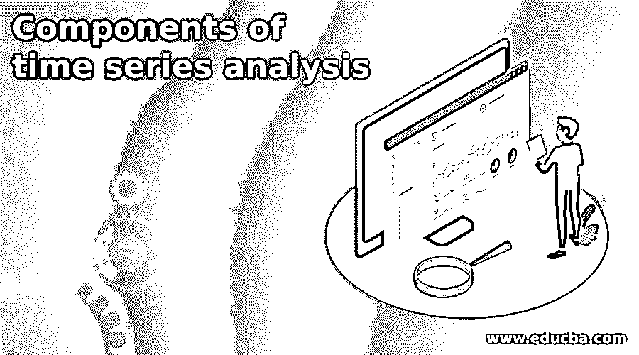

# 时间序列分析的组成部分

> 原文：<https://www.educba.com/components-of-time-series-analysis/>

## 时间序列分析组成部分的定义

时间序列分析的组成部分被定义为一个更大的整个时间序列算法的部分或元素，当它们被捆绑在一起时，有助于该算法实现其真正的意图。在我们的日常对话中，我们确实会谈论黄金或汽油或任何其他商品的价格随时间的变化。我们在那里做什么？我们将某一时期的价格与同一商品的其他可比时期的价格进行比较。按连续时间段排序的观察值集被称为时间序列，作为从数据中得出趋势和行为的重要部分的组件是时间序列分析的组件。在本文中，我们将研究构成时间序列分析的不同组成部分。

### 时间序列分析的组成部分

现在我们已经知道，按照时间顺序排列的数据点被称为时间序列。此外，时间序列分析是两个变量之间的关系，其中一个是时间变量，另一个是数量变量。时间序列有各种各样的用途，在我们了解时间序列分析的组成部分之前，我们只需浏览一下，这样当我们研究时间序列时，就可以清楚地看到组成部分是如何解决时间序列分析的。

<small>Hadoop、数据科学、统计学&其他</small>

*   进行时间序列分析是为了在过去行为的基础上预测任何定量变量的未来行为。例如，雨伞在雨季比其他季节卖得多，尽管雨伞在其他时间也有卖。所以也许为了预测未来的行为，在雨季会卖出更多的雨伞！
*   相对于预期的或计划的业绩来评估企业的业绩时，时间序列分析有助于做出明智的决策，使企业做得更好。
*   时间序列也使商业分析师能够比较不同时间或地点不同价值的变化。

保持这些时间序列的应用，我们现在来看看这个分析中涉及的不同组成部分。它们是:

#### 1.长期运动或趋势

该组件在一个长期的时间范围内观察属性的移动，主要是试图理解与行为相关的数量值的增加或减少。这更像是测量参数的平均趋势。在时间周期的不同部分，观察到的趋势可以是增加、减少或稳定。在此基础上，我们可以将趋势分为线性趋势和非线性趋势。在线性趋势中，我们只谈论持续增加或持续减少，而在非线性趋势中，我们可以将时间段分割成不同的帧并填充趋势！有许多方法可以将非线性趋势包含在分析中。我们可以采用手头变量的更高阶，这实际上是不可解释的，或者比这更好的方法是函数的分段规范，其中每个分段函数都具有线性，并且在整体水平上共同形成非线性趋势。

#### 2.短期运动

与长期变化相反，这一部分着眼于较短的时间段，以获得这一时间段内数量变量的行为。时间序列中的这种运动有时会在一段时间内重复出现，甚至以有规律的间歇方式出现。这些在较短时间范围内的运动产生了两个子分量，

*   **季节性**:这些是在研究中发现的变量的变化，这些变量的跨度不到一年。这些变化主要出现在数据中，其中记录的差异持续时间较短，如每天、每周、每月。我们谈到的在雨季销售雨伞的例子是季节性的。ACs 在夏季的销售也是季节性效应。有些人为的惯例会影响季节性，如节日、场合等。
*   **周期性变化**:虽然这个成分是对时间序列的短期运动分析，但它比季节性要长得多，在季节性中类似变化的跨度超过一年。这个运动中所有步骤的完成，对于说这个变化是一个循环是至关重要的。有时我们甚至称之为商业周期。例如，产品生命周期是一个周期变化的例子，其中产品经历生命周期的各个步骤，即引入、增长、成熟、衰退，就在产品达到衰退阈值之前，我们寻找具有一些更新功能的产品的重新推出。

#### 3.不规则变化或随机变化

这个组件是最不规则的变体之一，因此也是最不可预测的。我们在这些组件中看到的运动波动或变化大多是不可预见的，不可控制的。属于这一部分的是自然灾害，如地震、洪水、饥荒，人为灾害，如战争，甚至是流行病，如新冠肺炎。在新冠肺炎的时间框架内，有一个不规则的变化，旅游，应该看到可能只有一次在一个人的一生。大多数情况下，这些随机波动在统计学上被称为残差。

最后，我们现在知道趋势、季节性、周期性和残差完全构成了时间序列分析，并且这些组成部分可能采取加法模型或乘法模型的形式，这取决于使用案例！

### 结论

至此，我们结束了时间序列分析的组成部分一文，在这里，我们非常详细地研究了每个组成部分，并在了解这些组成部分在时间序列分析中的用法之前熟悉了它们！

### 推荐文章

这是一个时间序列分析组件的指南。这里我们讨论构成时间序列分析的不同组成部分。您也可以看看以下文章，了解更多信息–

1.  [时间序列分析](https://www.educba.com/time-series-analysis/)
2.  [熊猫时间序列](https://www.educba.com/pandas-time-series/)
3.  [SQL 时间戳](https://www.educba.com/sql-timestamp/)
4.  [马里亚布时区](https://www.educba.com/mariadb-timezone/)

