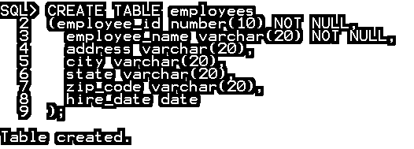

# 在 Oracle 中创建表

> 原文：<https://www.educba.com/create-table-in-oracle/>

## 在 Oracle 中创建表简介

[Table 是数据库](https://www.educba.com/table-in-sql/)的一个对象，用来存储员工、部门等实体相关信息，用来在 oracle 数据库中创建一个表，CREATE TABLE 语句用来创建一个表，我们需要给这个表起一个名字，并定义它的列和每列的数据类型。

**语法** **在 Oracle 中创建表:**

<small>Hadoop、数据科学、统计学&其他</small>

`CREATE TABLE tablename
(
column1 data_type [  NOT NULL | NULL  ] ,
column2 data_type [  NOT NULL | NULL ] ,
. . .
columnn data_type [ NOT NULL | NULL ] );`

**参数:**

*   **tablename:** 指定我们要创建的表名。
*   **列 1，列 2，...column:** 它指定了我们希望包含在表格中的列的名称。
*   **Data_type:** 指定列的数据类型或者列中可以存储哪种类型的数据。
*   **“NOT NULL”或“NULL”:**指定约束，NOT NULL 约束指定值不能为 NULL，而 NULL 指定值可以为 NULL 或 bank。NULL 约束是默认约束。

### 在 Oracle 中创建表的示例

这里我们将创建一个名为 employees 的表，它没有任何主键。

**查询:**

`CREATE TABLE employees
( employee_id number(15) NOT NULL ,
employee_name varchar2(20) NOT NULL ,
city varchar2(20)
);`

**输出:**

**查询:**

`Describe employees;`

**输出:**

**查询:**

`Select * from employees;`

**输出:**

在这里，我们创建一个雇员表，并将列添加为 employee_id(第一列将雇员 id 存储为数字数据类型，将约束存储为非空值)、employee_name(第二列将雇员姓名存储为 varchar2 数据类型(最大长度为 20 个字符)和 constraint 存储为非空值)，最后添加 city(第三列将雇员居住的城市存储为 varchar2 数据类型(最大长度为 20 个字符，约束为空值)。

### 在 Oracle 中创建带有主键的表的示例

*   查询以在列级别创建主键

**查询:**

`CREATE TABLE employees
( employee_id number CONSTRAINT employees_pk PRIMARY KEY,
employee_name varchar(20) NOT NULL ,
city varchar(20)
) ;`

**输出:**

这里，我们创建一个表 employee，并添加列 employee_id、employee_name 和 city 来存储雇员居住的城市，其中 employee_id 被创建为列级别的主键列，这意味着每个雇员的 employee_id 应该是唯一的，任何雇员的 employee_id 都不能为 null。通常，主键用于唯一地标识每个记录，甚至主键也可以在另一个表中作为外键引用，以在另一个表中存储特定的实体信息。

**查询:**

`Describe employees;`

**输出:**

*   在表级别创建主键的查询

**查询:**

`CREATE TABLE employees
( employee_id number NOT NULL ,
employee_name varchar(20) NOT NULL ,
city varchar(20) ,
CONSTRAINT employees_pk PRIMARY KEY (employee_id)
) ;`

**输出:**

这里，我们创建一个表 employee，并添加列 employee_id、employee_name 和 city 来存储居住在城市中的雇员，其中 employee_id 被创建为表级别的主键列。

**查询:**

`Describe employees;`

**输出:**

这里我们创建一个有三列的表，其中第一列作为主键创建。主键是包含唯一记录的单个列或列的组合。主键的规则是它必须由唯一值填充。主键列中不允许空值。一个表只能有一个主键。

### 在 Oracle 中创建日期数据类型的表的示例

在这里，我们创建一个名为 employees 的 Oracle 表，它存储雇员 ID、雇员姓名、雇员地址相关信息和雇员雇用日期。

*   Employees 表的 Oracle CREATE TABLE 语句是:

**查询:**

`CREATE TABLE employees
(employee_id number(10) NOT NULL ,
employee_name varchar(20) NOT NULL ,
address varchar(20) ,
city varchar(20) ,
state varchar(20) ,
zip_code varchar(20) ,
hire_date date
);`

**输出:**

**查询:**

`Describe employees;`

**输出:**

### 使用主键和外键在 Oracle 中创建表的示例

基于雇员表，我们希望创建一个名为 departments 的 Oracle 表，用于存储部门 id、部门名称和雇员 id。Employees 表的主键应该是雇员 id。在 department 表上创建一个外键，该外键基于 employee_id 列引用 employee 表。外键是引用另一个表列的键。外键值应仅来自引用主键，[外键可以有重复值](https://www.educba.com/foreign-key-in-sql/)，但不能有空值，因为主键没有空值。

*   Oracle 对 Employees 表的 CREATE TABLE 语句是:

**查询:**

`CREATE TABLE employees
( employee_id number NOT NULL ,
employee_name varchar(20) NOT NULL ,
department_id number ,
salary number(6) ,
CONSTRAINT employees_pk PRIMARY KEY (employee_id)
);`

**输出:**

**查询:**

`Desc employees;`

**输出:**

**查询:**

`CREATE TABLE departments
( department_id number(10) NOT NULL ,
department_name varchar(20) NOT NULL ,
employee_id number NOT NULL ,
CONSTRAINT departments_pk PRIMARY KEY (department_id),
CONSTRAINT employees_fk
FOREIGN KEY (department_id)
REFERENCES employees (employee_id)
);`

**输出:**

**查询:**

`Desc departments;`

**输出:**

### 结论

*   表是数据库的一个对象。
*   它用于存储与实体相关的信息，如员工、部门等。
*   在 Oracle 数据库中，CREATE TABLE 语句用于创建表。
*   主键用于唯一标识每条记录。

### 推荐文章

这是一个在 Oracle 中创建表的指南。在这里，我们讨论使用不同的键和数据类型在 oracle 中创建表的介绍和参数。你也可以看看下面的文章来了解更多-

1.  [Oracle 字符串函数的十大特性](https://www.educba.com/oracle-string-functions/)
2.  [实施 Oracle PLM](https://www.educba.com/agile-oracle/)
3.  [如何在 SQL 中使用 Distinct 关键字？](https://www.educba.com/distinct-keyword-in-sql/)
4.  [数据库管理系统中的散列](https://www.educba.com/hashing-in-dbms/)

