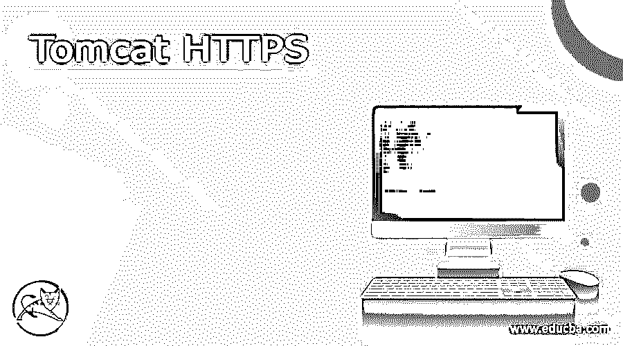
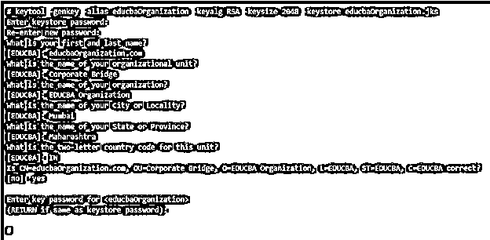
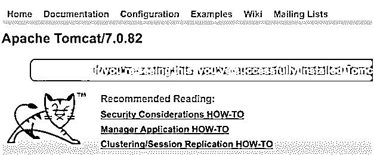
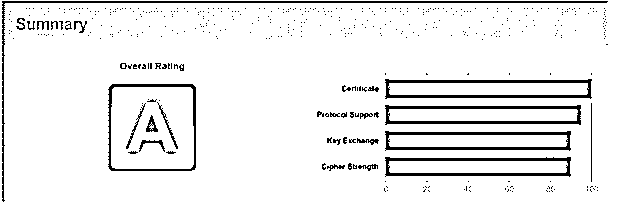

# 雄猫 HTTPS

> 原文：<https://www.educba.com/tomcat-https/>

## Tomcat HTTPS 简介

Tomcat HTTPS 是当您想要在 HTTPS URL 协议上运行 web 应用程序时使用的，这只有在您配置了 SSL 证书的情况下才会发生。在本文中，我们将讨论 tomcat HTTPS、配置、tomcat 重定向的概述，以及在 tomcat 中启用 HTTPS 的逐步过程。

### Tomcat HTTPS 概述

Tomcat HTTPS 是当您想要在 HTTPS URL 协议上运行 web 应用程序时使用的，这只有在您配置了 SSL 证书的情况下才会发生。我们可以遵循多种认证 SSL 的方法，即在负载平衡器或给定的 CDN 级别终止 SSL，我们可以实施安全套接字层或实施 SSL，我们可以利用可用的 web 服务器，包括 Apache Tomcat、Nginx 等。在 SSL 前端。

<small>Hadoop、数据科学、统计学&其他</small>

### 配置中的 Tomcat HTTPS

https 可以在 tomcat 的 server.xml 配置文件的连接器标记中指定。对于每个模块，我们将有一个 XML 元素。XML 文件属性用于描述模块的属性。在 tomcat 服务器的配置中，Server.xml 文件是位于路径 TOMCAT_HOME/conf/server.xml 的主配置文件。在 TOMCAT _ HOME/conf/name-of-server.xml 文件中，server.xml 文件有助于操作在 server . XML 文件之后读取的本地系统配置。

### Tomcat 重定向

我们可以设置 tomcat 配置，以便所有请求都从 http 重定向到 HTTPS。为此，打开位于 TOMCAT_INSTALL/conf/中的 server.xml，并将重定向端口设置为 HTTPS 端口 443。这可以通过使用如下所示的属性更改连接器的标签来实现

redirectPort = "443 "或为 HTTPS 设置的任何其他端口。

您还需要在具有相同更改的配置中修改 web.xml 文件。之后，HTTP 的所有请求都将被导航到 HTTPS。

所有步骤都详细说明了 HTTPS

*   对于直接在前端启用 tomcat 或者在 tomcat 内部使用 SSL 部署，我们可以按照下面提到的步骤来操作—
    应该生成 CSR，即证书签名请求。
*   在密钥库文件中，我们需要导入证书。
*   启用 Tomcat 内部的安全套接字层。
*   应该配置 TLS，它代表传输层服务协议
*   修改配置，以便 tomcat 开始监听 443 端口地址。
*   应该正确检查和测试 SSL 漏洞。

让我们详细讨论每个步骤——

*   应该生成 CSR，它代表证书签名请求。–

我们将使用实用程序中的符号 keytool 来控制证书的管理。我们将登录到 tomcat 服务器，然后导航到它的安装路径。现在，我们将创建一个名为 ssl 的新文件夹，然后执行下面提到的命令，该命令将为我们创建一个密钥库

`Keytool -genkey -alias name_of_domain -keyalg RSA -keysize 1024/2048 -keystore name_of_file.jks`

别名和文件的名称应该易于记忆。最建议的方法是给它们取与域名相同的名字。

例如，考虑以下命令–

`# keytool -genkey -alias educbaOrganization -keyalg RSA -keysize 2048 -keystore educbaOrganization.jks
Enter keystore password:
Re-enter new password:
What is your first and last name?
[EDUCBA]: educbaOrganization.com
What is the name of your organizational unit?
[EDUCBA]: Corporate Bridge
What is the name of your organization?
[EDUCBA]: EDUCBA Organization
What is the name of your City or Locality?
[EDUCBA]: Mumbai
What is the name of your State or Province?
[EDUCBA]: Maharashtra
What is the two-letter country code for this unit?
[EDUCBA]: IN
Is CN=educbaOrganization.com, OU=Corporate Bridge, O=EDUCBA Organization, L=EDUCBA, ST=EDUCBA, C=EDUCBA correct?
[no]: yes`

输入<educbaorganization>的密钥密码</educbaorganization>

`(RETURN if same as keystore password):
#`

在终端上运行时，输出为–

此后，您将从证书提供商处收到证书。

*   在密钥库文件中，我们需要导入证书。

现在，让我们首先将证书导入到密钥库中。为此，我们将执行以下命令

keytool-import cert-alias root-file root-Keystore educbaorganization . jks

将根证书导入证书提供商提供的密钥库中。现在，我们将执行以下命令来导入中间证书

keytool-import cert-alias intermediate-file intermediate-Keystore educbaorganization . jks

我的情况是，我只有一个中级证书。如果您有多个中间证书，那么您需要将它们全部导入。导入的最后一步是导入域证书，可以使用命令–

keytool-import cert-file educbaOrganization . cer-Keystore educbaOrganization . jks-alias educbaOrganization

导入所有这些内容后，您将收到安装确认，并且证书密钥库将全部设置好。

*   启用 Tomcat 内部的安全套接字层，并
*   应该配置 TLS，它代表传输层服务协议

移动到 tomcat 的 conf 文件夹，其中包含配置。备份现有的 server.xml 文件，然后移动到如下行

`<Connector port = “8080” protocol = “HTTP/1.1”> and add the following new properties in the same tag –
Scheme = “https” SSLEnabled = “true” clientAuth = “false” sslProtocol = “TLS” keyPass = “payal” keystoreFile = “ssl/educbaOrganization.jks”`

您应该根据您的凭证设置密钥库的名称和相应的密码。在 server.xml 文件中保存所有更改后，您需要重新启动 tomcat，使其可以通过 HTTPS 进行访问。现在，如果您转到 URL，`https://educbaOrganization.com:8080`，那么您可以看到如下所示的 tomcat 主页

*   修改配置，以便 tomcat 开始监听 443 端口地址。

我们现在希望系统监听 443 端口，而不是默认的 tomcat 端口 8080。这是因为我们不需要在 https:// URL 中指定端口号来访问 tomcat。您可以更改 server.xml 文件，搜索

*   应该正确检查和测试 SSL 漏洞。

最后一步是检查您的域中的任何在线威胁和漏洞。市场上有各种各样的在线工具。我们可以利用一个叫做 SSL 实验室的工具。为此，您首先需要转到 SSL 实验室页面，输入要进行 SSL 漏洞测试的域的 URL，然后开始测试。观察绿色的所有评级意味着您的域名 URL 不容易受到任何威胁。输出可能如下所示

### 结论

我们可以设置 tomcat 的配置，以便 HTTP 协议上的所有请求都可以重定向到 HTTPS。但是，在此之前，您必须按照上面的步骤为 tomcat 启用 HTTPS。

### 推荐文章

这是一个指南雄猫 HTTPS。在这里，我们讨论介绍、概述、配置和代码实现示例。您也可以看看以下文章，了解更多信息–

1.  [什么是阿帕奇雄猫？](https://www.educba.com/what-is-apache-tomcat/)
2.  [Weblogic vs Tomcat](https://www.educba.com/weblogic-vs-tomcat/)
3.  [阿帕奇兴趣点依赖关系](https://www.educba.com/apache-poi-dependency/)
4.  [阿帕奇兴趣点](https://www.educba.com/apache-poi/)

