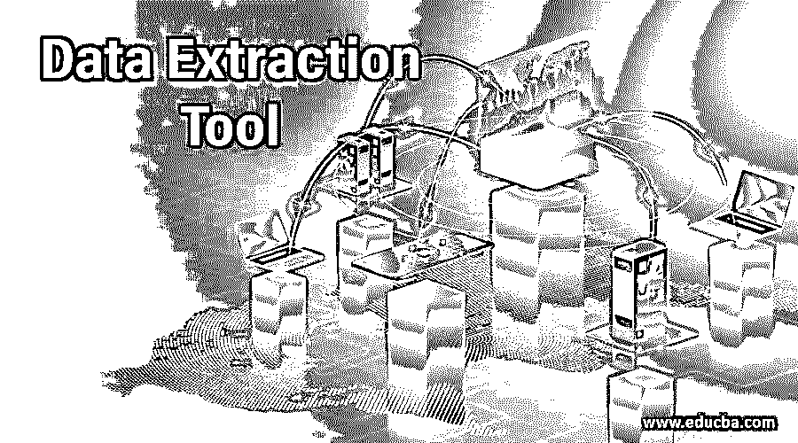

# 数据提取工具

> 原文：<https://www.educba.com/data-extraction-tool/>

## 数据提取工具简介

从传统和数字来源生成的数据可以分为 13 种不同类型，即结构化/非结构化/半结构化、具有高容量/速度/准确性的大数据、传感器数据、带时间戳的数据、开放数据、黑暗数据、运营数据、实时数据、基因组数据、高维数据、跨分析数据、时空数据、过时数据和跨分析数据。

数据提取是一个过程，通过该过程，来自应用环境中各种来源的数据被定期或实时挑选出来，经过处理以适应数据库或数据分析平台的格式，并加载到目标数据库中。

<small>Hadoop、数据科学、统计学&其他</small>

### 数据提取工具的类型

下面是三种类型的数据提取工具:

#### 1.批处理(传统)处理工具

这些工具在非高峰时段从 OLTP 遗留数据库中提取数据，以减少系统中的负载。标准 ERP 的 BI 应用程序管理这一提取过程。该工具非常适合具有内部托管的同质数据源的应用程序。

#### 2.开源工具

非常适合低成本预算的应用，具备所需的基础设施和足够的知识。一些产品的有限编辑可以作为开放源码获得。

#### 3.基于云的工具

最新一代的现代产品托管在云中。它提供数据的实时提取和数据的动态灵活建模。这些解决方案是高度安全和投诉。

### 15 大数据提取工具

以下是数据提取中的 15 大工具:

1.  **刮网器**:使用非常简单的工具。电子邮件链接、价格、联系方式、图片和网页都可以从网上提取
2.  OutWitweb :最流行的从网站提取数据的工具。理想的表格，图像，邮件 id 和链接提取从网上。
3.  Octaparse :它从任何网站提取开放数据，无需任何编辑工作。数据，IP 地址，电话号码，邮件 id 可以很容易地提取。
4.  Parsehub :基于图形用户界面(GUI)的工具。使用这个可视化工具，可以从网络上提取图像、文档、电话号码和联系人
5.  Spinn3r: 可以访问网络上发布的所有博客，并且这些博客都被编入了索引。
6.  Fminer :从网络中提取数据的可视化工具。它也作为一个宏记录器。
7.  **表格捕获:**通过 Chrome 浏览器，数据被提取出来，这是一种便捷的数据提取方式
8.  **Scrapy** :开源提取工具。这里使用 Python，它允许开发自己的代码来提取数据
9.  **Tabula:** 是一款桌面 App。运行 MS，Linux，Mac 操作系统。有一个功能转换成 XLS，csv 格式的 PDF 文件，并可以在那里编辑。主要用于新闻业的内容创作
10.  **Dexi.io:** 无需下载，可在浏览器中打开。爬虫可以被设置为可以从网络中挑选出来的数据。浏览过的数据可以直接保存到 google drive。
11.  **Import.io:** 无需编写任何代码即可实现数据提取。可以提取网络数据、电子邮件 iD、图像和电话号码
12.  **可视化网页抓取器**:使用该工具可以自动提取数据。网络采集是这里的一个独特的功能。
13.  **Webhose.io** :用于业务应用中提取数据
14.  从任何网站提取数据并转换成你需要的格式。
15.  **数据提取器:**是一款 SAP 产品，替代了 SAP ERP 中的几个 T 代码。它允许将 SAP 数据提取到 Excel 表格中。

可以使用目标 ERP 产品中提供的提取工具将标准 ERP 中的数据提取并导入到另一个 ERP 中。例如，SAP 拥有数据连接器，可以从 Oracle、MS Dynamics、Ramco 的 Marshall、IFS 等其他 ERP 产品中提取数据。同样，Oracle 有自己的工具从其他 ERP 中提取数据。

### ETL 过程(遗留应用程序)

下面是遗留应用程序的 ETL 过程:

*   **提取:**在传统的应用程序中，数据是从由在线交易系统(OLTP)维护的数据库中挑选出来的。提取以预定义的时间间隔进行，并保存在临时暂存区。系统维护提取数据的日志，并用于进一步提取数据，没有任何遗漏和重复。
*   **转换:**来自 OLTP 系统的数据不具备分析能力，需要清理、优化、计算、聚合和添加一些元数据，以便在进行进一步处理之前丰富数据。从 OLTP 中提取的原始数据被转换，以适应暂存区中的分析。
*   **加载然后分析:**将转换后的数据加载到 BI 数据库中，作为在线分析处理(OLAP)的一部分进行维护。市场上有很多 BI 分析软件可以从 BI 数据库中获得洞察力，从而做出更好的决策。在设计中加入任何改变都是非常困难的，整个过程都必须重新进行

### ELT 流程(数字应用)

下面是数字化应用的 ETL 过程:

**提取:**实时提取 OLTP 系统、社交媒体、Web、电子邮件、视频/音频文件、云应用程序中的结构化和非结构化数据。

**加载:**提取的数据被简单地加载到分析数据库中。该数据库可以位于内部或云中。

**转换和分析:**该方法的独特之处在于

*   原始数据在实时模式下可用，并且可以对数据进行有意义的实时分析。
*   无论何时，数据和数据建模的转换都发生在 OLAP 层
*   用户可以根据不同时间点的业务需求，以动态的方式灵活地对数据建模，并获得洞察力
*   丰富的存储、强大的计算能力和云选项使这种模式更快、更强大。
*   许多现成的云产品可用于管理整个 OLAP 运营

### 选择数据提取工具时需要考虑的要点

*   应该维护提取和加载事件的详细日志，以便进行审计和故障排除
*   应定期进行数据刷新(增量数据加载),并保留审计跟踪。
*   应支持任何格式的结构化和非结构化数据文件，并应与任何 OLTP 系统和其他最新数据接口
*   必要的接口或 API 应该可以与任何应用程序交互并使用其数据
*   应在任何阶段报告故障或错误
*   必须有良好的通知流程，并且应该是主动的
*   它应该具有低延迟、高可伸缩性和 100%的准确性

### 结论

数据提取工具有助于从任何来源中剔除数据，用户必须根据应用程序和数据源选择正确的工具。

### 推荐文章

这是一个数据提取工具指南。在这里，我们讨论一个介绍，类型，15 大工具与两个不同的过程中的细节点和关键点。您也可以浏览我们的其他相关文章，了解更多信息——

1.  [猪命令](https://www.educba.com/pig-commands/)
2.  [什么是 Apache Flink](https://www.educba.com/what-is-apache-flink/)
3.  [什么是预测分析](https://www.educba.com/what-is-predictive-analytics/)
4.  [什么是商业分析](https://www.educba.com/what-is-business-analytics/)

