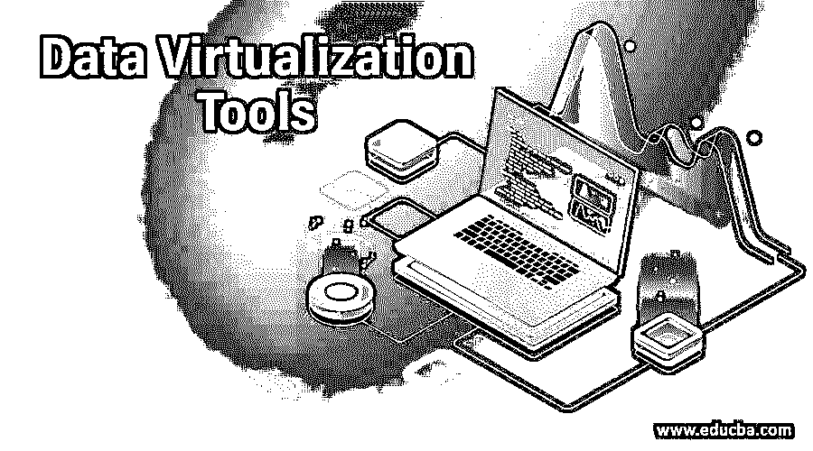

# 数据虚拟化工具

> 原文：<https://www.educba.com/data-virtualization-tools/>

## 数据虚拟化工具简介

数据的虚拟化提供了对数据的访问，同时隐藏了位置、配置或访问语言等技术方面。它帮助应用程序访问数据，而无需了解数据在哪里。数据联合就是一个例子，在这个例子中，对于不同数据存储中的消费应用程序来说，数据被呈现为看起来像单个数据存储。它的虚拟化提供了跨多个数据管理工具和多个数据库的查询。数据虚拟化工具比 ETL 更高效、更快。数据虚拟化不同于提取、转换和加载(ETL)过程，它避免了数据冗余

### 数据虚拟化工具的特性

数据虚拟化工具提供如下功能

<small>Hadoop、数据科学、统计学&其他</small>

1.  将多个数据源作为一个源进行评估
2.  集成和转换数据以创建数据的虚拟模型
3.  实时虚拟化数据访问，无需传输数据
4.  高级查询引擎
5.  集中所有元数据
6.  简单的数据分析
7.  按需数据的发布
8.  虚拟数据层提供防火墙数据，访问控制安全

### 数据虚拟化工具列表

现在我们将看到顶级数据虚拟化工具列表

#### 1.TIBCO 数据虚拟化

它是一个企业数据虚拟化软件，提供对多个数据源的访问。它使得连接到所有多个数据源和针对多个数据源的查询变得更加容易。在合并所有数据时，它还可以避免数据重复。它提供了一种虚拟层方法，以安全、快速的方式呈现用于分析的数据。

##### TIBCO 数据虚拟化的特点

1.  删除重复数据
2.  拖放功能。
3.  各种数据源适配器。
4.  支持 Spotfire 进行数据分析。

#### 2.我的名字

Denodo 是一个基于网络的软件，提供像 Google 一样的数据和元数据搜索功能，并支持连接到多个数据源。它有一个数据目录，便于搜索数据。Denodo 还通过单一控制和管理提供对公司所有数据的安全、选择性访问，从而提供安全性和管理

##### 德诺多的特点

1.  查询优化器在执行时选择最佳的查询策略，以便更快地访问数据
2.  它还提供了内存中的并行处理，加快了数据访问的速度
3.  大型数据部署的诊断功能
4.  它有一个服务层，支持 OpenAPI、OAuth 2.0、OData 4 和 SAML 云标准，这些标准支持与可用云系统的可靠互操作性。它还支持云市场，如微软 Azure、亚马逊网络服务(AWS)、Docker 等。

#### 3.VMware 云计算管理平台

VMware 云计算管理是一个完整的云基础架构，是一个数据虚拟化软件，可简化数据操作，并为所有应用程序提供最佳 SLA。它有助于维护和执行各种 It 操作，如计算、联网、异构和混合云存储。

##### VMware 云计算管理平台的功能

1.  高级网络和安全性
2.  vRealize Suite 可解决复杂的运营问题并实现 IT 自动化
3.  高效的数据虚拟化管理
4.  VSP here suite for operations management
5.  用于高级内存管理的 vSphere 虚拟机管理程序

#### 4.Red Hat JBoss 数据虚拟化

Red Hat JBoss 数据虚拟化是一个流行的数据虚拟化工具，它为多个数据源提供数据供应和数据集成解决方案，允许将这些多个数据源作为一个单一的数据源，并以用户期望的形式交付所需的数据。

##### Red Hat JBoss 数据虚拟化的特性

1.  成本比任何其他替代产品都低
2.  灵活的云管理
3.  异质覆盖
4.  基于 web 的数据提取的自动化过程

#### 5.亚马逊弹性计算云(EC2)

亚马逊弹性计算云(Amazon EC2)是一种 web 服务，它在亚马逊 Web 服务(AWS)云中提供可伸缩的计算。它的界面有助于配置、联网、大型数据的安全性以及管理此存储。它提供工作负载管理和高级监控。它还有助于在整个企业中实施数据虚拟化。

##### 亚马逊弹性计算云的特点

1.  IT 组织的网络管理
2.  灵活的网络规模计算
3.  可靠的云托管服务
4.  便宜的

#### 6.斯通庞德

Stonebond 是最好的数据虚拟化软件之一，它帮助用户分析业务数据，同时最大限度地利用资产，降低成本，提高业务效率。它通过集成数据降低了成本和时间，因为不需要投资昂贵的数据仓库和数据存储。它有最简单的用户界面和集成完整性管理器(IIM ),有助于配置，管理和修改数据流。

##### 斯通邦德的特点

1.  数据目录可实现更快、更轻松的搜索
2.  数据集来源、最终目的地、业务规则、公式的标识
3.  双向数据访问
4.  拖放功能允许自动生成虚拟模型，可快速用于 web 服务、BI 报告和应用程序。
5.  保护敏感信息隐私的数据屏蔽。
6.  它支持多个用户群体，如 DBA、业务分析师以及开发人员
7.  生成和托管 web 服务，如 REST、ODATA、BDC SOAP、ADO。NET，JSON，JDBC，ODBC，BCS

### 结论

在本文中，我们看到了各种数据虚拟化工具，它们将帮助您集成来自多个来源的数据并管理它们。您可以根据自己的需求选择任何软件。我们希望这篇文章对您有所帮助。

### 推荐文章

这是数据虚拟化工具指南。在这里，我们将讨论各种数据虚拟化工具及其特性。您也可以看看以下文章，了解更多信息–

1.  [概念数据模型](https://www.educba.com/conceptual-data-model/)
2.  [数据库测试工具](https://www.educba.com/database-testing-tools/)
3.  [元数据管理工具](https://www.educba.com/metadata-management-tools/)
4.  [MYSQL 数据库](https://www.educba.com/mysql-database/)

