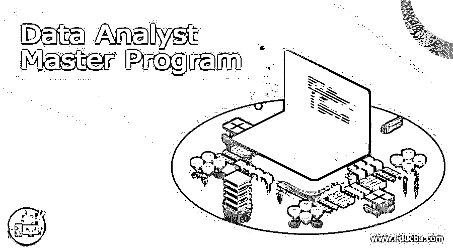

# 数据分析师主计划

> 原文：<https://www.educba.com/data-analyst-master-program/>

## 什么是数据分析师硕士课程？

这个项目可以教授学生分析对世界的影响以及相关的法律问题。它是为那些对分析的技术或业务方面感兴趣的人设计的。数据分析的主题与技术进步同步发展。机器学习和其他震撼该领域的前沿技术可以在这些项目中教授。通过学习数据分析理论，可以提高学生处理和解构数据的能力。

### 顶级数据分析师硕士项目

数据正迅速成为数据驱动型企业中最有价值的资产，它对于解决未来的问题至关重要。从优化现有生产线到开发新的业务模式，数据驱动的决策是数字组织的核心。

<small>Hadoop、数据科学、统计学&其他</small>

聪明的头脑产生创新，这个全球硕士项目让任何人都可以负责你未来的数据科学职业。

#### 1.数据分析理学硕士

该课程的目标是为毕业生提供在当今竞争激烈的全球 IT 环境中成为成功的数据分析师、运营分析师和领导者所需的能力。全面了解构成数据科学、统计学、数据挖掘、问题分析、大数据和决策制定的主要技术。

**课程包括:**

1.网络安全分析:大型安全分析研究可以揭示有关攻击和危险的信息。

2.大数据分析:讨论了大数据作为企业资产的概念，以及组织和分析工具、方法和平台。

3.机器学习理论:包括算法模式

4.数据结构和算法:本课程还介绍了算法分析和设计中使用的基本形式和概念。

5.Python 编程与统计

#### 2.数据科学硕士项目:

基础课程包括:

**a .数学**

了解如何创建和分析真实世界情况的数学模型。本课程将涵盖线性代数、离散数学、概率和微积分，重点是数据科学和数据工程中的应用。

**b .带 R 的统计:**

学生学习如何使用 R 编程语言进行统计分析、数据可视化和报告生成。描述统计学、集中趋势、探索性数据分析、概率论、离散和连续分布、统计推断、相关性、多元线性回归、列联表和卡方检验是本课程教授的一些主题。

**c .用于数据科学的 Python:**

本课程解释了 Python 编程语言的基本特征，同时也展示了关键的计算机科学原理。它详细介绍了数据表示策略，解释了如何在 Python 中实现数据结构，并展示了数据科学和软件工程工具。

**d .数据库和数据准备**

**e .决策分析**

接下来，我们有两个部门可供选择:

1.分析建模 2。人工智能

氟（fluorine 的缩写）网络安全和机器学习

项目包括:

数据科学用例与模型工程

使用的工具和语言:

Python、R、pandas 和 SQL

**职业机会:**

数据科学硕士学位打开了许多大门，让你在数据驱动型组织的职业竞争中脱颖而出。

#### 3.在线 MBA 的数据分析

对于忙碌的成年人来说，这是一个实用而灵活的解决方案。如果你正在寻找一个更具战略性的高级或管理职位，并希望将你的职业生涯和你的组织带到一个新的高度。

本课程涵盖了在统计数据的收集、设计和分析中运用理论模型的两个要素，以及开发和实施基于该数据的解决方案的实际过程。项目涵盖整个数据分析过程，从数据收集到争论，再到结果和解决方案的分析和交流。随着可用数据比以往任何时候都多，那些能够处理和理解这些数据的人可能会给工作场所带来真正的价值。这些模块侧重于学习如何评估数据以及做出将塑造组织未来的关键业务决策。

有许多职业机会，包括:

数据分析经理
管理顾问
分析师(业务)
任职期限:2.5 年

#### 4.数据分析和信息系统管理理学硕士

该计划专为希望在该领域改变职业生涯并自信地利用大数据为其俱乐部带来成功的 IT 管理员而设计。这门课程也适合那些以前热衷于管理领域的人。凭借您的数据分析知识，完成这个硕士课程后，您将领先于其他 IT 专业一步。

**课程模块**

1.数据设计(架构)
2。数据可视化和决策一般化
3。用用例处理数据

**选择职业**

完成这一理学硕士数据分析和信息系统管理课程后，您将深入了解业务驱动的战略职业或将数据计算能力应用于 IT 专业。

你可以看看下面的工作

高级数据分析师，信息系统经理，商业领域的数据经理，银行的职能主管，系统经理。

#### 5.应用统计与分析理学硕士

在这 12 门选修课中，有 5 门在职课，10 门选修课，5 门选修课选修。学生将恰当地运用统计推断，构建商业环境中操作的统计模型，使用统计方式管理紧急情况，并在强大的伦理道德基础上进行专业演讲，以处理大量数据。任何马里维尔大学数学建模和精算专业成绩优秀的本科生都可以申请应用统计学和数据分析硕士学位。

#### 6.数据分析和可视化硕士

本课程教授学生如何使用统计学、技术、考试和设计将大量原始数据转化为昂贵的信息。学生对日益增长的数据知识需求做出反应，以便他们能够在各种领域工作。该课程的毕业生将有能力掌握整个数据生命周期，从数据捕获到操纵，再到数据仓库，再到统计分析和解释，以及最终数据工件的可视化和叙述性分布。

### 结论

该计划是在对来自世界各地的 5000 多份职位描述进行全面研究后制定的。硕士课程的注册不要求任何先决条件。无论你是一个完美的 IT 专业人士，还是一个对获得数据评论员感兴趣的学生，硕士课程都是结构化的，适合各种专业帝国。

### 推荐文章

这是一个数据分析师硕士课程指南。在这里，我们讨论什么是数据分析师主计划？顶级数据分析师硕士项目(2021)。您也可以看看以下文章，了解更多信息–

1.  [什么是数据分析师？](https://www.educba.com/what-is-data-analyst/)
2.  [数据分析师面试问题](https://www.educba.com/data-analyst-interview-questions/)
3.  [数据分析师 vs 数据科学家](https://www.educba.com/data-analyst-vs-data-scientist/)
4.  [数据分析师助理](https://www.educba.com/data-analyst-associate/)

