# 数据布里克斯三角洲湖

> 原文：<https://www.educba.com/databricks-delta-lake/>

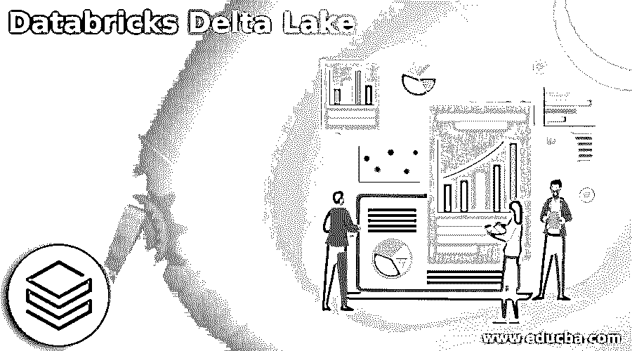

## 达布里克斯三角洲湖简介

Databricks Delta Lake 是一个提供安全性的开源存储层。考虑到批处理和流操作，它为 databricks 数据湖和用户数据湖的性能带来了可靠性。Delta lake 支持在数据湖之上构建湖屋架构。它为 Databricks delta lake 添加了优化的布局和索引，以实现快速的交互式查询。

### 关键要点

以下几点概述了 Databricks 三角洲湖、其要点及其用途:

<small>Hadoop、数据科学、统计学&其他</small>

*   Databricks Delta Lake 有助于迎合 Spark、Hive 等大数据 ETL 工具的一些要点。，无法解析。
*   Delta lake 还提供 DML 支持，即使用 Merge 单步更新和插入并删除坏记录。
*   它提供了数据版本控制，支持数据回滚、审计更改和报告复制。
*   它具有统一的流和批处理接收器，能够将大量数据直接接收到查询表中。
*   Delta lake 使用优化和 z-order 来提高查询性能以及模式演化，使用户能够对表模式进行更改，这些更改会自动应用，而不需要任何 DDL 语句。
*   delta lake 使用 Delta 格式存储数据，在将 Delta 数据移植到 Spark 平台时，Delta 格式需要被 Parquet 格式所取代。

### 什么是达布瑞克三角洲湖？

Databricks delta lake 提供具有可伸缩元数据处理的 ACID(原子、一致性、隔离、持久性)事务。Delta lake 运行在现有数据湖之上，兼容 Apache API Sparkdelta lake 还具有成本效益，因为用户可以用非结构化、半结构化和结构化数据替换数据孤岛。它自动处理模式变化，以防止在摄取过程中插入讨厌的记录。它还支持回滚、历史审计跟踪和可重复的机器学习实验。

Delta 引擎优化通过支持从大规模 ETL 处理到即席交互式查询的各种工作负载，帮助 Delta lake 高效运行。

### 如何使用 Databricks 三角洲湖工作区？

Delta Lake Workspace 需要访问 Azure Databricks Workspace，该工作空间通过将 Delta Lake 用于批处理作业来帮助执行结构化流。

**步骤 1:** 使用 Delta Lake Workspace 的先决条件是拥有一个有效的 Azure 帐户。点击 https://portal.azure.com/注册/登录(如果现有用户)。

**步骤 2:** 登录后，点击+创建资源，如下所示。

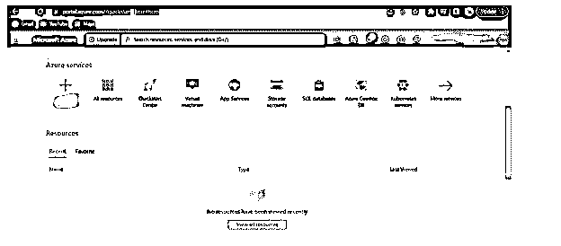

**步骤 3:** 在下面的屏幕中，在 Marketplace 文本框中搜索“Azure Databricks”并选择。

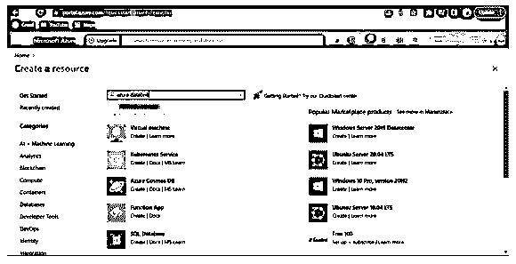

**步骤 4:** 在 Azure Databricks 中，点击“创建”，如下所示。

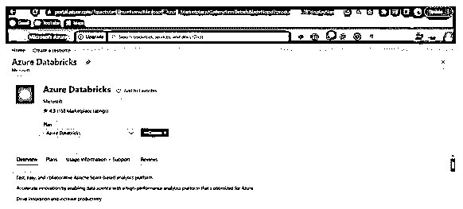

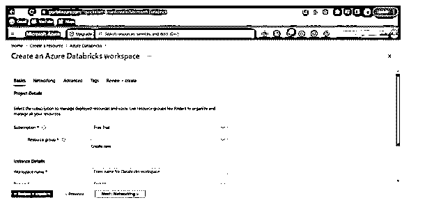

**步骤 5:** 在上面的 Azure Databricks 服务刀片表单中，填写以下详细信息。

*   **工作区名称:** awdbwsstudxx 此处“xx”代表用户姓名首字母。
    **订阅:**选择用户在 Azure lab 使用的订阅。
*   **资源组名称:**awrgstudxx；这里，“xx”代表用户姓名首字母。
*   **地点:**美国东部。
*   **定价等级:**试用版(高级-14 天免费 DBUs)(如 Azure 门户所示)。
    选择审核并创建。

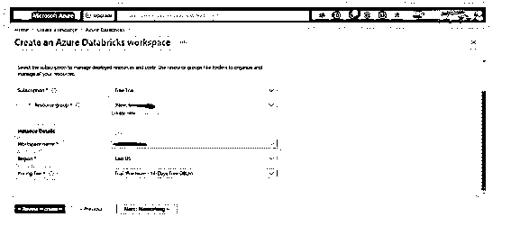

**步骤 6:** 一旦你点击了 Review+Create，给定的细节被验证，Azure Databricks Workspace 被创建。

**步骤 7:** 点击“Create”，部署开始。

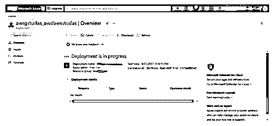

**步骤 8:** 部署完成后，选择“转到资源”。

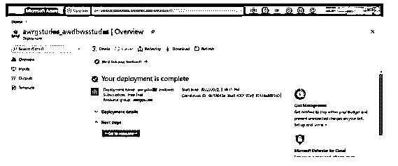

**步骤 9:** 现在，选择 Launch Workspace 或 Go to Resource，在新的选项卡中打开 Databricks workspace。

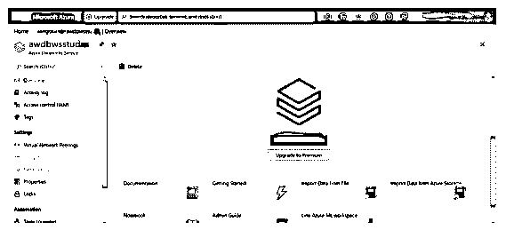

**步骤 10:** 在 Databricks 工作区的左侧菜单中，选择 Create Cluster。

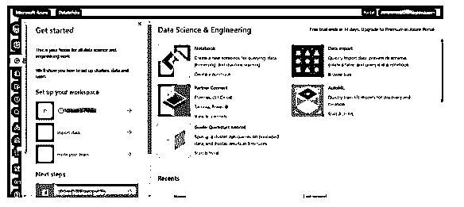

**第十一步:**如下图填写详细信息；根据需要，用户可以选择具有所需节点类型的单节点或多节点，然后单击“Create Cluster”。

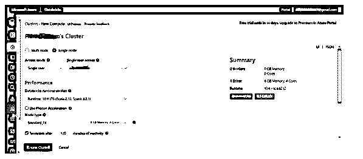

**第 12 步:**一旦集群被创建，用户就可以执行流和批处理。单击工作区–用户，选择所需的用户名，然后单击导入。

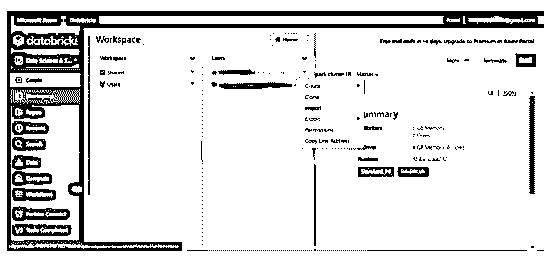

**步骤 13** :在导入对话框中，粘贴以下 URL(示例)

https://github.com/solliancenet/microsoft-learning-paths-databricks-notebooks/blob/master/data-engineering/DBC/11-Delta-Lake-Architecture.dbc?raw=true

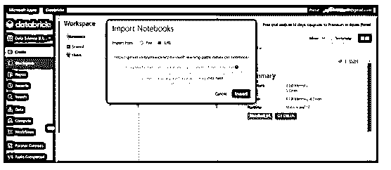

开放式 11 三角形架构开放式 1 三角形架构。

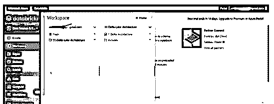

**第 14 步:**运行所有单元或运行每个单元，如下图所示，并生成输出。

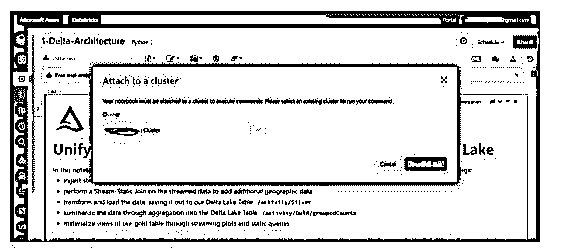

### Databricks 三角洲湖泊建筑图或三角洲湖泊模型

让我们透视一下三角洲湖泊的建筑:

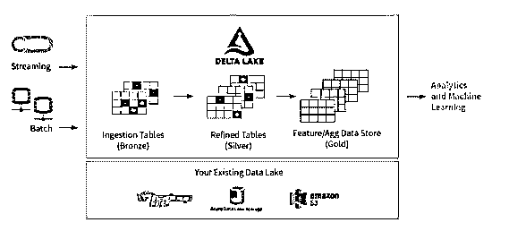

三角洲湖建筑是对λ建筑的改进。在上面显示的每个阶段，用户可以通过连接的管道来改进数据，这允许用户通过共享文件存储和 ACID 事务来组合批处理和流式工作流。

如上所示，Delta lake 中的数据被组织到文件夹或层中，即青铜、白银和黄金。

*   **Bronze:** 这些表包含来自 JSON 文件、RDBMS 数据、IoT 数据等来源的原始数据。
*   **Silver:** 这些表具有用户数据的精确视图，并且可以连接来自各种青铜表的字段，以更新帐户状态或改进流记录。
*   **Gold:** 这些表格提供了用于报告和仪表板的业务级汇总。它包括每个商店的周销售额、每个部门的季度总收入或每日活跃网站用户。

输出具有可操作的见解、业务指标报告和仪表板。大多数物联网或传感器设备通过各种摄取路径生成数据。通过 Azure databricks 或 Azure Data factory 获取批量数据。从物联网中心或活动中心消费流数据。提取和转换的数据被加载到 Delta Lake。

### 常见问题解答

常见问题如下:

#### Q1。Delta 不支持哪些 DML 和 DDL 语句？

**答案:**

Delta 不支持的 DML 语句包括 Overwrite、Bucketing、在 truncate 表中指定目标分区以及在读取表时指定 schema。Analyze Table、Load Data、Create table 和 Alter table 是 Delta 不支持的 DDL 语句。

#### Q2。三角洲湖和阿帕奇火花有什么关系？

**答案:**

数据布里克斯三角洲湖坐落在阿帕奇火花之上。计算和格式层有助于简化大数据管道的构建，并提高管道的整体效率。

#### Q3。用户可以直接在增量表中输入和输出数据流吗？

**答案:**

是的，用户可以使用结构化流将数据直接写入增量表并读取。

### 结论

至此，我们结束了“数据布里克斯三角洲湖”的话题我们已经了解了 Databricks Delta lake 的含义以及如何使用 Delta Lake 工作空间处理批处理和流数据的步骤，以及 Delta Lake 的架构和模型。我们还列出了德尔塔湖的关键要点，并看到了一些常见问题，以提供更好的帮助。

### 推荐文章

这是去达布里克斯三角洲湖的指南。在这里，我们讨论了介绍，模型，以及如何使用 Databricks 三角洲湖工作区与常见问题。您也可以看看以下文章，了解更多信息–

1.  数据块 CLI
2.  [Azure 数据块](https://www.educba.com/azure-databricks/)
3.  [Databricks 面试问题](https://www.educba.com/databricks-interview-questions/)
4.  [数据工程师项目](https://www.educba.com/data-engineer-projects/)

