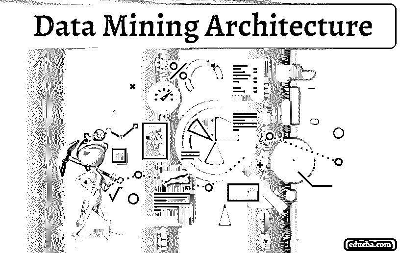
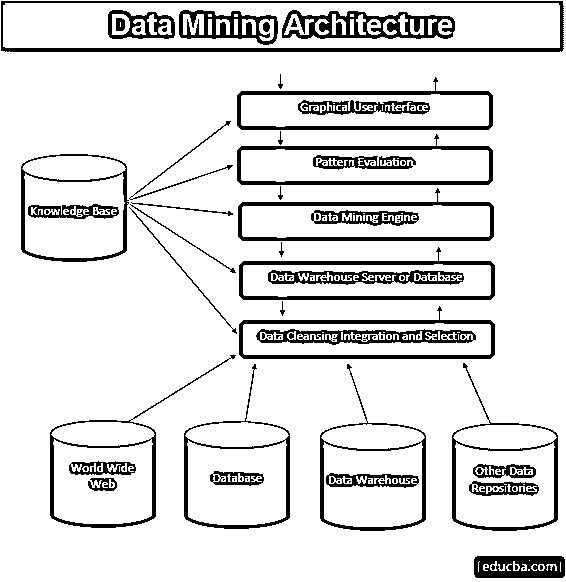

# 数据挖掘架构

> 原文：<https://www.educba.com/data-mining-architecture/>

## 数据挖掘体系结构概述

数据挖掘是在复杂的大型数据集中发现和探索基本或高级模式的方法，它涉及统计学、机器学习和数据库系统的交叉方法。它可以是统计学和[计算机科学](https://www.educba.com/what-is-computer-science/)的交叉领域，目标是使用智能方法和技术通过提取从一组特定的数据中提取信息，从而转换数据。数据管理活动和数据预处理活动以及推理考虑事项也被考虑在内。在本文中，我们将深入研究数据挖掘的体系结构。

### 数据挖掘架构

[数据挖掘是从存储在许多数据源(如文件系统、数据仓库和数据库)中的大量数据中提取有趣知识的技术](https://www.educba.com/data-mining-concepts-and-techniques/)。数据挖掘架构的主要组件包括

<small>Hadoop、数据科学、统计学&其他</small>

#### 1.数据源

各种各样的现有文档，如数据仓库、数据库、www 或俗称的万维网，成为实际的数据源。大多数情况下，数据也可能不存在于任何这些黄金来源中，而仅以文本文件、普通文件或序列文件或电子表格的形式存在，然后需要以与处理从黄金来源接收的数据非常相似的方式处理信息。今天的大部分主要数据块是从因特网或万维网获得的，因为今天因特网上呈现的一切都是以某种形式或另一种形式形成某种形式的信息储存库单元的数据。

在数据被预先处理之前，它所经过的不同过程包括数据清理、集成和选择，最后信息被传递到数据库或任何 EDW(企业数据仓库)服务器上。这组数据有时面临的主要挑战是不同的来源和构成数据组件的各种数据格式。因此，数据不能以原始状态直接用于处理，而是以更有用的方式进行处理、转换和加工。这样也保证了数据的可靠性和完整性。主要步骤包括数据收集、清理和集成，并发布只有相关数据被转发。所有这些活动构成了一套独立的工具和技术的一部分。

#### 2.数据仓库服务器或数据库

一旦从各种数据源接收到数据，数据库服务器就是包含数据的实际空间。服务器包含准备处理的实际数据集，因此服务器管理数据检索。所有这些活动都是基于对人的数据挖掘的请求。

#### 3.数据挖掘引擎

在数据挖掘中，引擎是核心组件，是最重要的部分，或者说是处理和管理所有请求的驱动力，用于包含几个模块。呈现的模块数量包括挖掘任务，例如分类技术、关联技术、回归技术、表征、预测和聚类、时间序列分析、朴素贝叶斯、支持向量机、集成方法、提升和打包技术、随机森林、决策树等。

#### 4.模式评估模块

模块的这种评估技术主要负责测量用于计算阈值的基本水平的所有那些模式的兴趣度，并且用于与数据挖掘引擎交互以协调其他模块的评估。该组件的主要目的是寻找和搜索所有有趣和可用的模式，这些模式可以使数据质量相对更好。

#### 5.图形用户界面

当数据与引擎以及模块的各种模式评估之间进行通信时，有必要与现有的各种组件进行交互，并使其对用户更加友好，从而可以高效和有效地使用所有现有的组件，因此产生了对通常称为 GUI 的图形用户界面的需求。

这用于在用户和数据挖掘系统之间建立一种接触感，从而帮助用户有效和容易地访问和使用该系统，以使他们避免在该过程中出现的任何复杂性。这是一种抽象形式，只向用户显示相关的组件。为了简单起见，隐藏了负责构建系统的所有复杂性和功能。每当用户提交一个查询时，该模块就与整个数据挖掘系统进行交互，从而以更容易理解的方式向用户显示相关的输出。

#### 6.知识库

这是构成[整个数据挖掘过程](https://www.educba.com/data-mining-process/)基础的组成部分，因为它有助于引导搜索或评估所形成模式的兴趣。该知识库由用户信念和从用户体验中获得的数据组成，这在数据挖掘过程中很有帮助。引擎可以从创建的知识库中获得其输入集，从而提供更高效、准确和可靠的结果。

数据挖掘是当今处理数据管理和数据处理的最重要的技术之一，它构成了任何组织的主干。任何组织的数据分析都会带来丰硕的成果。数据挖掘技术和体系结构的每个组件都有自己的方式来有效地履行职责和完成数据挖掘。不同的模块需要正确地交互以产生有价值的结果，并通过向业务提供正确的信息集来成功地完成复杂的数据挖掘过程。

### 推荐文章

这是数据挖掘架构的指南。在这里，我们讨论数据挖掘架构的主要组件的简要概述。您也可以浏览我们推荐的其他文章，了解更多信息——

1.  [数据挖掘工具](https://www.educba.com/data-mining-tool/)
2.  [数据挖掘的优势](https://www.educba.com/advantages-of-data-mining/)
3.  [什么是数据挖掘中的聚类？](https://www.educba.com/what-is-clustering-in-data-mining/)
4.  [数据挖掘中模型的算法](https://www.educba.com/models-in-data-mining/)

