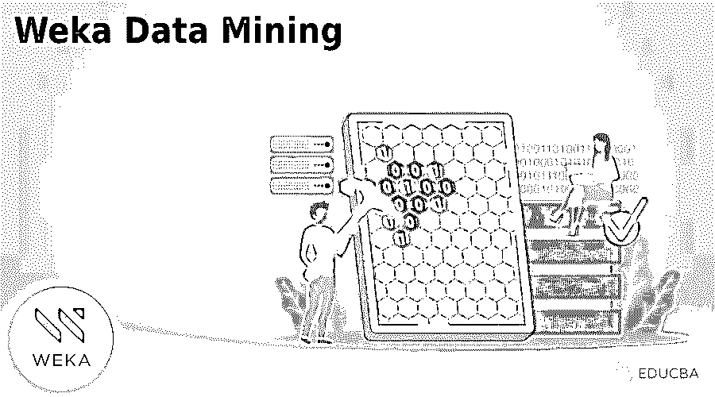
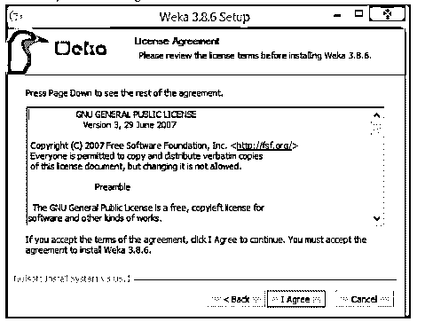
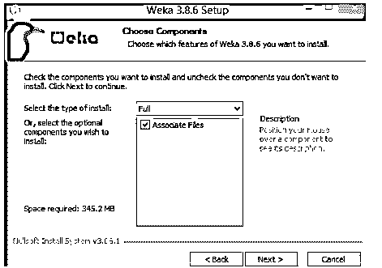
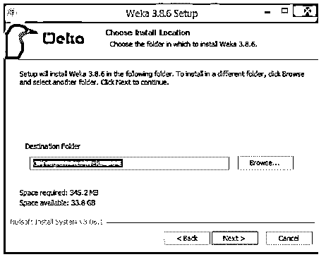
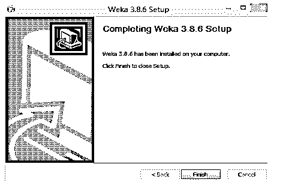
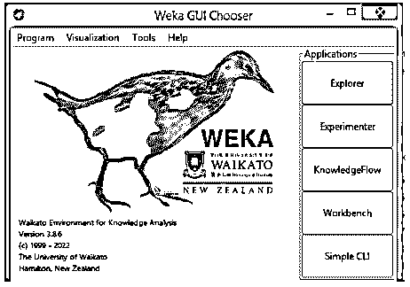
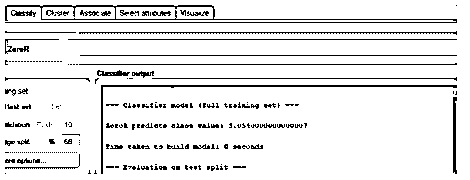
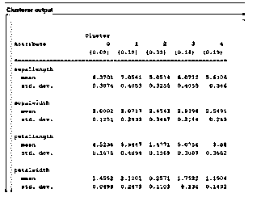
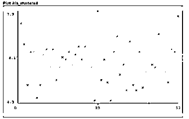

# Weka 数据挖掘

> 原文：<https://www.educba.com/weka-data-mining/>

## Weka 数据挖掘简介

基本上，Weka 只不过是用于数据挖掘的不同机器学习算法的集合。Weka 数据挖掘包含使用数据挖掘规则进行分类、回归和聚类的不同工具。Weka 是一个免费的开源工具，用于数据预处理以及不同机器算法的实现。换句话说，我们可以说它是用来解决现实世界的数据挖掘问题的。

### 关键要点

*   它是用于开发基于现实世界问题的机器学习模型的最强大的工具之一。
*   Weka 提供了实现不同类型的机器学习算法的平台。
*   它是免费开源的，可移植的，所以我们可以很容易地实现它。

### 什么是 Weka 数据挖掘？

它是新西兰怀卡托大学创建的人工智能编程系统。这个程序是用 Java 写的。它包含一组感知设备和计算，用于结合图形用户界面进行信息检查和预见性演示。Weka 支持一些标准的信息挖掘任务，更明确地说，信息预处理、群聚、表征、重现、表示和元素选择。

<small>Hadoop、数据科学、统计学&其他</small>

数据挖掘基本上用于分析大量的数据，或者我们可以说，它是一个处理原始数据集的过程，这些数据集用于进行商业登录，它将有助于增加业务。在数据挖掘中，我们可以使用任何类型的输入，如 CSV 文件、来自仓库的数据、CRM、普通数据和文本文件等。

通常数据挖掘有不同的步骤，如数据的获取、数据的清洗和数据集的整合。因为我们从不同的数据集收集数据，我们需要避免数据重复和原始数据。不同的模型可以应用于等效的数据集。然后，我们可以查看各种模型的结果，并选择符合我们前提条件的最佳模型。因此，Weka 的使用导致了人工智能模型的快速改进。

### 为什么要使用 Weka 数据挖掘？

让我们看看为什么我们需要实现 Weka 数据挖掘:

*   它对用户是免费的，这意味着我们可以使用公共许可证。
*   它是完全可移植的，这意味着它完全是在 Java 编程的帮助下开发的，因此我们可以在当今世界的任何平台上执行，以借助数据挖掘概念来解决实时问题。
*   基本上，它包括所有的数据挖掘处理以及所有的建模技术。
*   最重要的用途是，它提供了图形用户界面，这样我们就可以轻松地进行交互。

### 如何安装 Weka？

首先，我们需要确保安装的要求，这样我们就可以在不同的操作系统上安装 Weka，如 Windows、MAC OS 等。我们要求最低 Java 8 或更高版本，以及 Weka 的稳定版本。

*   先从官网下载 Weka。下载完成后，双击安装文件。
*   现在接受许可协议，如下图所示。

*   之后，我们需要选择组件并单击下一步按钮，如下图所示。

*   在下一步中，我们需要选择位置，否则我们可以使用默认位置，并单击安装按钮，如下图所示。

*   最后，我们需要点击完成按钮，如下图所示。

*   成功安装后，我们得到下面的屏幕。

*   在上面的截图中，我们可以看到不同类别的应用程序，并可以根据我们的要求选择任何一个。

### Weka 数据挖掘工具

基本上，它包含了可视化，因此实施、预测以及分析非常容易。它还提供了一个图形用户界面，用户可以方便地访问所有需要的功能。Weka 数据挖掘工具是一个完全基于 Java 的应用程序，建模算法可以很容易地通过 Java 实现，但我们必须确保在安装期间我们需要 Java 版本 8 或以上。

### Weka 数据挖掘功能

下面给出了不同的 weka 数据挖掘功能:

#### 1.预处理

这是 Weka 的一个基本特征，因为大部分时间收集的数据是原始的，所以很有可能包含冗余数据，或者我们可以说包含垃圾数据的空数据也向系统中添加了一些额外的数据，所以它降低了算法的性能。我们必须对原始数据进行预处理以获得更好的结果。Weka 向用户提供这种类型的过滤器。

#### 2.分类

分类是机器学习中使用的另一个特征。在实现机器学习算法的过程中，我们需要分配类别或不同类别的数据。选择类别或分类后，我们需要为分类的训练集选择选项，如训练集、提供的测试集和交叉验证。样本分类如下图所示。

#### 3.群聚；聚集

聚类用于将不同的组管理到相似的项目类别中。在此类别中，所有数据都具有相同的属性，但它属于不同的分类，如下所示。

我们还可以看到上面的聚类图，如下图所示。

#### 4.联想

它是用于确定数据和数据集之间关系的规则。换句话说，我们可以说，如果陈述定义了关系的概率。

#### 5.选择属性

我们知道原始数据包含了几个无意义的属性，所以那时候我们需要只选择有价值的属性，去掉不需要的属性。

#### 6.设想

它用于显示模型的矩阵和图形，示例图形如下图所示。

### 常见问题解答

下面是提到的常见问题:

#### Q 1。为什么我们使用 Weka 进行数据挖掘？

**答:**基本上，它提供了查看数据的可视化，我们还能够将不同的模型应用于同一数据集，因此比较将会很容易。

#### Q 2。我们在 Weka 中使用哪种编程语言？

**回答:**通常 Weka 是基于 java 的，但在安装时，我们必须要求至少 8 个 Java 版本。

#### Q 3。我们如何在 Weka 中预测结果？

**回答:**首先，我们需要使用预先标记的数据来训练数据集，并确保数据应该是 ARFF 格式。之后，我们需要加载已经训练好的模型，并选择未标记的数据进行预处理。

### 结论

在这篇文章中，我们看到了什么是 Weka 数据挖掘，以及我们也看到了一些基本的配置 Weka 数据挖掘的关键思想。我们还了解了 Weka 数据挖掘的用途和功能，以及如何使用它们。

### 推荐文章

这是 Weka 数据挖掘指南。这里我们讨论一下入门，为什么要用 weka 数据挖掘？安装、工具和功能。您也可以看看以下文章，了解更多信息–

1.  [数据挖掘的类型](https://www.educba.com/type-of-data-mining/)
2.  [数据挖掘过程](https://www.educba.com/data-mining-process/)
3.  [数据挖掘应用](https://www.educba.com/data-mining-applications/)
4.  数据块 CLI

