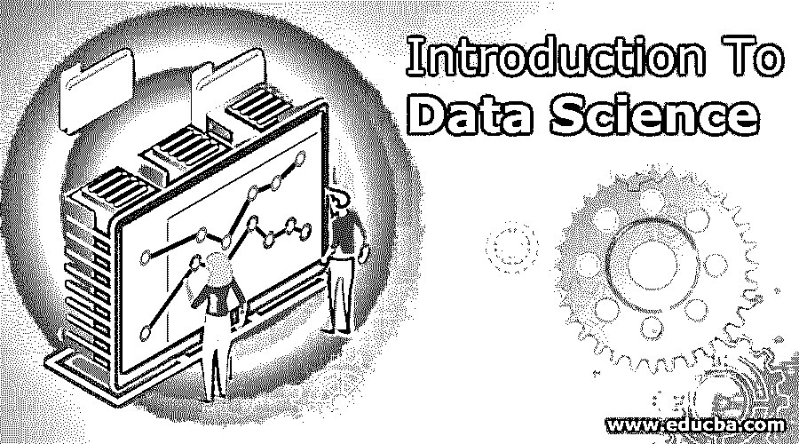
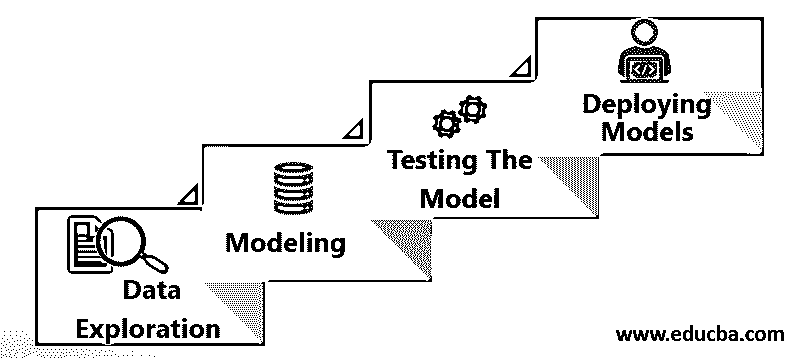
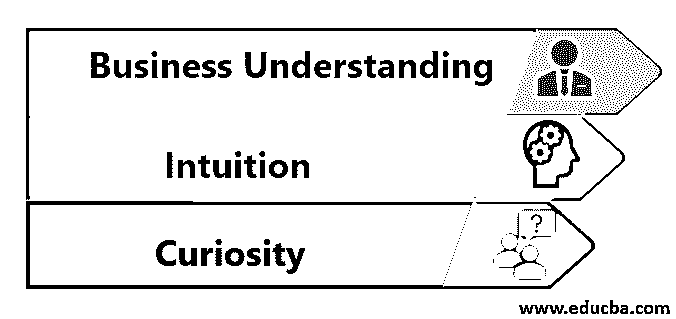
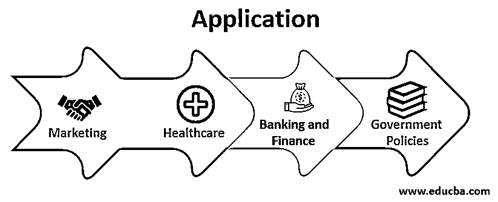

# 数据科学导论

> 原文：<https://www.educba.com/introduction-to-data-science/>

## 数据科学导论

下面的文章提供了数据科学导论的大纲。数据科学是这十年来发展最快、最具挑战性和高薪的工作之一。那么，问题来了，什么是数据科学？数据科学是一个跨学科领域(它由多个研究分支组成)，使用统计学、计算机科学和[机器学习算法](https://www.educba.com/machine-learning-algorithms/)从结构化和非结构化数据中获得洞察力。据《经济时报》报道，印度各行各业对数据科学专业人员的需求增长了 400%以上，而这类人才的供应增长缓慢。

### 数据科学的主要组成部分

主要组件或流程如下:

<small>Hadoop、数据科学、统计学&其他</small>

#### 1.数据探索

这是最重要的一步，因为这一步耗费的时间最多。大约 70%的时间花在数据探索上。数据科学的主要成分是数据，因此当我们获得数据时，数据很少处于正确的结构化形式。数据中存在大量噪声。这里的噪声意味着大量不需要的数据。那么这一步我们做什么呢？

这一步涉及数据的采样和转换，我们在其中检查观察值(行)和特征(列),并通过使用统计方法去除噪声。该步骤还用于检查数据集中各种特征(列)之间的关系；对于关系，我们是指功能(列)是相互依赖还是相互独立，是否有缺失值数据。因此，基本上，数据被转换并准备好供进一步使用。因此，这是最耗时的步骤之一。

#### 2.造型

因此，到目前为止，我们的数据已经准备就绪，随时可以使用。这是第二步，我们实际上使用机器学习算法。在这里，我们实际上将数据放入模型中。模型的选择取决于我们拥有的数据类型和业务需求。例如，向客户推荐商品的模型选择将不同于预测在特定一天将售出的商品数量所需的模型。一旦决定了模型，我们就将数据放入模型中。

#### 3.测试模型

这是下一步，也是关系到模型性能的非常重要的一步。使用测试数据对模型进行测试，以检查模型的准确性和其他特征，并对模型进行必要的更改以获得所需的结果。如果我们没有获得所需的精度，我们可以再次转到步骤 2(建模)，选择不同的模型，然后重复相同的步骤 3，并根据业务需求选择提供最佳结果的模型。

#### 4.部署模型

一旦我们根据业务需求通过适当的测试获得了想要的结果，我们就最终确定了模型，它根据测试结果为我们提供了最好的结果，并将模型部署到生产环境中。

### 数据科学的特征

其特点如下:

#### 1.商业理解

除非你懂业务，否则这是最重要的特征；即使你对机器学习算法或统计技能有很好的了解，你也无法做出一个好的模型。数据科学家需要了解业务需求，并根据这些需求开发分析。因此，业务领域的知识也变得重要或有用。

#### 2.直觉

虽然所涉及的数学是经过验证的基础，但数据科学家需要选择具有正确准确性的正确模型，因为所有模型都不会给出相同的结果。因此，数据科学家需要知道模型何时可以投入生产部署。他们还需要直觉来知道生产模型在什么时候过时了，需要重构来响应不断变化的业务环境。

#### 3.好奇心

数据科学不是一个新领域。以前也有过，但是这个领域的进展非常快。解决常见问题的新方法在不断开发，因此，作为一名数据科学家，学习新兴技术的好奇心变得非常重要。

### 应用程序

在《数据科学导论》中，我们已经阐明了数据科学应用的巨大潜力。每个领域都需要。以下是一些可以使用或正在积极使用数据科学的行业示例。

#### 1.营销

市场营销的范围很大；例如，像优步这样的改进定价策略的公司，电子商务公司可以使用数据科学驱动的定价，增加他们的利润。

#### 2.卫生保健

使用可穿戴数据来预防和监控健康问题。从身体产生的数据可以用于医疗保健，以防止未来的紧急情况。

#### 3.银行和金融

正如我们现在讨论的数据科学简介一样，我们将继续将数据科学应用于[银行业的欺诈检测](https://www.educba.com/fraud-detection-analytics/)，这有助于减少银行的不良资产。

#### 4.政府政策

政府可以使用数据科学来制定更好的政策，以满足人民的需求以及他们通过调查和其他官方来源获得的数据。

### 数据科学的优势和劣势

下面是提到的优点和缺点:

#### 优势:

*   它通过其强大的工具帮助我们从历史数据中获得洞察力。
*   它有助于优化业务、雇用合适的人员并产生更多收入，因为使用数据科学有助于您为业务做出更好的未来决策。
*   公司可以更好地开发和营销他们的产品，因为他们可以更好地选择他们的目标客户。
*   数据科学的介绍也有助于消费者搜索更好的商品，尤其是在基于数据驱动推荐系统的电子商务网站中。

#### 缺点:

*   缺点通常是当数据科学用于客户特征分析和侵犯客户隐私时。
*   他们的信息，如交易、购买和订阅，对其母公司是可见的。
*   利用数据科学获得的信息可以用来对付某个群体、个人、国家或社区。

### 推荐文章

这是一本介绍数据科学的指南。在这里，我们讨论了数据科学简介的主要组件和特征。您也可以阅读以下文章，了解更多信息——

1.  [数据科学应用](https://www.educba.com/data-science-applications/)
2.  [数据科学机器学习](https://www.educba.com/data-science-machine-learning/)
3.  [预测分析与数据科学](https://www.educba.com/predictive-analytics-vs-data-science/)
4.  [数据科学生命周期](https://www.educba.com/data-science-lifecycle/)

