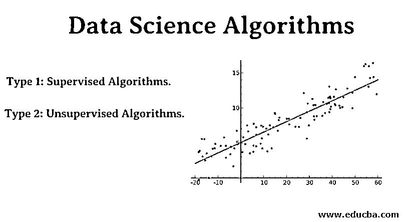
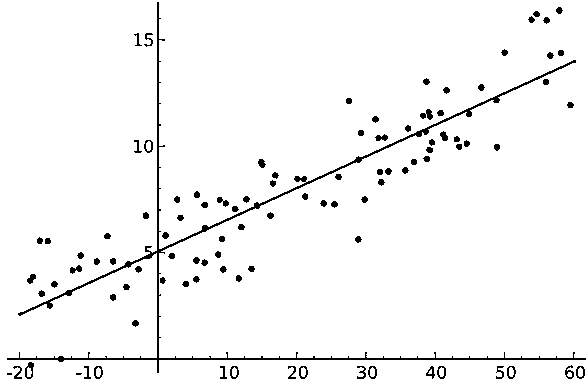
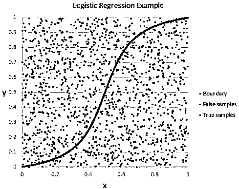
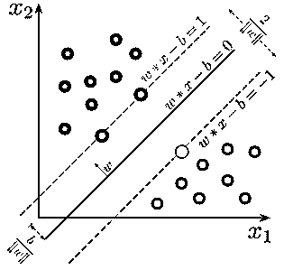

# 数据科学算法

> 原文：<https://www.educba.com/data-science-algorithms/>

## 数据科学算法简介

对数据科学中使用的基本算法的高级描述。如您所知，数据科学是一个基于我们从数据中获得的洞察力而不是传统的基于规则的确定性方法来做出决策的研究领域。通常，我们可以将机器学习任务分为三个部分。

*   获取数据并映射业务问题，
*   应用[机器学习技术](https://www.educba.com/machine-learning-techniques/)并观察性能指标
*   测试和部署模型

在整个生命周期中，我们使用各种数据科学算法来解决手头的任务。本文将根据学习类型对最常用的算法进行分类，并对这些算法进行高层次的讨论。

<small>Hadoop、数据科学、统计学&其他</small>

### 数据科学算法的类型

我们可以简单地根据学习方法将机器学习或数据科学算法分为以下类型。

1.  监督算法
2.  无监督算法

#### 1.监督算法

顾名思义，监督算法是一类机器学习算法，其中模型是用带标签的数据训练的。例如，根据历史数据，您希望预测客户是否会拖欠贷款。在标记数据的预处理和特征工程之后，在结构化数据上训练监督算法，并在新的数据点上测试，或者在这种情况下，预测贷款违约者。让我们深入研究最流行的[监督机器学习算法](https://www.educba.com/supervised-machine-learning-algorithms/)。

##### k 个最近邻居

k 近邻(KNN)是最简单但功能强大的[机器学习算法](https://www.educba.com/machine-learning-algorithms/)之一。这是一种监督算法，基于 k 个最近的数据点进行分类。KNN 背后的想法是相似的点聚集在一起；通过测量最近的数据点的属性，我们可以对测试数据点进行分类。例如，我们解决一个标准的分类问题，其中我们希望预测一个数据点属于 A 类还是 b 类。现在我们将测试测试数据点的 3 个最近的数据点；如果其中两个属于 A 类，我们将把测试数据点声明为 A 类，否则为 b 类。通过交叉验证找到 K 的正确值。它具有线性时间复杂度，因此不能用于低延迟应用。

##### 线性回归

线性回归是一种受监督的数据科学算法。

**输出:**

**

** 

变量是连续的。想法是找到一个超平面，其中最大数量的点位于该超平面中。例如，预测降雨量是一个标准的回归问题，可以使用线性回归。线性回归假设自变量和因变量之间的关系是线性的，并且很少或没有多重共线性。

##### 逻辑回归

尽管名字是回归，逻辑回归是一种监督分类算法。

**输出:**

几何直觉是，我们可以使用线性决策边界来分离不同的类别标签。逻辑回归的输出变量是分类的。请注意，我们不能使用均方误差作为逻辑回归的成本函数，因为它对于逻辑回归是非凸的。

##### 支持向量机

在逻辑回归中，我们的主要座右铭是找到一个分离的线性曲面。

**输出:**

我们可以将支持向量机视为这一思想的扩展，以找到最大化边缘的超平面。但是什么是保证金呢？.对于一个向量 W(我们需要想出的决策面)，我们在两边画两条平行线。这两条线之间的距离称为边距。SVM 假设数据是线性可分的。虽然我们也可以使用核技巧将 SVM 用于非线性数据。

##### 决策图表

决策树是一个嵌套的基于 If-Else 的分类器，它使用类似树的图形结构来做出决策。决策树是流行的，也是整个数据科学领域中最常用的监督机器学习算法之一。在大多数情况下，它提供了比其他监督算法更好的稳定性和准确性，并且对异常值具有鲁棒性。决策树的输出变量通常是分类的，但它也可以用来解决回归问题。

##### 全体

集成是数据科学算法的一个流行类别，其中多个模型用于提高性能。如果你熟悉 Kaggle(谷歌的一个平台，用于在数据科学挑战中练习和竞争)，你会发现使用一些集合的最赢家解决方案。

我们可以将合奏大致分为以下几类。

*   制袋材料
*   助推
*   堆垛
*   级联

随机森林、梯度推进决策树是一些流行的集成算法的例子。

#### 2.无监督算法

无监督算法用于数据未标记的任务。无监督算法最流行的用例是聚类。聚类是在没有人工干预的情况下将相似的数据点组合在一起的任务。让我们在这里讨论一些流行的[无监督机器学习](https://www.educba.com/unsupervised-machine-learning/)算法

##### k 表示

k 均值是一种用于聚类的随机无监督算法。k 表示遵循以下步骤

1.随机初始化 K 个点(c1，c2..ck)

2.对于数据集中的每个点(Xi)

选择最近的 Ci {i=1，2，3..k}

将 Xi 添加到配置项

3.使用适当的度量标准(即簇内距离)重新计算质心

4、重复步骤(2)(3)直到收敛

##### k 是++的意思

K 均值中的初始化步骤是完全随机的，并且基于初始化，聚类会发生剧烈变化。K means++通过以概率的方式初始化 k 而不是纯粹的随机化来解决这个问题。K 均值++比经典 K 均值更稳定。

##### k 水母

K medoids 也是一种基于 K 均值的聚类算法。两者的主要区别是 K 均值的质心不一定存在于数据集中，而 K 均值的质心不存在于数据集中。k-medoids 提供了更好的聚类解释能力。K 均值最小化总平方误差，而 K 中值最小化点之间的不相似性。

### 结论

在本文中，我们讨论了数据科学中最流行的机器学习算法。做完这些，你可能会想到一个问题 **'** 哪种算法最好？**’**显然，这里没有赢家。这完全取决于手头的任务和业务需求。作为最佳实践，它总是从最简单的算法开始，逐渐增加复杂性。

### 推荐文章

这是数据科学算法的指南。在这里，我们详细讨论了数据科学算法概述和两个数据科学算法。您也可以浏览我们的文章，了解更多信息——

1.  [数据科学平台](https://www.educba.com/data-science-platform/)
2.  [数据科学语言](https://www.educba.com/data-science-languages/)
3.  [分类算法](https://www.educba.com/classification-algorithms/)
4.  [创建决策树的简单方法](https://www.educba.com/create-decision-tree/)
5.  [机器学习的类型](https://www.educba.com/types-of-machine-learning/)

