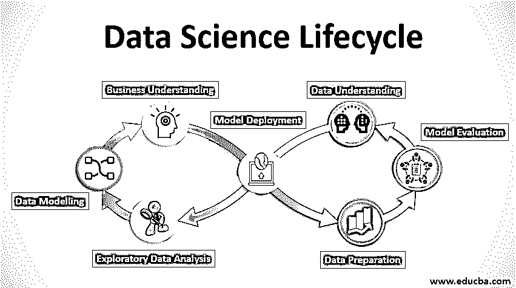

# 数据科学生命周期

> 原文：<https://www.educba.com/data-science-lifecycle/>

## 数据科学生命周期简介

数据科学生命周期围绕着使用机器学习和其他分析方法从数据中产生见解和预测，以实现业务目标。整个过程包括几个步骤，如数据清理、准备、建模、模型评估等。这是一个漫长的过程，可能需要几个月才能完成。因此，对于手头的每个问题，有一个通用的结构来遵循是很重要的。全球公认的解决任何分析问题的结构是跨行业的数据挖掘标准流程或 CRISP-DM 框架。

### 数据科学的生命周期

下面是数据科学项目的生命周期。

<small>Hadoop、数据科学、统计学&其他</small>

#### 1.商业理解

整个循环围绕着业务目标。如果你没有一个精确的问题，你会解决什么？清楚地理解业务目标是很重要的，因为这将是你分析的最终目标。只有我们能够在正确理解之后，设定与业务目标同步的具体分析目标。你需要知道客户是想减少信用损失，还是想预测商品价格等等。

#### 2.数据理解

业务理解之后，下一步就是数据理解。这包括收集所有可用的数据。如果您与业务团队密切合作，了解存在哪些数据、哪些数据可用于解决该业务问题以及其他信息，将会有所帮助。这一步包括描述数据、它们的结构、它们的相关性、它们的数据类型。使用图形图探索数据。基本上，通过探索数据来提取你能得到的关于数据的任何信息。

#### 3.数据准备

接下来是数据准备阶段。这包括选择相关数据、通过合并数据集整合数据、清理数据、通过移除或输入数据来处理缺失值、通过移除数据来处理错误数据，以及使用箱线图检查异常值并处理它们。构建新数据，从现有数据中获取新特征。将数据格式化为所需的结构，移除不需要的列和要素。数据准备是整个生命周期中最耗时也是最重要的一步。你的模型会和你的数据一样好。

#### 4.探索性数据分析

这一步包括在构建实际模型之前，对解决方案和影响它的因素有所了解。数据在不同特征变量中的分布使用条形图进行图形化探索；不同特征之间的关系通过散点图和热图等图形表示来捕捉。许多其他数据可视化技术被广泛用于单独探索每个要素，并将它们与其他要素相结合。

#### 5.数据建模

数据建模是数据分析的核心。模型将准备好的数据作为输入，并提供所需的输出。这一步包括选择适当的模型类型，无论问题是分类问题、回归问题还是聚类问题。在选择了模型系列之后，在该系列的各种算法中，我们需要选择要实现的算法，并仔细地实现它们。我们需要调整每个模型的超参数，以实现所需的性能。我们还需要确保在性能和可推广性之间有一个正确的平衡。我们不希望模型学习数据，而在新数据上表现不佳。

#### 6.模型评估

在这里，评估模型是为了检查它是否准备好被部署。该模型在看不见的数据上进行测试，在一组经过仔细考虑的评估指标上进行评估。我们还需要确保模型符合现实。如果我们在评估中没有获得满意的结果，我们必须重新迭代整个建模过程，直到达到期望的度量水平。任何数据科学解决方案，一个[机器学习模型](https://www.educba.com/machine-learning-models/)，就像人类一样，应该进化，应该能够用新数据改进自己，适应新的评估指标。我们可以为某个现象建立多个模型，但很多模型可能并不完美。模型评估帮助我们选择和建立一个完美的模型。

#### 7.模型部署

经过严格评估后，该模型最终以期望的格式和渠道部署。这是数据科学生命周期的最后一步。上面解释的数据科学生命周期中的每一步都应该认真对待。任何一步执行不当，都会影响下一步，整个努力就白费了。例如，如果数据收集不当，您将丢失信息，并且您将无法构建一个完美的模型。如果数据清理不当，模型将不起作用。如果模型评估不当，它将在现实世界中失败。从业务理解到模型部署，每一步都应该给予适当的关注、时间和努力。

### 推荐文章

这是数据科学生命周期指南。在这里，我们讨论数据科学生命周期的概述以及构成数据科学生命周期的步骤。您也可以浏览我们的相关文章，了解更多信息——

1.  [数据科学算法简介](https://www.educba.com/data-science-algorithms/)
2.  [数据科学与软件工程| 8 大有用对比](https://www.educba.com/data-science-vs-software-engineering/)
3.  [不同类型的数据科学技术](https://www.educba.com/data-science-techniques/)
4.  [数据科学技能与类型](https://www.educba.com/data-science-skills/)
5.  [探索性数据分析指南](https://www.educba.com/exploratory-data-analysis/)

