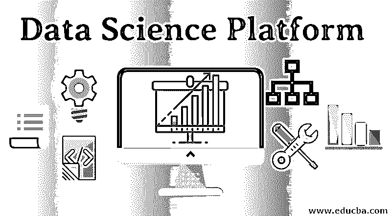
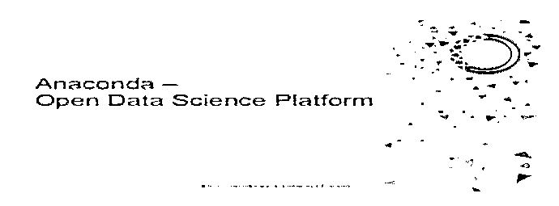
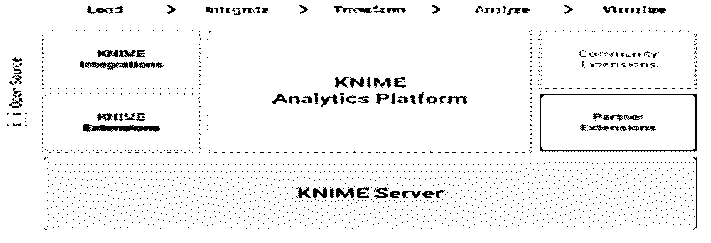
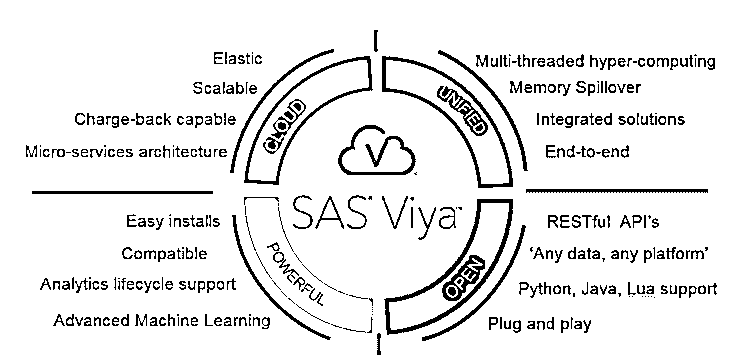

# 数据科学平台

> 原文：<https://www.educba.com/data-science-platform/>

## 数据科学平台简介

数据科学平台是一套不同的工具，负责整个数据建模过程。数据科学平台使数据科学家能够从数据源收集的数据中挖掘出有价值的见解。它不仅能产生洞察力，还能帮助数据科学家团队将结果可视化并传达给关键客户和利益相关方。数据科学平台使企业在做出数据驱动的决策时具有优势，从而最大限度地提高产量和客户满意度。随着技术的不断发展，数据科学平台通过将最新的[数据科学工具](https://www.educba.com/data-science-tools/)添加到清单中，为团队提供了更好的灵活性和可扩展性。

### 不同的数据科学平台

不同的数据科学平台如下:

<small>Hadoop、数据科学、统计学&其他</small>

#### 1.Anaconda 平台

Anaconda platform 是用于科学计算的 python 和 R 语言的免费开源发行版。它使用 Conda(“包管理系统”)简化了包管理和部署。Anaconda 涵盖了多达 1500 个流行的数据科学包，目前有 1500 万用户在使用(据该公司称)。这个平台可以在 Windows、Linux 和 macOS 上使用。Anaconda Navigator GUI 是 Anaconda 平台的一个优点，因为它比 CLI 好。导航器可以在 anaconda 云或本地存储库上搜索包，安装它们，并根据需要更新它们。

#### 2.H2o.ai 平台

H2O.ai 是一个开源、免费分发的平台。它正在努力使人工智能和人工智能更容易。H2O 在新手和专家数据科学家中很受欢迎。H2O.ai 机器学习套件。

*   **H2O:** 建立和生产数据模型的平台。
*   **深水:**与 TensorFlow、MXNet 和 Caffe 集成，用于 Dl 工作负载。
*   **苏打水:**与 Apache Spark 的整合。
*   公司的企业产品，用于构建和部署应用程序以及 API。(付费版)。
*   **无人驾驶人工智能:**非技术员工在不了解任何技术细节的情况下，为特定业务问题准备数据、调整参数、确定最佳解决方案的简化功能。T3T5】

#### 3\. KNIME

KNIME 是一个免费的开源平台。KNIME 使用不同的数据科学工具用于 [ML 和数据挖掘](https://www.educba.com/data-mining-vs-machine-learning/)；其模块化数据管道概念使其成为一个完整的数据科学平台(数据分析、报告、集成)。此外，KNIME 的 GUI 和 JDBC 允许用户使用不同的数据源进行分析、建模和可视化，无论有没有编程。KNIME 最初是作为一个药物研究工具开始的，但是模块化的概念为不同的领域做出了适当的选择。

#### 4.Alteryx 分析

Alteryx Analytics 是许多跨国公司使用的领先数据科学平台之一。该平台不是开源的，但旨在使每个数据专家和新手都能轻松进行高级分析。

该公司目前在其分析套件下提供四种产品。

*   Alteryx 连接
*   Alteryx 设计器
*   Alteryx 升级
*   Alteryx 服务器

Alteryx 最受欢迎的程序是自助分析。它为 BI 分析师提供了可重复使用的自助服务数据工作流，因此您可以花更少的时间准备数据，投入更多的时间进行分析。它的拖拽界面对于非技术用户来说也不错。

#### 5.快速采矿机

Rapidminer 是一个集成的数据科学平台，可提供高级预测分析。它用于小型和大型商业应用以及研究、教育、培训、快速原型制作和应用开发。这是一个付费软件，但在 AGPL 许可下，1 个逻辑处理器可以免费使用。

Rapidminer 目前提供五种产品。

*   **Rapidminer 工作室:**是平台本身。
*   **Rapidminer Auto Model:** 它是 Studio 的一个扩展，可以加速模型的构建和验证。
*   **Rapidminer Turbo Prep:** 它旨在使数据准备更容易。它提供了一个用户界面，您的数据总是可见的前端和中心。
*   **Rapidminer 服务器:**这是一款专为优化性能而设计的应用程序专用服务器。
*   Rapidminer Radoop: 是针对 Hadoop 技术的集成。T3T5】

#### 6.数据砖

Databricks 是一个开源的基于云的数据科学平台，在 apache Spark 计算框架上开发。它是由加利福尼亚大学开发 Apache Spark 的团队开发的。Databricks 统一分析套件包括:

*   **Databricks Workspace:** 它处理所有的分析过程，从 ETL 到训练模型和部署。(比如 python，R，Java)。
*   Databricks 运行时:它在大规模上准备干净的数据，并为您的 AI 应用程序训练 ML 模型。(比如 Hadoop，TensorFlow)。
*   **Databricks 云服务:**作为基于云的服务，它降低了基础设施的复杂性，有更多的时间关注数据问题，同时保持数据的管理和安全(AWS、Azure)。T3T5】

#### 7.SAS 统一数据科学

SAS 是最古老的数据科学平台之一。它在一个包中提供大数据、高级分析和预测分析。SAS 软件套件还为非技术用户提供 GUI，为技术用户提供 SAS 语言。SAS 系统模块附带各种工具，如 Base SAS、SAS/STAT、SAS/ETS、SAS/OR、SAS/QR、SAS/Graph、SAS AF、SAS/Access 等。SAS Viya 是 SAS 公司的又一个产品:一个开放的、强大的、统一的、基于多平台的平台。它提供了多种安装选项，如现场安装、云安装和混合安装。SAS Viya 使用 Teradata 数据存储集进行运营。

### 结论

数据科学平台是当今时代的需要。今天，我们正在产生前所未有的大量数据。使用数据科学工具，我们可以帮助我们这一代人过上更好的生活，如上所述。数据科学平台正在许多领域为我们提供帮助。

*   医疗保健和生命科学
*   信息技术
*   银行、金融服务和保险(BFSI)
*   制造业
*   能源和公用事业
*   研究

预计未来 5 到 7 年，全球数据科学平台市场将以 40%的 CAGR 增长。在 2016-17 财年期间，全球数据科学平台市场占 200 亿美元(根据数据桥市场研究)。不幸的是，尽管数据科学平台在许多领域为我们提供了帮助，但我们却严重缺乏劳动力来完成这项任务。根据 LinkedIn 劳动力报告，仅在美国就有超过 151，000 个数据科学家职位空缺。

### 推荐文章

这是数据科学平台的指南。在这里，我们讨论了数据科学平台的简介和不同类型，并给出了详细的解释。您也可以浏览我们推荐的其他文章，了解更多信息——

1.  [数据科学工具](https://www.educba.com/data-science-tools/)
2.  [数据科学语言](https://www.educba.com/data-science-languages/)
3.  [数据科学职业](https://www.educba.com/data-science-career/)
4.  [数据科学生命周期](https://www.educba.com/data-science-lifecycle/)

