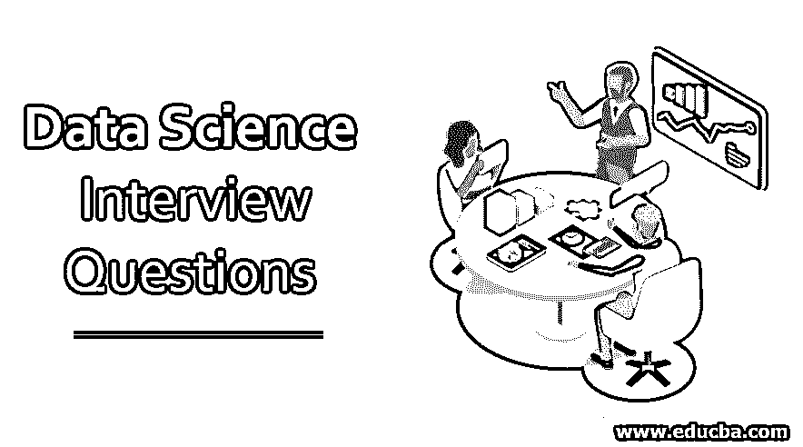

# 数据科学面试问题

> 原文：<https://www.educba.com/data-science-interview-questions/>

## 数据科学简介面试问答

以下是 2022 年数据科学面试中最常被问到的问题列表如下:

### 第 1 部分—数据科学面试问题(基础)

这第一部分包括基本的面试问题和答案。

<small>Hadoop、数据科学、统计学&其他</small>

#### Q1。什么是数据科学？

**答案:**

数据科学是不同科学方法、技术、流程和知识的跨学科领域，用于将不同类型的数据(如结构化、非结构化和半结构化数据)转换为所需的格式或表示形式。数据科学概念包括不同的概念，如统计、回归、数学、计算机科学、算法、数据结构和信息科学，还包括一些子领域，如数据挖掘、机器学习和数据库等。,

数据科学概念最近在计算技术中发展到更大程度，以对现有数据执行数据分析，其中数据以指数形式随时间增长。数据科学研究各种类型的数据，如结构化、半结构化和非结构化数据，以任何形式或格式获取一些信息。数据科学由用于研究数据的不同技术组成，如数据挖掘、数据存储、数据清除、数据存档、数据转换等。，使之高效有序。数据科学还包括模拟、建模、分析、机器学习、计算数学等概念。,

#### Q2。在数据科学中使用哪种编程语言最好？

**答案:**

数据科学可以通过使用像 Python 或 R 编程语言这样的编程语言来处理。这两种语言是数据科学家或数据分析师最常用的两种语言。r 和 Python 是开源的，可以免费使用，在 20 世纪 90 年代出现。Python 和 R 有不同的优势，这取决于应用程序和所需的业务目标。Python 更适合用于重复任务或工作的情况以及数据操作。相比之下，R 编程可以用于查询或检索数据集和定制的数据分析。

大多数情况下，Python 是所有类型的数据科学应用程序的首选，而 time R 编程是高级或复杂数据应用程序的首选。Python 更容易学习，学习曲线更短，而 R 的学习曲线很长。Python 在所有情况下都是首选的，它是一种通用编程语言，可以在除数据科学之外的许多应用程序中找到。r 主要出现在数据科学领域，仅用于独立服务器中的数据分析或单独计算。

### 第 2 部分—数据科学面试问题(高级)

现在让我们来看看高级面试问题:

#### Q3。为什么数据清理在数据科学中至关重要？

**答案:**

数据清理在数据科学中更为重要，因为数据分析结果来自现有数据，其中无用或不重要的数据需要在不需要时定期清理。这确保了数据的可靠性和准确性，也释放了内存。数据清理减少了数据冗余，并在存在大量客户信息并应定期清理的数据分析中提供了良好的结果。在电子商务、零售、政府机构等企业中，包含大量过时的客户交易信息，需要进行清理。

根据数据的数量或大小，应使用合适的工具或方法从数据库或大数据环境中清理数据。数据源中存在不同类型的数据，如脏数据、干净数据、干净数据和脏数据的混合以及干净数据样本。现代数据科学应用依赖于机器学习模型，学习者从现有数据中学习。因此，在系统优化期间，现有的数据应该始终是干净的，并得到良好的维护，以获得复杂和良好的结果。

#### Q4。什么是数据科学中的线性回归？

**答案:**

以上是面试中常见的数据科学面试问题。线性回归是一种用于监督机器学习的技术，是数据科学中的算法过程。这种方法用于预测分析。

预测分析是统计科学中的一个领域，其中现有的信息将被提取和处理，以预测趋势和结果模式。该学科的核心在于分析现有的背景来预测未知的事件。

线性回归方法的过程是通过在因变量和自变量之间建立最佳关系来预测一个称为目标变量的变量。这里的因变量是结果变量和响应变量，而自变量是预测变量或解释变量。

例如，在现实生活中，根据本财政年度发生的费用或每月费用，通过计算即将到来的月份或财政年度的大致费用来进行预测。在这种方法中，可以使用 Python 编程技术来实现，其中最重要的方法被用在数据科学领域下的机器学习技术中。线性回归也称为回归分析，属于统计科学领域，与数据科学相结合。

#### Q5。什么是数据科学中的 A/B 测试？

**答案:**

A/B 测试也称为桶测试或分割测试。这是一种比较和测试两个版本的系统或应用程序以确定哪个版本的应用程序性能更好的方法。当向客户或最终用户展示多个版本以实现目标时，这一点非常重要。在数据科学中，这种 A/B 测试用于了解现有两个变量中的哪个变量可以优化或增加目标的结果。A/B 测试也称为实验设计。这种测试有助于在自变量和因变量之间建立因果关系。

这种测试也是设计实验或统计推断的简单组合。显著性、随机化和多重比较是 A/B 测试的关键要素。显著性是所进行的统计检验的显著性的术语。随机化是实验设计的核心组成部分，其中变量是平衡的。多重比较是在顾客兴趣的情况下比较更多变量的方式，这导致更多的误报，从而导致在电子商务中需要修正卖方的信心水平。

A/B 测试是数据科学领域中预测结果的一个重要测试。

### 推荐文章

这是数据科学面试问题和答案的指南，以便候选人可以轻松解决这些数据科学面试问题。您也可以阅读以下文章，了解更多信息——

1.  [男性面试着装技巧](https://www.educba.com/interview-grooming-tips/)
2.  [信用分析师面试问题](https://www.educba.com/credit-analyst-interview-questions/)
3.  [面试准备技巧](https://www.educba.com/tips-for-the-interview-preparation/)
4.  [MBA 面试问题](https://www.educba.com/interview-questions-of-mba/)

