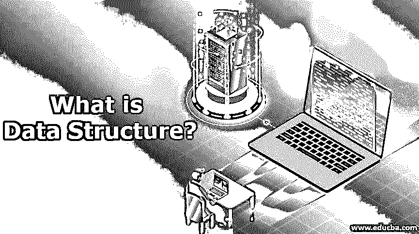
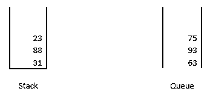
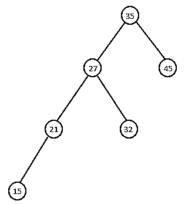

# 什么是数据结构？

> 原文：<https://www.educba.com/what-is-data-structure/>

## 什么是数据结构？

数据结构包括来自数据管理、数据组织和数据存储的所有形式的数据，以便为使用数据开展业务的用户提供适当的访问权限。收集和管理所有形式的数据，维护它们之间的关系，并执行与数据相关的操作。也可以从存储空间中检索数据。任何数据结构的基础都是很好的安排数据。可以用不同的方式适当地访问和处理数据。两种主要的结构是数组和链接数据结构。

### 数据结构的类型

有各种类型的数据结构，特定类型的使用和应用取决于数据结构必须应用的上下文。一些重要的数据结构已经在下一节讨论过了。

<small>Hadoop、数据科学、统计学&其他</small>

#### 1.链表

它是一种由节点组成的数据结构。这些节点存储数据，一个节点通过指针连接到另一个节点。因此，我们有一系列的节点链接成一个系列，基本上显示为一个列表，因此名称。链表中的一个节点有两部分。第一部分存储数据值，第二部分引用另一个节点。

有两种类型的链表，即。单链表和双链表。单链表是一种链表，其中一个节点引用下一个节点。[双向链表](https://www.educba.com/doubly-linked-list-in-data-structure/)指的是一种链表，其中一个节点引用下一个和前一个节点。这两种类型的链表的图示如下所示。

**单链表:**

**双向链表:**

#### 2.堆栈和队列

这些是本质上是动态的集合。这里，删除操作决定了数据结构的性质。解释如下:在堆栈中，被删除的元素是最近插入的元素，即堆栈执行后进先出(LIFO)方法来执行删除操作。对于队列，遵循的方法是不同的。在队列的情况下，首先进入数据结构的元素是第一个出来的。因此，队列遵循先进先出(FIFO)方法进行删除操作。所以堆叠就像一堆碟子或盘子，其中第一个放在底部，永远不会是第一个出来的。而队列就像一根两端都敞开的管子，先进去的先从另一端出来。

在堆栈的情况下，插入操作被称为 Push，因为元素被推入堆栈。栈的删除操作称为 Pop，因为我们弹出元素来取出它。在队列的情况下，插入操作称为入队；而另一方面，删除操作被称为出列。

#### 3.二分搜索法树

二分搜索法树是简单的数据结构。顾名思义，它基于两种价值观的理念。最初，我们有一个存储一些值的根节点，比如 x。在下一层，我们有两个分支。左边的分支指向代表所有小于 x 的值的节点，而右边的分支指向代表所有大于 x 的值的节点。树分成几个分支的过程基于二元条件继续发生，我们得到一个二叉树。使用这种数据结构排列的数据允许有效的搜索操作。

**二叉查找树的视觉表现:**

#### 4.设置

这些是包含各种值的数据结构。但是，这些值没有特定的顺序。这个概念的基本思想是，一个集合中的值不同于其他集合中的值。数学上，一个集合表示为 A = {3，8，14，33，61}。因此，花括号中的值列表构成了一个集合。像并集和交集这样的操作可以在集合上执行。集合可以是有序的，也可以是无序的。一个无序的集合，元素不需要以任何特定的方式排序，例如 B = {5，3，11，2}。

在有序集合的情况下，元素以特定的系统方式排序，例如 C = {4，12，25，36，63}。在集合 C 中，我们找到了按升序排列的元素。在集合运算中，最重要的事情是检查要添加到集合中的项目是否已经存在。在有序集合的情况下，与无序集合的情况相比，执行检查所涉及的工作要稍微少一些。

### 数据结构的重要性

*   [数据结构允许](https://www.educba.com/what-is-data-structure/)程序员以最有效的方式管理数据，从而提高算法的性能。
*   它们允许实施科学方法，而不是传统方法。当涉及到诸如处理速度、处理多个请求和搜索大量记录等方面时，数据结构证明是方便的。
*   它们允许有效地使用内存。数据结构优化内存使用。这通常在涉及处理大型数据集的情况下会产生影响。
*   数据结构是可重用的。它们可以作为一个包集成到库中。不同的利益相关者可以根据需要在不同的情况下使用这些库。
*   它们允许一个特定问题有多个解决方案，允许用户选择数据结构以最佳方式解决问题。

### 结论

使用数据结构有助于用户有效地执行数据操作。各种操作，如插入、删除、搜索等。，可以使用它们来执行。一项任务可以使用多种数据结构来执行，但是选择特定类型的数据结构应该基于上下文。

### 推荐文章

这是一本什么是数据结构的指南？.在这里，我们讨论不同类型的数据结构和重要性以及例子。您也可以浏览我们推荐的文章，了解更多信息——

1.  [免费数据分析工具](https://www.educba.com/free-data-analysis-tools/)
2.  [数据分析技术的类型](https://www.educba.com/types-of-data-analysis-techniques/)
3.  [数据分析 vs 数据分析](https://www.educba.com/data-analytics-vs-data-analysis/)
4.  [什么是数据集成？](https://www.educba.com/what-is-data-integration/)

