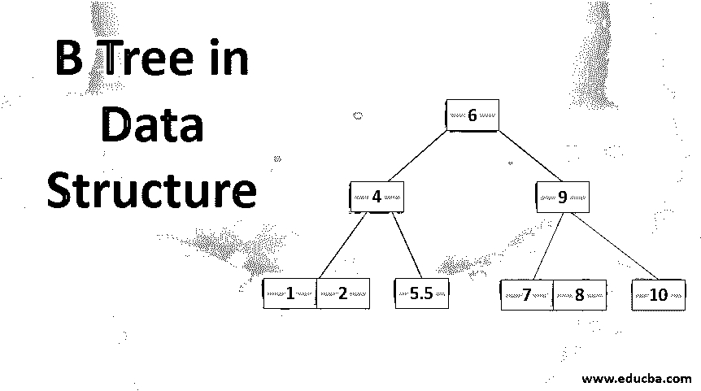
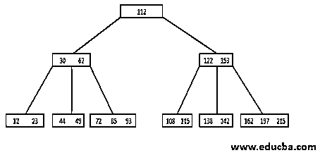
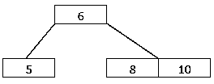
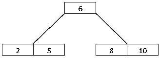

# 数据结构中的 b 树

> 原文：<https://www.educba.com/b-tree-in-data-structure/>

## 数据结构中的 B 树介绍

b 树是一种数据结构，它存储数据并允许系统地进行诸如搜索、插入和删除之类的操作。有一些与 B 树相关的方面，以平衡的形式处理树。因此，对于平衡树，每个节点中应该有 n/2 个键，n 是 B 树的顺序。其他考虑如下。

*   所有叶节点必须出现在同一级别。
*   所有节点最多可以有 n–1 个键。
*   根至少有两个子代。
*   n 是子节点的最大数量，k 是每个节点可以包含的键的数量。
*   至少有 n/2 个子代，最多有 n 个非空子代。
*   该树被分割，使得左子树中的值应该小于右子树中的值。

### b 树可视化表示

B 树的一个示例可视化表示如下所示。这是一棵平衡树，遵循与概念相关的所有约束。

<small>Hadoop、数据科学、统计学&其他</small>

在上面的 B 树中，所有的叶节点都在同一层。非叶节点中的键数少于子节点中的键数。

### B 树数据结构是如何工作的？

让我们通过插入和删除操作来理解 B 树的工作原理。在 B 树中插入一个键有两种情况。首先，节点未满，其次，节点已经满了。如果节点是未满的叶节点，则在该节点中插入一个键。如果节点已满，则该节点会在中间位置被拆分为两个节点，标高保持不变，标高会升高中间元素。

#### 1.插入操作

我们将看到对于 6、10、5、8、2、4、9、7、1 和 5.5 的集合，插入是如何发生在 B 树中的。

*   插入的第一个元素是 6。

*   下一个要插入的元素是 10。它大于 6，因此将位于它的右侧，如下所示。

*   5 小于 6，所以它位于树的左侧，如下所示。

*   现在，在插入下一个元素之前，检查树是否已满。由于树现在已满，所以分配了一个新的空节点。这个节点成为根节点，而之前的根节点被拆分，新的根节点包含 6 个节点。因此，当 8 插入树中时，排列如下所示。

*   下一个要插入的元素是 2。它将在 5 之前进入左子树。现在的排列如下所示。

*   现在，要插入的下一个元素是 4。当它小于 6 时，它进入左边的子树。它在节点中占据中间位置，如下面的 B 树排列所示。

*   下一步至关重要。我们现在有 9 和 7 作为下两个要插入到 B 树中的元素。在这种情况下，由于节点已满，所以它被拆分，中间的子节点被放入根节点。我们得到的 B 树排列如下图所示。这里，9 进入根，而 7 加入 8，10 进入一个单独的节点。

*   最后两个元素是 1 和 5.5。1 将与 2、4 和 5 一起进入左子树。树被劈开，中间的孩子被送上了根。现在，我们在一个单独的节点中有 5 和 5.5。B 树的排列看起来像，如下所示。

#### 2.从 B 树中删除

当执行从 B 树的删除时，遍历该树。在到达相关节点后，可能出现两种情况，第一个节点是引导节点，第二个节点是非叶节点。我们将通过下面的例子来看删除是如何在 B 树中发生的。

*   让我们考虑一下，我们打算从上面的 B 树排列中删除 5，叶节点中存在 5，所以它将被删除，给出下面的 B 树排列**。**

*   现在，如果我们删除一个非叶节点。4 是非叶节点。我们将删除它。一旦 4 被删除，我们得到如下所示的排列。

*   所以，我们发现 5.5 和 9 上升了一级。5.5 进入具有 1 和 2 的节点。另一方面，9 和 6 一起进入根节点。

### B 树的优势

以下是 B 树的优点:

*   b 树有助于有序的顺序访问，因此与哈希表相比，它的工作效率更高。
*   它允许以与二叉树支持的方式非常相似的方式对项目进行迭代。迭代根据需要以适当的顺序(升序或降序)排列项目。
*   该树可以存储数百万个条目，通过其扁平的结构，可以方便高效地遍历数据。
*   当有数百万条记录时，从表中删除一条记录的代价可能会很高，因为表可能需要重写。然而，如果使用 B 树来处理对表的顺序访问，或者如果整个数据都存储在 B 树节点中，那么删除操作可以变得更简单。

### 结论

b 树是一种有效地辅助数据操作的数据结构，包括插入、删除和遍历。数据结构的有用性在小型应用程序中并不明显，但在涉及大型数据集的现实世界中却很有效。

### 推荐文章

这是一个数据结构中 B 树的指南。这里我们讨论包括插入、删除和遍历在内的数据操作的优点。您也可以浏览我们的其他相关文章，了解更多信息——

1.  [什么是数据结构？](https://www.educba.com/what-is-data-structure/)
2.  [数据结构中树的类型](https://www.educba.com/types-of-trees-in-data-structure/)
3.  [数据结构面试试题](https://www.educba.com/data-structure-interview-questions/)
4.  [数据科学应用](https://www.educba.com/data-science-applications/)
5.  [数据结构中堆栈的工作](https://www.educba.com/stack-in-data-structure/)

