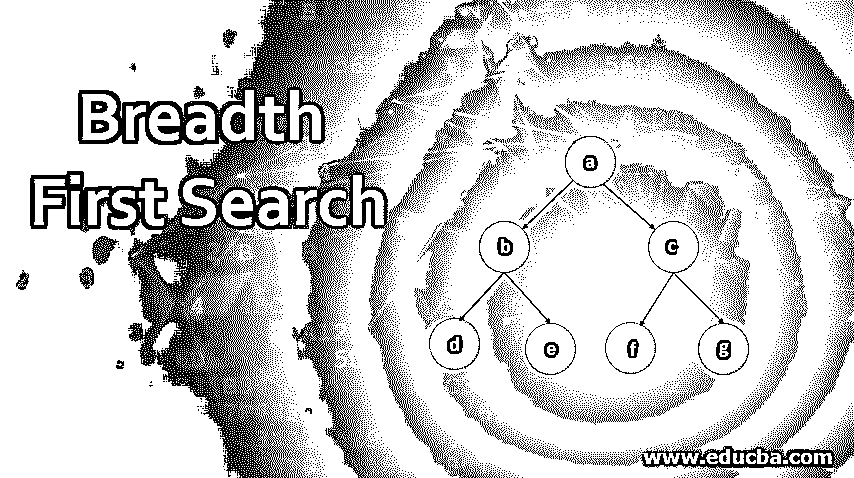
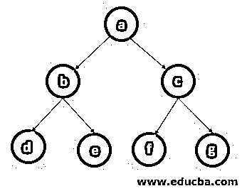
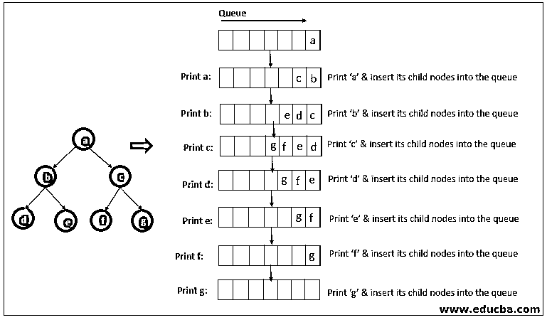
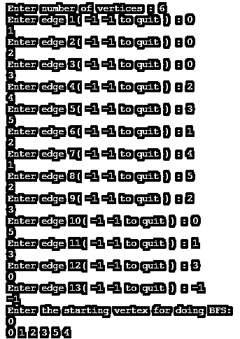

# 横向优先搜索

> 原文：<https://www.educba.com/breadth-first-search/>

## 广度优先搜索简介

广度优先搜索是一种算法，它是无信息搜索策略的一部分。这用于在树中搜索所需的节点。该算法的工作方式是在节点下进行横向遍历。它通过从根节点开始搜索来开始操作，从而扩展该级别的后继节点。然后，它通过沿其相邻宽度扩展而移动到另一个节点。在所需节点位于树或图的底部的情况下，该算法需要大量的存储空间和时间来执行。BFS 算法的实现需要使用先进先出队列。BFS 战略不需要任何领域知识。

现在我们来看一下 BFS 战略的步骤。

<small>Hadoop、数据科学、统计学&其他</small>

第一步:我们取一个空队列。

**步骤 2:** 然后，我们选择一个起点或根节点开始，并将来自该节点的数据插入队列。

**步骤 3:** 如果队列不为空，那么我们以横向方式从相邻节点中提取节点，并将其子节点插入到队列中。

**第四步:**然后，我们就可以打印提取的节点了。

### 广度优先搜索示例

现在，我们将在这个例子中看到上述 BFS 策略的步骤。我们来看看下图。我们将使用 BFS 策略来遍历该图。

我们可以分配“a”作为根节点。然后我们开始按照上面提到的步骤向下搜索目标节点。

该图说明了在端到端过程中绑定的 BFS 中涉及的步骤。这些步骤以下列方式执行。

1.  我们分配节点“a”作为起始根节点，并将其插入队列。
2.  然后提取“a”节点，并将“a”的子节点“b”和“c”放入队列中。
3.  然后我们打印 a。
4.  然后，再次类似地提取队列中的第一个节点。
5.  接下来,“b”的子元素“d”和“e”被插入到队列中，并被提取出来进行打印。
6.  然后我们递归地重复这些步骤，直到队列为空。
7.  我们不能对已经访问过的节点重复这些步骤。

现在让我们看看下面的算法伪代码。

1.  输入:s 作为源节点
2.  BFS(英、西)
3.  设 Q 为队列。
4.  排队
5.  将标记为已访问
6.  while ( Q 不为空)
7.  v = Q.dequeue()
8.  对于图 G 中 v 的所有邻居 w
9.  如果 w 没有被访问
10.  排队(w)
11.  马克被拜访了

### 广度优先搜索的应用

我们可以说 BFS 在数据科学中有许多应用，其中之一是使用最小生成树寻找最短路径。在网络、广播、GPS 导航等方面有各种应用。应用程序的范围让我们感到惊讶，尽管有时执行时间可能不允许我们选择它。BFS 是用于索引网页的主要算法之一。

用于 BFS 实现的 C 语言程序如下:

`#include<stdio.h>
#include<stdlib.h>
#define MAX 200
#define initial 1
#define waiting 2
#define visited 3
int m;
int adj[MAX][MAX];
int state[MAX];
void create_graph();
void BF_Traversal();
void BFS(int x);
int queue[MAX], front = -1,rear = -1;
void insert_queue(int vertex);
int delete_queue();
int isEmpty_queue();
int main()
{
create_graph();
BF_Traversal();
return 0;
}
void BF_Traversal()
{
int x;
for(x=0; x<m; x++)
state[x] = initial;
printf("Enter the starting vertex for doing BFS: \n");
scanf("%d", &x);
BFS(x);
}
void BFS(int x)
{
int i;
insert_queue(x);
state[x] = waiting;
while(!isEmpty_queue())
{
x = delete_queue( );
printf("%d ",x);
state[x] = visited;
for(i=0; i<m; i++)
{
if(adj[x][i] == 1 && state[i] == initial)
{
insert_queue(i);
state[i] = waiting;
}
}
}
printf("\n");
}
void insert_queue(int vert)
{
if(rear == MAX-1)
printf("Queue is overflowing\n");
else
{
if(front == -1)
front = 0;
rear = rear+1;
queue[rear] = vert ;
}
}
int isEmpty_queue()
{
if(front == -1 || front > rear)
return 1;
else
return 0;
}
int delete_queue()
{
int delete_item;
if(front == -1 || front > rear)
{
printf("Queue is underflowing\n");
exit(1);
}
delete_item = queue[front];
front = front+1;
return delete_item;
}
void create_graph()
{
int count,m_edge,ori,dest;
printf("Enter number of vertices : ");
scanf("%d",&m);
m_edge = m*(m-1);
for(count=1; count<=m_edge; count++)
{
printf("Enter edge %d( -1 -1 to quit ) : ",count);
scanf("%d %d",&ori,&dest);
if((ori == -1) && (dest == -1))
break;
if(ori>=m || dest>=m || ori<0 || dest<0)
{
printf("Invalid edge!\n");
count--;
}
else
{
adj[ori][dest] = 1;
}
}
}`

**输出**

代码的运行时间由 O (V+E)给出，其中 V =顶点数，E =边数。

### 广度优先搜索的优缺点

以下是 BFS 的优点和缺点

#### 优势

*   广度优先搜索算法完成。
*   最优解可能从 BFS 获得。
*   BFS 算法在数据科学中有大量的应用。
*   如果代码中使用的所有操作符具有相同的成本，并且目标节点可以及时到达，则最优性意味着可容许性。另一种可能性是，在没有最优性的情况下，找到具有最短长度的解。
*   执行时间是指数级的，内存空间复杂度可以表示为 O(b^d)，其中 d =搜索空间的深度，b =分支因子(子节点)

#### 不足之处

*   当目标节点未知时，运行时间可能会超过。
*   执行时间可能会陷入无限循环。
*   主要缺点似乎存在于用大量数据寻找解所花费的时间中，因此它优先考虑首先寻找较短的长度。

### 结论

宽度优先搜索是一种简单的算法，用于实现宽度方向的搜索操作，并使用 FIFO 队列。内存空间需求可能会很高，但事实证明需求很高。它用于使用树的节点信息来确定树的级别。从这个基本应用到更高范围的网络应用，对等网络，我们可以找到 BFS 的应用。因此，我们可以说，BFS 是一个重要的不知情的搜索算法，也打开了研究的大门。

### 推荐文章

这是广度优先搜索的指南。在这里，我们讨论广度优先搜索的例子，以及 BFS 策略中涉及的步骤和优缺点。您也可以看看以下文章，了解更多信息–

1.  [BFS 算法](https://www.educba.com/bfs-algorithm/)
2.  [人工智能中的搜索算法](https://www.educba.com/search-algorithms-in-ai/)
3.  [DFS 算法](https://www.educba.com/dfs-algorithm/)
4.  [HDFS 命令](https://www.educba.com/hdfs-commands/)

