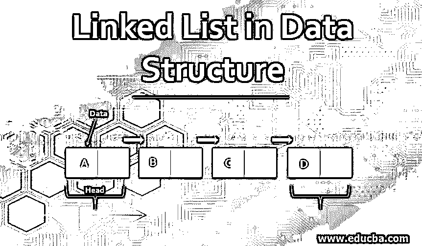

# 数据结构中的链表

> 原文：<https://www.educba.com/linked-list-in-data-structure/>

## 数据结构中的链表介绍

链表是一种以节点列表形式存储数据的数据结构。每个节点有两个部分。第一部分存储数据元素，第二部分存储对下一个节点的引用。链表是一种引人注目的数据结构，有助于有效和高效的内存管理。

### 如何对链表进行操作？

可以有效地对链表执行插入和删除等操作。插入和删除都可以从开头和结尾进行。我们将通过程序看到插入和删除是如何发生的。让我们通过下面用 C 语言实现的编程代码来理解链表的插入和删除操作。

<small>Hadoop、数据科学、统计学&其他</small>

**代码:**

`#include <stdio.h>
#include <conio.h>
#include <stdlib.h>
struct node
{
int d;
struct node *next;
};
struct node *start = NULL;
void insertbegin(int);
void insertend(int);
void display_list();
void delete_begin();
void delete_end();
int c = 0;
void main ()
{
int i, d;
for (;;) {
printf("\n1\. Beginning Insert.\n");
printf("\n2\. End Insert.\n");
printf("\n3\. Display linked list.\n");
printf("\n4\. Beginning Delete.\n");
printf("\n5\. End Delete.\n");
printf("\n6\. Exit\n");
scanf("%d", &i);
if (i == 1)
{
printf("\nEnter an element for beginning insertion: ");
scanf("%d", &d);
insert_begin(d);
}
else if (i == 2)
{
printf("\nEnter an element for ending insertion: ");
scanf("%d", &d);
insert_end(d);
}
else if (i == 3)
display_list();
else if (i == 4)
delete_begin();
else if (i == 5)
delete_end();
else if (i == 6)
break;
else
printf("\nInvalid input.");
}
getch();
}
void insert_begin(int x)
{
struct node *t;
t = (struct node*)malloc(sizeof(struct node));
t -> d = x;
c++;
if (start == NULL) {
start = t;
start -> next = NULL;
return;
}
t -> next = start;
start = t;
}
void insert_end(int x)
{
struct node *t, *temp;
t = (struct node*)malloc(sizeof(struct node));
t -> d = x;
c++;
if (start == NULL)
{
start = t;
start -> next = NULL;
return;
}
temp = start;
while (temp->next != NULL)
temp = temp->next;
temp -> next = t;
t -> next = NULL;
}
void display_list()
{
struct node *t;
t = start;
if (t == NULL)
{
printf("There is no element in the linked list.\n");
return;
}
printf("There are %d elements in linked list.\n", c);
while (t->next != NULL)
{
printf("%d ", t->d);
t = t->next;
}
printf("%d ", t->d);
}
void delete_begin()
{
struct node *t;
int k;
if (start == NULL)
{
printf("There's no element in the list.\n");
return;
}
k = start -> d;
t = start -> next;
free(start);
start = t;
c--;
printf("%d deleted from the beginning of the linked list.\n", k);
}
void delete_end()
{
struct node *t, *v;
int k;
if (start == NULL)
{
printf("Linked list is empty.\n");
return;
}
c--;
if (start->next == NULL)
{
k = start->d;
free(start);
start = NULL;
printf("%d deleted from the end of the linked list.\n", k);
return;
}
t = start;
while (t->next != NULL) {
v = t;
t = t->next;
}
k = t -> d;
v -> next = NULL;
free(t);
printf("%d deleted from end successfully.\n", k);
}`

当我们执行程序时，我们得到选项，如下图所示。我们必须输入执行该操作所需的选项号。

**输出:**

**代码解释:**我们实现了上面的代码，并执行它来检查它是如何工作的。浏览代码，我们可以发现程序要求用户输入六个选项中的一个，即。首先在链表的开头插入一个元素，其次在链表的末尾插入一个元素，第三显示链表，第四从链表的开头删除一个元素，第五从链表的末尾删除一个元素，最后退出程序。无限循环继续下去，直到用户不断传递正确的输入。

如果退出，程序中断。可以看出，这个程序大量使用了指针，而指针是链表中最重要的元素。我们验证了上面的编程代码，并通过一系列的执行来验证它是否工作良好。下面的屏幕截图显示了各种输入和返回的结果。让我们逐一查看一下，

让我们从在链表的开头输入某些元素开始。

**输入 1:**

所以，我们输入 1 作为选项。它是指在链表的开头插入一个元素。我们将 23 作为成功插入开始的输入进行传递。

**输入 2:**

同样，我们插入了另一个元素，它是链表的开始，如下图所示。

**输入 3:**

我们输入了选项 2，它指的是在链表的末尾插入一个元素。我们在链表的末尾插入了 89，如下图所示。

**输入 4:**

类似地，我们在链表的末尾插入了另一个元素 57，如下图所示。

**输入 5:**

同样，我们在链表的开头插入了另一个元素。这一次我们插入了 77，正如下面的截图所示。

**输入 6:**

现在，我们选择选项 3，它用于显示链表。从下面可以看出，链表现在有五个元素。

**输入 7:**

我们现在将删除一些元素。这次选择了选项 4，并从列表中删除了开始时存储的 77。

**输入 8:**

类似地，我们从链表的开头删除了另一个元素。

**输入 9:**

现在，我们选择选项 5 从链表的末尾删除一个元素。

**输入 10:**

最后，我们显示了链表。从下面可以看出，该列表现在只包含两个元素。

### 结论——数据结构中的链表

链表作为一种数据结构，是一个非常复杂的概念。在内存使用很重要的大规模应用程序中会用到这个概念。有各种各样的方法可以使用链表，上下文通常控制着实现。

### 推荐文章

这是一个数据结构中链表的指南。这里我们讨论一个基本概念，如何在链表中执行操作，以及插入和删除操作。你也可以看看下面的文章来了解更多-

1.  [数据结构中的数组](https://www.educba.com/arrays-in-data-structure/)
2.  [数据分析过程的阶段](https://www.educba.com/data-analysis-process/)
3.  [数据结构的类型](https://www.educba.com/what-is-data-structure/)
4.  [数据湖架构](https://www.educba.com/data-lake-architecture/)

