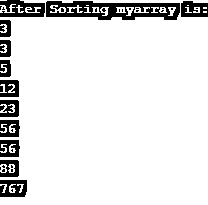
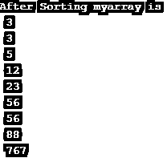

# 数据结构中的快速排序

> 原文：<https://www.educba.com/quick-sort-in-data-structure/>

## 数据结构中的快速排序介绍

数据结构中的快速排序是一种对元素列表进行排序的方法。它使用分而治之的方法，这意味着元素数组分为两部分，然后进一步快速排序算法应用于这两部分。阵列的这种划分是通过一个支点来实现的。选择枢轴的位置，使得枢轴左边的元素小于枢轴元素，并且右边的元素大于枢轴元素。这种划分的目的是在线性运行时间内获得排序后的数组。

### 数据结构中的快速排序算法

以下任何一种方法都可以选择一个枢轴:

<small>Hadoop、数据科学、统计学&其他</small>

*   数组的最后一个元素
*   数组的第一个元素
*   任何随机元素都会被选取。
*   选择中间值作为轴心。

快速排序使用一个函数分区来为一个数组寻找分区点，并且快速排序进一步为两个子数组调用。这个分区函数使用一个假设，将数组的最后一个元素作为支点。

**快速排序算法:**

`partition (myarr[], left, right)
{
pivot = myarr[right];
i = (left - 1)
for (j = left; j <= right- 1; j++)
{
if (pivot > myarr[j] )
{
i++;
swap myarr[i] and myarr[j] }
}
swap myarr[i + 1] and myarr[right])
return (i + 1)
}
quickSort(myarr[], left, right)
{
if (left < right)
{
pi = partition(myarr, left, right);
quickSort(myarr, left, pi - 1);
quickSort(myarr, pi + 1, right);
}
}`

**说明:**在上面的算法中，有用于寻找数组的分区元素的分区函数的伪代码，后面是用于快速排序的伪代码。快速排序算法调用分区函数计算分区点。快速排序是一种尾递归的就地算法，使其适用于包含大量元素的数组。

### 在数据结构中实现快速排序的例子

快速排序可以使用以下两种方案来实现，如下所示:

#### 1.快速排序的递归版本

这里我们将看到快速排序的递归版本。

**代码:**

`def partition(mymyarr,left,right):
i = ( left-1 )
pivot = mymyarr[right] for j in range(left , right):
if myarr[j] <= pivot:
i = i+1
myarr[i],myarr[j] = myarr[j],myarr[i] myarr[i+1],myarr[right] = myarr[right],myarr[i+1] return ( i+1 )
def qSort(myarr,left,right):
if left < right:
pi = partition(myarr,left,right)
qSort(myarr, left, pi-1)
qSort(myarr, pi+1, right)
myarr = [12,56,23,767,3,88,3,56,5] n = len(myarr)
qSort(myarr,0,n-1)
print ("After Sorting myarray is:")
for i in range(n):
print ("%d" %myarr[i])`

**输出:**

**代码解释:**上述程序是针对递归快速排序方法，其中 myarr 被定义为待排序，第 0 个元素即 12 被认为是起始索引，第 n-1 个元素即 5 被认为是结束索引。调用分区函数来查找分区元素。在这里，我们认为 pivot 元素是最后一个元素，并且是比作为参数传递的数组左侧小的元素的索引。然后，将每个元素与 pivot 进行比较，如果发现比 pivot 小的元素，I 将递增，并交换一个元素。当没有剩余元素要交换时，左边的所有元素都小于枢轴，而右边的元素都大于枢轴。

对这个子数组调用进一步的快速排序算法，这种算法继续划分数组并对元素进行排序。

##### 复杂性

这里有三种类型的复杂性，解释如下:

**1。最佳情况**:当分区元素恰好总是数组的中间元素时，就会出现这种情况。在这种情况下，下面是递归表达式:-

`T(n) = 2T(n/2) + Θ(n)`

因此，上述表达式的时间复杂度为θ(nLogn)。

**2。最坏的情况**:如果分区元素总是最小或最大的数组元素，就会出现这种情况。在这种情况下，循环如下:

`T(n) = T(0) + T(n-1) + Θ(n)`

这相当于，

`T(n) = T(n-1) + Θ(n)`

因此，这种情况下的复杂度称为θ(n2)。

**3。平均情况**:这种情况发生在当划分将元素划分为 O(n/9)个元素在一个集合中而 9n/10 个元素在另一个集合中时发生的划分。这种情况下的复发是，

`T(n) = T(n/9) + T(9n/10) + Θ(n)`

时间复杂度为θ(nLogn)。

上述算法需要一些优化来降低复杂性，例如将 pivot 作为任意随机元素，或者首先列举较小的数组并使用尾递归方法。递归需要函数调用堆栈中的大量空间来存储左右元素以及其他参数。使用下面的快速排序迭代方法可以避免这种缺点。

#### 2.快速排序的迭代版本

这里我们将看到快速排序的迭代版本。

**代码:**

`def partition(myarr, left, right):
i = left - 1
x = myarr[right] for j in range(left, right):
if myarr[j] <= x:
# increment index of smaleftlefter eleftement
i = i + 1
myarr[i], myarr[j] = myarr[j], myarr[i] myarr[i + 1], myarr[right] = myarr[right], myarr[i + 1] return (i + 1)
def qSortIterative(myarr, left, right):
size = right - left + 1
stack = [0] * (size)
top = -1
top = top + 1
stack[top] = left
top = top + 1
stack[top] = right
while top >= 0:
right = stack[top] top = top - 1
left = stack[top] top = top - 1
p = partition( myarr, left, right )
if p-1 > left:
top = top + 1
stack[top] = left
top = top + 1
stack[top] = p - 1
if p + 1 < right:
top = top + 1
stack[top] = p + 1
top = top + 1
stack[top] = right
myarr = [12,56,23,767,3,88,3,56,5] n = len(myarr)
qSortIterative(myarr, 0, n-1)
print ("After Sorting myarray is")
for i in range(n):
print ("% d" % myarr[i]),`

**输出:**

**代码解释:**两个程序中的分区函数相同。只有对元素排序的调用发生了变化，因为这里使用了一个辅助堆栈来存储元素，并以排序的方式弹出和存储它们。要减少正在使用的堆栈的大小，必须先推送较小的堆栈。

### 结论

快速排序方法使用分治法对元素进行排序，平均复杂度为 O(nLogn)。它可以通过递归和迭代的方式实现。它是就地的、缓存友好的，也是尾递归算法。在数组的情况下，这是最可取的，因为需要对元素进行大量的访问，这在链表的情况下会消耗大量的时间。

### 推荐文章

这是一个在数据结构中快速排序的指南。这里我们讨论数据结构和代码实现中快速排序的介绍和算法。您也可以浏览我们推荐的其他文章，了解更多信息——

1.  [数据结构中的数组](https://www.educba.com/arrays-in-data-structure/)
2.  [什么是云托管？](https://www.educba.com/what-is-cloud-hosting/)
3.  [数据分析软件](https://www.educba.com/data-analysis-software/)
4.  [什么是数据分析？](https://www.educba.com/what-is-data-analysis/)
5.  [数据结构中的 B 树指南](https://www.educba.com/b-tree-in-data-structure/)
6.  [数据结构|应用中的堆栈](https://www.educba.com/stack-in-data-structure/)

