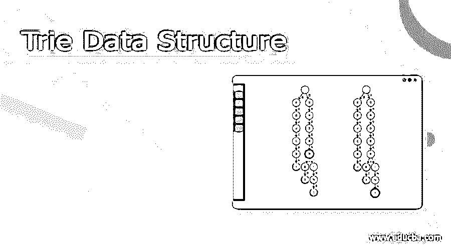
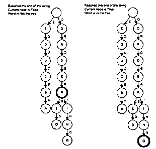

# 数据结构

> 原文：<https://www.educba.com/trie-data-structure/>

## 数据结构的定义

Trie 数据结构被定义为一种能够从包含许多其他字符串的包中快速有效地检索字符串的数据结构。这些字符串被表示为键，字符串的存储方式使得搜索变得高效而快速。单词 trie 来源于数据结构遵循“检索”的方法这里搜索复杂度降低到最优复杂度，复杂度等于搜索字的长度。即使在最优且平衡良好的二叉树的情况下，时间复杂度也是 M * log (N)的量级，其中 M 表示搜索串的长度，N 表示二叉查找树中的关键字总数。在本文中，我们将研究 Trie 数据结构的算法，并了解它的一些优点和缺点。

### Trie 数据结构算法

首先，在我们继续理解 trie 数据结构的操作及其算法之前，我们需要理解 Trie 数据结构的构造。trie 数据结构描述了一个树，其中如果存储了字符串，则每个节点代表一个字符，如果存储了数字，则每个节点代表一个位数，并且第一个节点是一个空节点，表示为根节点。从这些节点中的每一个，取决于存储的是什么单词，有可能出现不同的字符分支。例如，如果 order 和 order 是存储的两个单词，那么按字母顺序，这两个单词在 order 之前都有共性。现在，在单词顺序的最后一个字母节点“r”处，将有两个分支，其中一个分支将表示单词顺序，另一个表示顺序，本质上意味着从字母“r”开始，一个分支将具有“ed”而另一个具有“ing”关于这个结构的下一件事是，存储的任何单词的最后一个字母表用一个数字或任何想要的标志来标记，以表明该单词已经在这个字符处结束。

<small>Hadoop、数据科学、统计学&其他</small>

既然我们已经知道了 trie 数据结构的结构，并继续进行 trie 数据结构的算法，我们需要理解由 Trie 数据结构完成的不同操作。这些操作是插入、搜索和删除，因此为了理解 Trie 数据结构的算法，理解使用 Trie 数据结构可能的操作的各个算法是很重要的。

首先，我们先看看 Trie 数据结构中的插入操作。从我们之前的讨论中，我们看到了 trie 数据结构的每个节点可能包含不同的分支，并且我们标记了存储在数据结构中的每个单词的最后一个节点。有了这些知识，我们知道，首先，trie 数据结构是空的。现在，当插入第一个单词时，每个字母都存储为一个节点。例如，让我们举前面的例子，有序和有序。让我们假设我们插入单词 ordered 这就是它看起来的样子。它是如何发生的，每个有序字母表通过第一个 O，然后 R，然后 D，然后 E，等等，直到最后一个字母表，也就是 D。

现在，一旦建立了这个结构，当我们插入第二个单词，即排序时，算法将从根节点开始，下一个单词的每个字母表将开始流入，算法将查看是否已经存在类似的踪迹。如果存在相似的踪迹，该单词的字母将继续跟随该踪迹，直到该单词开始彼此不同。既然 ordered 已经存在于链中，那么直到单词 order，它将遵循相同的轨迹，并且从下一个单词开始，它将分叉。方法如下所示:

请注意，最后一个字母具有不同的颜色，即表示最后一个单词是该单词的结束字母。可能会有这样的情况，开始字母不同，因此分支从根节点开始，类似于(插入的单词是 Educba):

现在，为了搜索一个单词，类似于它被插入的情况，传递各个字母，然后在存储字符串池的树中查找。现在，如果树已经有了一个单词，它返回这个单词存在。现在，字符串存储的方式，一些子字符串也可以存在，因此树可能返回一个子字符串存在。例如，如果我们搜索 order，那么我们会看到它存在，但不是作为一个字符串，而是作为一个子字符串。这是检查结束字母标记的地方，如果搜索字符串的最后几个字母也是标记的字母，我们说这个单词存在，否则不存在。下面是两种情况，在第一张图中，我们说顺序不存在，在第二张图中，我们说词序存在。

对于删除，我们需要遵循以下流程:

1.搜索要删除的单词然后:
a .如果需要删除的单词不存在，则根本不修改 trie。如果该单词不是任何其他单词的后缀或前缀，并且各个节点也没有分支，则删除从根到叶(最后一个)节点的所有节点。
c .如果要删除的单词是另一个单词的前缀，则作为要删除的单词的最后一个字母的叶节点被标记为非结束字母。
d .如果要删除的单词是某个其他单词(w1)的后缀，则删除不属于 w1 的单词的所有节点。
e .最后，如果上述情况都没有发生，并且要删除的单词既不是前缀也不是后缀，而是一些节点只是与另一个单词共享，那么就应该删除不常用字母。

### Trie 数据结构的优缺点

**优点:**

1.插入和搜索算法具有最好的时间复杂度，即 O(n)，甚至比最好的 BST 更快。
2。所有的单词都可以很容易地按字母顺序打印出来，如果我们使用散列法，这是很困难的。
3。前缀搜索很容易做到。

**缺点:**

1.在 Trie 中存储字符串池会占用大量内存，随着插入越来越多的单词，空间复杂度会激增。

### 结论

在本文中，我们查看了所有与 Trie DS 相关的算法以及 Trie 的优缺点，这将使读者在选择和使用 Trie 时做出明智的决定。

### 推荐文章

这是一个数据结构指南。这里我们讨论一下 Trie 数据结构的简介、算法、优缺点。您也可以看看以下文章，了解更多信息–

1.  [堆数据结构](https://www.educba.com/heap-data-structure/)
2.  [数据结构中的散列](https://www.educba.com/hashing-in-data-structure/)
3.  [数据结构中的 B+树](https://www.educba.com/b-plus-tree-in-data-structure/)
4.  [数据结构中循环链表](https://www.educba.com/circular-linked-list-in-data-structure/)

