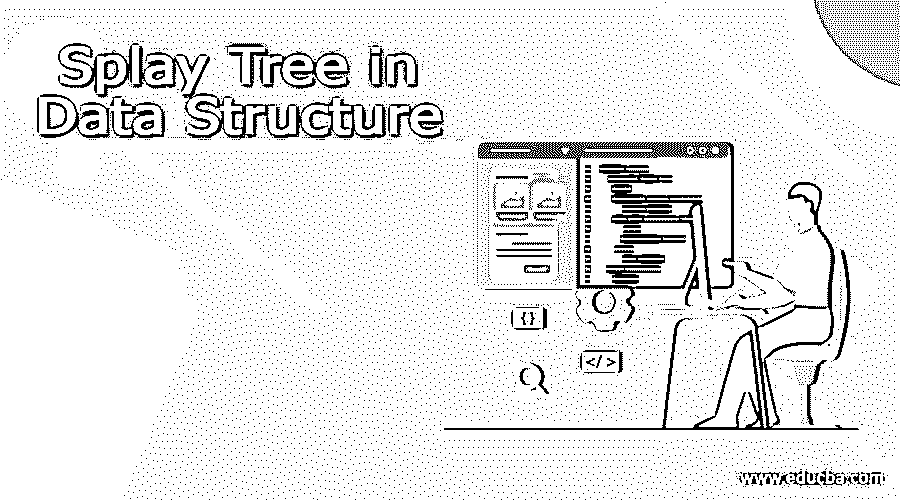
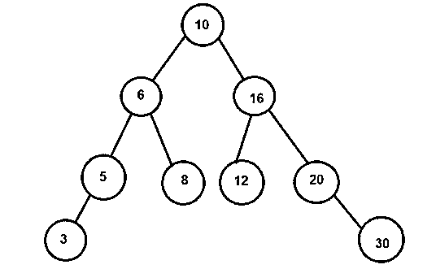

# 在数据结构中显示树

> 原文：<https://www.educba.com/splay-tree-in-data-structure/>

## 数据结构中的展开树介绍

数据结构中的八叉树实际上是二叉查找树的一种变体或类型，它能够实现自调整和自平衡功能。在这种类型的数据结构中，每当在树上执行任何操作时，都会有一个称为 splay 的特殊操作跟随其后。slay 操作包括重新排列树中的数据节点，使得正在执行操作的当前元素被设置为树数据结构的根节点。在这篇文章中，我们将学习关于 splay 树，在 splay 树上执行的操作，以及如何使用 C 编程语言实现 splay 树。

### 张开树木

在我们开始使用八叉树之前，需要你对二叉树有一点了解，在二叉树中，所有小于根节点的值都在根的左侧，而所有大于根节点的值的节点都在根的右侧。当平均考虑每个节点时，二叉查找树的时间复杂度是 O(logn ),而在最坏的情况下，二叉树的时间复杂度是 O(n)。当二叉树是右偏或左偏时，时间复杂度总是 O(n)。因此，为了避免这种情况，使用了 AVL 树和红黑树，使得所有情况的复杂度为 O(logn)。

<small>Hadoop、数据科学、统计学&其他</small>

在八字树中引入了一些额外的特性，这使得它在实际应用中比 AVL 树和红黑树更有效。除了所有常见的操作，如插入、删除和搜索，Splay tree 还执行 Splay 操作，重新排列树，并将节点放在根位置进行操作。每当执行任何上述操作时，在此之前，该算法也执行张开操作。因此，我们可以说八字树是大致平衡的树。

### 展开树中的操作

假设我们在树中有七个元素，如下所示:

现在，如果我们想要执行搜索操作，那么我们将首先执行简单的二分搜索法，这意味着 6 小于 10，那么我们将从右边开始。在完成这个搜索操作后，算法将执行张开，这将重新排列所有节点，并且被操作的节点将通过执行旋转而被带到根。

**旋转**

总共执行六种类型的旋转——

*   **Zig:** 向左旋转时。
*   **Zag:** 向右旋转时。
*   当我们表演“之”后面跟着“之”时，意思是“右”后面跟着“左”。
*   当我们执行 Zag 后跟 zig 时，这意味着先左后右。
*   **Zig zig:** 进行两次右操作时。
*   **Zag zag:** 执行两次左操作时。

**选择要执行的旋转类型**

该算法根据以下某些因素执行上述旋转

*   执行操作的节点有或没有祖父母。
*   操作节点位于直接父节点的右侧或左侧。
*   操作节点位于 grand parent 的右侧或左侧。

**确定旋转类型的可能情况**

*   **情况 1:** 如果节点在直接父节点的右侧，并且没有祖父节点，则执行左旋转，否则，如果节点没有祖父节点，并且在直接父节点的左侧，则执行右旋转。
*   **情况 2:** 当节点没有祖父母时，考虑以下场景
*   **场景 1:** 如果操作节点以及直接父节点在右侧，则执行 zig 操作，即右向右旋转。
*   **场景 2:** 如果操作节点在父节点的左边，而父节点本身在它自己的直接父节点的右边，那么 zig-zag 意味着执行左右操作。
*   **场景 3:** 如果操作节点和父节点都在其直接父节点的右侧，则执行 zag zag，这意味着执行左左操作。
*   **场景 4:** 如果操作节点在右侧，父节点在左侧，则执行左右操作的 zag zig 操作。

### 数据结构中的八叉树示例

在下面的示例中，l_node 是左侧节点，r_node 是右侧节点，n_node 是新节点，p_node 是父节点。sPlayTree_DS 用于创建的 sPlayTree 数据结构 struct。

**代码:**

`#include <stdio.h>
#include <stdlib.h>
typedef struct node {
int data;
struct node * l_node;
struct node * r_node;
struct node * p_node;
}node;
typedef struct sPlayTree_DS {
struct node * root_node;
}sPlayTree_DS;
node* n_node(int data) {
node *n = malloc(sizeof(node));
n->data = data;
n-> p_node = NULL;
n-> r_node = NULL;
n-> l_node = NULL;
return n;
}
sPlayTree_DS* new_sPlayTree_DS() {
sPlayTree_DS *t = malloc(sizeof(sPlayTree_DS));
t-> root_node = NULL;
return t;
}
node* maximum(sPlayTree_DS *t, node *x) {
while(x-> r_node != NULL)
x = x-> r_node;
return x;
}
void  l_node_rotate(sPlayTree_DS *t, node *x) {
node *y = x-> r_node;
x-> r_node = y-> l_node;
if(y-> l_node != NULL) {
y-> l_node-> p_node = x;
}
y-> p_node = x-> p_node;
if(x-> p_node == NULL) { //x is  root_node
t-> root_node = y;
}
else if(x == x-> p_node-> l_node) { //x is  l_node child
x-> p_node-> l_node = y;
}
else { //x is  r_node child
x-> p_node-> r_node = y;
}
y-> l_node = x;
x-> p_node = y;
}
void  r_node_rotate(sPlayTree_DS *t, node *x) {
node *y = x-> l_node;
x-> l_node = y-> r_node;
if(y-> r_node != NULL) {
y-> r_node-> p_node = x;
}
y-> p_node = x-> p_node;
if(x-> p_node == NULL) { //x is  root_node
t-> root_node = y;
}
else if(x == x-> p_node-> r_node) { //x is  l_node child
x-> p_node-> r_node = y;
}
else { //x is  r_node child
x-> p_node-> l_node = y;
}
y-> r_node = x;
x-> p_node = y;
}
void splay(sPlayTree_DS *t, node *n) {
while(n-> p_node != NULL) { //node is not  root_node
if(n-> p_node == t-> root_node) { //node is child of  root_node, one rotation
if(n == n-> p_node-> l_node) {
r_node_rotate(t, n-> p_node);
}
else {
l_node_rotate(t, n-> p_node);
}
}
else {
node *p = n-> p_node;
node *g = p-> p_node; //grand p_node
if(n-> p_node-> l_node == n && p-> p_node-> l_node == p) { //both are  l_node children
r_node_rotate(t, g);
r_node_rotate(t, p);
}
else if(n-> p_node-> r_node == n && p-> p_node-> r_node == p) { //both are  r_node children
l_node_rotate(t, g);
l_node_rotate(t, p);
}
else if(n-> p_node-> r_node == n && p-> p_node-> l_node == p) {
l_node_rotate(t, p);
r_node_rotate(t, g);
}
else if(n-> p_node-> l_node == n && p-> p_node-> r_node == p) {
r_node_rotate(t, p);
l_node_rotate(t, g);
}
}
}
}
void insert(sPlayTree_DS *t, node *n) {
node *y = NULL;
node *temp = t-> root_node;
while(temp != NULL) {
y = temp;
if(n->data < temp->data)
temp = temp-> l_node;
else
temp = temp-> r_node;
}
n-> p_node = y;
if(y == NULL) //newly added node is  root_node
t-> root_node = n;
else if(n->data < y->data)
y-> l_node = n;
else
y-> r_node = n;
splay(t, n);
}
node* search(sPlayTree_DS *t, node *n, int x) {
if(x == n->data) {
splay(t, n);
return n;
}
else if(x < n->data)
return search(t, n-> l_node, x);
else if(x > n->data)
return search(t, n-> r_node, x);
else
return NULL;
}
void delete(sPlayTree_DS *t, node *n) {
splay(t, n);
sPlayTree_DS * l_node_subtree = new_sPlayTree_DS();
l_node_subtree-> root_node = t-> root_node-> l_node;
if( l_node_subtree-> root_node != NULL)
l_node_subtree-> root_node-> p_node = NULL;
sPlayTree_DS * r_node_subtree = new_sPlayTree_DS();
r_node_subtree-> root_node = t-> root_node-> r_node;
if( r_node_subtree-> root_node != NULL)
r_node_subtree-> root_node-> p_node = NULL;
free(n);
if( l_node_subtree-> root_node != NULL) {
node *m = maximum( l_node_subtree,  l_node_subtree-> root_node);
splay( l_node_subtree, m);
l_node_subtree-> root_node-> r_node =  r_node_subtree-> root_node;
t-> root_node =  l_node_subtree-> root_node;
}
else {
t-> root_node =  r_node_subtree-> root_node;
}
}
void inorder(sPlayTree_DS *t, node *n) {
if(n != NULL) {
inorder(t, n-> l_node);
printf("%d\n", n->data);
inorder(t, n-> r_node);
}
}
int main() {
sPlayTree_DS *t = new_sPlayTree_DS();
node *p, *q, *r, *s, *t, *u, *v, *w, *x, *y, *z, *a, *b;
p = n_node(10);
q = n_node(20);
r = n_node(30);
s = n_node(100);
t = n_node(90);
u = n_node(40);
v = n_node(50);
w = n_node(60);
x = n_node(70);
y = n_node(80);
z = n_node(150);
a = n_node(110);
b = n_node(120);
insert(t, p);
insert(t, q);
insert(t, r);
insert(t, s);
insert(t, t);
insert(t, u);
insert(t, v);
insert(t, w);
insert(t, x);
insert(t, y);
insert(t, z);
insert(t, a);
insert(t, b);
delete(t, p);
delete(t, b);
inorder(t, t-> root_node);
return 0;
}`

**输出:**

### 结论

八字树是一种类似于二叉树的数据结构，但是具有自平衡的能力。展曲是在对树执行任何其他操作之后执行的操作，该操作涉及以这样的方式重新排列节点，使得正在进行操作的节点成为根节点。

### 推荐文章

这是一个在数据结构中显示树的指南。在这里，我们也讨论了 splay tree 的介绍和操作，并给出了一些例子。您也可以看看以下文章，了解更多信息–

1.  [堆数据结构](https://www.educba.com/heap-data-structure/)
2.  [数据结构中的散列](https://www.educba.com/hashing-in-data-structure/)
3.  [数据结构中的 B+树](https://www.educba.com/b-plus-tree-in-data-structure/)
4.  [数据结构中的堆栈](https://www.educba.com/stack-in-data-structure/)

