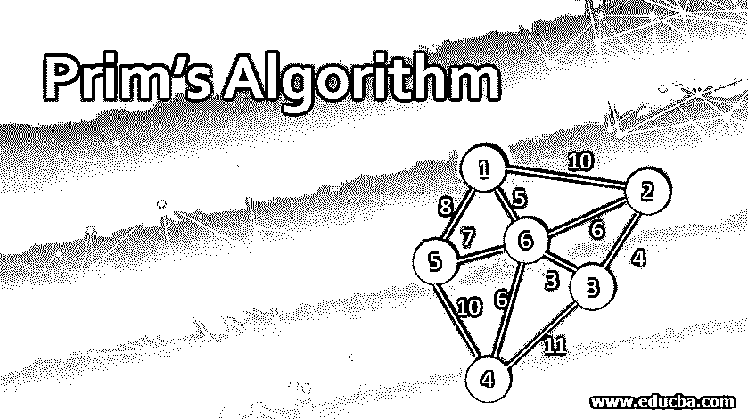
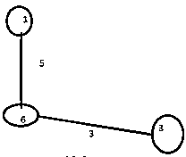
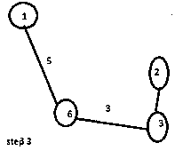
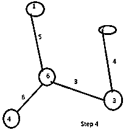
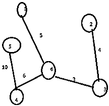
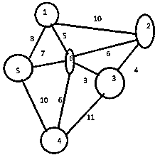

# 普里姆算法

> 原文：<https://www.educba.com/prims-algorithm/>

## Prim 的算法是什么？

Prim 算法，一种使用贪婪方法寻找最小生成树的算法。它与最短路径优先算法有相似之处。简单介绍一下生成树，生成树是一个图的子集，它的所有顶点都被最少可能边覆盖。它们不是循环的，不能断开。生成树没有周期。一个连通图可以有多个生成树。

因此，prims 算法的主要途径是通过最短路径优先算法寻找最小生成树。基本上，该算法将节点视为单个树，并不断从图中添加新节点。

<small>Hadoop、数据科学、统计学&其他</small>

### Prim 算法的工作原理

prim 的算法内部发生了什么，我们将详细介绍:-

所以它从一个空的生成树开始，维护两组顶点，第一组已经添加到树中，另一组还没有添加。因此，它考虑连接 MST 中该值的所有边，并从该边中选取最小加权值，将其移动到另一个端点进行相同的操作。Prim 算法的每一步都使用了图论中的一个切割，拾取最小加权边。

### Prim 算法的伪代码

让我们来看看普里姆算法的伪代码

我们创建两组顶点 U 和 U-V，U 包含已访问列表，另一组不包含。所以我们把顶点从 V-U 移到 U，一个接一个连接最小权重的边。

*   第一步:创建两个集合 U 和 V
*   **步骤 2:** 将起始值放入 U 中，我们必须根据它来生成生成树。
*   第三步:当 U 不等于 V 时，找出到达边缘的最低成本，并将其置于 U 之上。
*   **步骤 4:** 对其他边重复步骤 3，直到达到 MST。

在这里，我们可以从图像中看到，我们有一个加权图，我们将在其上应用 prism 的算法。

**步骤 1:** 让我们选择一个顶点 1，如上图步骤 1 所示。这将选择 prims 算法所说的最小加权顶点，并且它将到达顶点 6。

其他顶点到顶点 1 距离分别是 8(对于顶点 5)、5(对于顶点 6)和 10(对于顶点 2)。因此最小距离，即 5 将被选择用于制作 MST，并且顶点 6 将被考虑。

*   选择要包含在 U 中的顶点 6
*   请参考上图中的步骤 1。

**步骤 2:** 然后集合将像在步骤 2 中那样移动到下一个，然后它将移动顶点 6 来找到相同的顶点。这里它会找到最小权重的 3，所以现在你会有{1，6}

现在其他顶点离顶点 6 的距离分别是 6(对于顶点 4)，3(对于顶点 3)和 6(对于顶点 2)。因此最小距离，即 3 将被选择用于制作 MST，并且顶点 3 将被考虑。

*   选择要包含在 U 中的顶点 3
*   请参考上图中的步骤 2。

**步骤 3:** 对顶点 3 重复同样的步骤，使 U 的值为{1，6，3}。图中的迭代 3。

现在另一个顶点离顶点 3 的距离分别是 11(对于顶点 4)，4(对于顶点 2)。因此最小距离，即 4 将被选择用于制作 MST，并且顶点 2 将被考虑。

*   选择要包含在 U 中的顶点 2
*   请参考上图中的步骤 3。

**步骤 4:** 现在它将再次移动到顶点 2，步骤 4，因为在顶点 2，树不能进一步扩展。所以现在从顶点 6 开始，它将寻找使 U 的值为{1，6，3，2}的最小值

现在其他顶点离顶点 6 的距离分别是 6(对于顶点 4)，7(对于顶点 5)，5(对于顶点 1)，6(对于顶点 2)，3(对于顶点 3)。由于距离 5 和 3 之前被用于生成 MST，我们将移动到距离 6(顶点 4)，这是生成树的最小距离。因此最小距离，即 6 将被选择用于制作 MST，并且顶点 4 将被考虑。

*   选择要包含在 U 中的顶点 4
*   请参考上图中的步骤 4。

**第五步:**如此迭代 5 次，到顶点 4，最后生成最小生成树，使 U 的值为{1，6，3，2，4}。

现在另一个顶点离顶点 4 的距离分别是 11(对于顶点 3)，10(对于顶点 5)和 6(对于顶点 6)。因为在上面的步骤 4 中 6 被考虑用于制作 MST。所以 10 将作为考虑的最小距离。因此，最小距离，即 10，将被选择用于制作 MST，并且顶点 5 将被考虑。

*   选择要包含在 U 中的顶点 5
*   请参考上图中的步骤 5。
*   现在，在步骤 5 中，它将转到 5，生成 MST。

所有的顶点都包含在 MST 中，以使用 prims 算法完成生成树。现在，最小生成树的成本=所有边权重之和= 5+3+4+6+10= 28

### 时间复杂性分析

Prim 算法的最坏情况时间复杂度是:-

*   O(ElogV)使用二进制堆
*   使用斐波那契堆的 O(E+VlogV)

使用广度优先搜索需要遍历所有顶点，然后遍历 O(V+E)次。使用最小堆操作来决定取 O(logV)时间的最小元素值。所以两者合并会给出时间复杂度为 O(Elogv)的时间复杂度。

### 结论

因此，从上面的文章中，我们检查了 prims 算法如何使用 GReddy 方法来创建最小生成树。贪婪算法的使用使得选择具有最小权重的边更容易。此外，我们分析了如何选择最小堆，并形成了树。我们也讨论了这个算法的时间复杂度，以及这个算法是如何实现的。由此，我们可以说 prims 算法是一种很好的寻找最小生成树的贪婪算法。

### 推荐文章

这是一本关于 Prim 算法的指南。在这里，我们讨论 prim 算法的内部情况，我们将检查细节以及如何应用。您也可以浏览我们的其他相关文章，了解更多信息——

1.  [人工智能中的搜索算法](https://www.educba.com/search-algorithms-in-ai/)
2.  [RSA 算法](https://www.educba.com/rsa-algorithm/)
3.  [KNN 算法](https://www.educba.com/knn-algorithm/)
4.  [层次聚类算法](https://www.educba.com/hierarchical-clustering-algorithm/)

