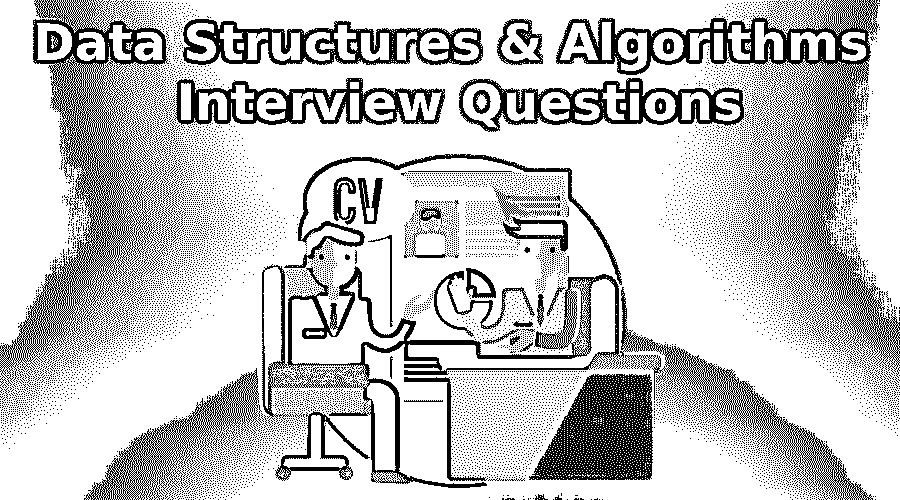

# 数据结构和算法面试问题

> 原文：<https://www.educba.com/data-structures-and-algorithms-interview-questions/>

## 数据结构与算法导论面试问答

数据结构是一种以结构化和系统化的格式定义、存储和检索数据的方式。数据结构包含不同类型的数据集。不同种类的数据可用于不同种类的应用程序，有些数据高度专用于特定的任务。算法是一个一步一步的过程，有一组适当执行的指令来获得期望的输出。在数学和计算机科学中，算法通常意味着解决一个循环问题的小程序。

如果是找数据结构与算法相关的工作，需要准备 2022 年的数据结构与算法面试题。虽然每个面试都是不同的，工作范围也是不同的，但我们可以帮助你解决顶级数据结构和算法面试问题和答案，这将帮助你取得飞跃，并在面试中取得成功。

<small>Hadoop、数据科学、统计学&其他</small>

以下是 2022 数据结构与算法面试问答排名。这些顶级问题分为以下两部分:

### 第 1 部分-数据结构和算法面试问题(基础)

第一部分包括基本的面试问题和答案。

#### 1.什么是数据结构？

**答:**
数据结构是一种以结构化&系统方式定义、存储&检索数据的方式。数据结构可以包含不同类型的数据项。不同种类的[数据结构适合](https://www.educba.com/what-is-data-structure/)不同种类的应用程序，有些高度专门化于特定的任务。

#### 2.有哪些不同的数据结构？

**答:**
数据结构可用性可能因编程语言而异。常用的数据结构有链表、数组、栈、队列、图、树等。

#### 3.什么是算法？

**答案:**
算法是一个循序渐进的过程，它定义了一组按照一定的顺序执行的指令，以获得期望的输出。一个计算机程序可以被看作是一个复杂的算法。在数学和计算机科学中，算法通常意味着解决一个循环问题的小程序。

让我们转到下一个数据结构和算法面试问题

#### 4.区分文件结构和存储结构？

**答案:**
实际上，关键的区别在于被访问的内存区域。当处理驻留在计算机系统的主存储器中的结构时，这被称为存储结构。当处理一个辅助结构时，我们称之为文件结构。

#### 5.什么是链表？

**答:**
链表是用链接连接的数据项的列表，即指针或引用。大多数现代高级编程语言不提供直接访问存储器位置的特征；因此，它们不支持链表，也不能以内置函数的形式使用。在计算机科学中，链表是数据元素的线性集合，其中数据元素的物理位置在内存中没有线性顺序。相反，每个元素指向下一个。它是由一组节点组成的数据结构，这些节点共同代表一个序列。

#### 6.栈是什么？

**答案:**
在数据结构中，堆栈是一种抽象数据类型(ADT)，用于在后进先出法中存储和检索值。堆栈是为执行线程留出的暂存空间。

#### 7.我们为什么使用堆栈？

**答:**
堆栈结构极大地限制了元素的插入、检索和移除方式:堆栈中最近插入的元素是唯一可以被检索或移除的元素。堆栈遵循 LIFO 方法，数据项的添加和检索只需ο(n)时间。堆栈用于我们需要以数据到达的相反顺序访问数据的地方。堆栈通常用于递归函数调用、表达式解析、图的深度优先遍历等。

### 第 2 部分-数据结构和算法面试问题(高级)

现在让我们来看看高级面试问题。

#### 8.可以对堆栈执行哪些操作？

**答:**
下面的操作可以在一个栈上执行

*   push()-将项目添加到堆栈-插入
*   pop()—移除顶部堆栈项目删除
*   peek()-给出一个顶部项目的值，但不删除它-遍历
*   isempty()—检查堆栈是否为空–空值检查
*   is full()—检查堆栈是否已满——没有空间

#### 9.数据结构中的队列是什么？

**答案:**
队列是一种抽象的数据结构，有点类似于栈。与堆栈不同，队列在两端都是开放的。一端总是用于插入数据(入队)，另一端用于移除数据(出队)。队列遵循先进先出的方法，即首先存储的数据项将首先被访问。

#### 10.什么是线性搜索？

**答案:**
线性搜索试图在一个顺序排列的数据类型中找到一个项目。这些顺序排列的数据项称为数组或列表，可在递增的存储单元中访问。线性搜索将预期数据项与列表或数组中的每个数据项进行比较。线性搜索的平均情况时间复杂度为ο(n)，最坏情况复杂度为ο(N2)。目标数组/列表中的数据不需要排序。

#### 11.什么是二分搜索法？

**答案:**
二分搜索法只对排序后的列表或数组有效。该搜索选择中间部分，将整个列表分为两部分。第一，中间比较。
该搜索首先将目标值与列表的中间值进行比较。如果找不到，那就看天气了。在计算机科学中，二分搜索法也称为半区间搜索、对数搜索或二进制截断，是一种在排序数组中查找目标值位置的搜索算法。

#### 12.什么是图？

**答:**
图是一组对象的图形表示，其中链接连接一些对象对。相互连接的对象由称为顶点的点表示，连接顶点的链接称为边。图形数据结构由顶点或节点或点的有限(并且可能是可变的)集合，以及无向图的这些顶点的一组无序对或有向图的一组有序对组成。

#### 13.什么是递归函数？

**答案:**
递归函数是一个直接调用自身，或者调用一个反过来调用它的函数的函数。每个递归函数都遵循递归属性——函数停止调用自身的基本标准，以及函数在每次迭代中尝试满足基本标准的渐进方法。递归在计算机科学中的一个重要应用是定义动态数据结构，如列表和树。

#### 14.河内塔是什么？

**答案:**
汉诺塔，是一个由三个塔(橛子)和一个以上圆环组成的数学谜题。所有的环都有不同的大小，并且互相堆叠，大的环总是在小的环下面。目的是在不破坏其属性的情况下，将圆盘的塔从一个桩移动到另一个桩。这个游戏的目标是从第一个钉子到最后一个钉子一个接一个地移动圆盘。只有一个条件，我们不能把一个大的放在一个小的上面。

#### 15.举几个贪心算法的例子？

**回答:**
下面给出的问题使用[一种贪婪算法](https://www.educba.com/what-is-a-greedy-algorithm/)方法找到它们的解决方案

*   旅行推销员问题
*   Prim 最小生成树算法
*   克鲁斯卡尔最小生成树算法
*   Dijkstra 的最小生成树算法
*   图表-地图着色
*   图形-顶点覆盖
*   背包问题
*   作业调度问题

### 推荐文章

这是一个数据结构和算法面试问题和答案列表的指南，以便候选人可以轻松地解决这些面试问题。您也可以阅读以下文章，了解更多信息——

1.  [数据结构和算法](https://www.educba.com/data-structures-and-algorithms/)
2.  [学习算法](https://www.educba.com/learning-algorithms/)
3.  [SSRS 面试问题](https://www.educba.com/ssrs-interview-questions/)
4.  [网络安全面试问题](https://www.educba.com/network-security-interview-questions/)

