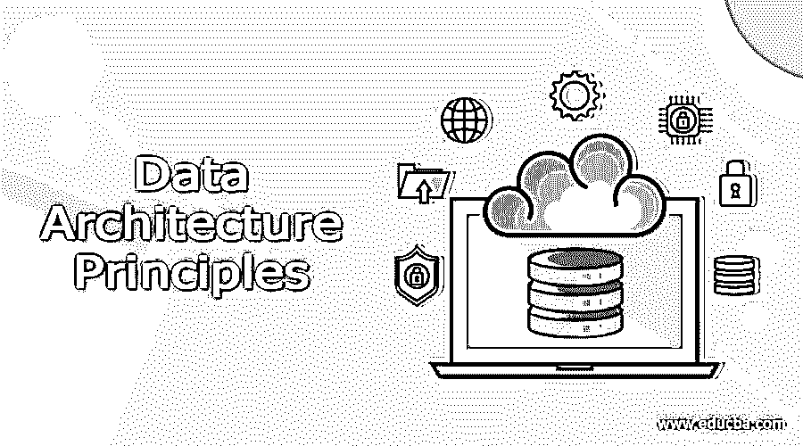

# 数据架构原则

> 原文：<https://www.educba.com/data-architecture-principles/>

## 数据架构原理介绍

用于管理用户数据收集和数据库管理的一组规则和规定称为数据架构原则，这些规则有助于保持数据框架的格式一致。这有助于以更好的方式形成数据架构的结构，从而使数据保持一致，并有助于更好地集成。这些原则是重要的，使得在管理具有所有可用数据资产的数据架构时，这些原则有助于在不损害底层结构的情况下维护数据架构的逻辑视图，从而帮助用户管理该结构。

### 什么是数据架构原则？

当我们收到数据库中的数据时，重要的是验证所有给定的数据，以便在源和目标之间不会有任何数据差异。如果有任何异常，最好使用任何自动化工具将其过滤掉。最好在整个团队中遵循一种命名数据列的模式，这样团队成员之间就不会产生混淆。应该为所有的数据条目创建报告，这样以后在记录这些条目上花费的时间会更少。此外，根本不应该在体系结构中创建数据副本。

<small>Hadoop、数据科学、统计学&其他</small>

### 市场列表

*   数据提供者和购买者被集合在一起，以便他们能够洞察他们共享的数据，这个地方被称为数据市场。最初，数据提供商通常从中间人那里获得数据，但现在，数据是直接从提供商那里购买的，以减少对数据来源和相关性的混淆。这个地方使得所有的供应商都很重要，因此新来者不会感到被市场冷落。
*   我们有 snowflake data marketplace、Otonomo、Datafairplay、Infochimps 和 Qlik，这些都是数据标准化和数据交易非常频繁的地方。提供了一个目录，我们可以在其中查找所需的数据集，并要求提供商提供数据的必要细节。数据订阅很容易获得，通常是实时数据或最近发生的批量数据。这可以用于公司的数据增长，从而为公司本身带来潜在的利润。
*   数据市场提供了各种类别，如营销、制造、酒店和许多其他特定于数据所属部门的类别。还提供了数据的位置，并且一旦买方请求访问，就应该签署某些规则和规定，以便在市场上连续交付相同类别的数据。

### 现代数据架构基础

*   在使用现代架构时，抛弃所有旧的数据库和遗留的数据建模系统是很重要的。我们可以通过检查效率和成本因素将数据转移到开源数据库中，这样我们在使用旧数据库时就不会损失太多。
*   最好转移到托管数据库，这样就不会在数据库管理和数据库扩展上花费时间。安全性和备份将由数据库本身负责，这样用户将有更多的时间进行数据分析和数据建模。
*   应该避免使用传统的数据仓库，因为它们的存储容量较小，但是现代数据仓库有数据湖存储，我们可以在容器或 blobs 中存储结构化和非结构化形式的数据。这有助于数据分类和数据分析，任何人都可以很容易地访问数据。
*   微服务架构是另一个优势，其中几个应用程序构建在一起，我们可以使用其中最好的数据库来处理我们的数据。因此，我们的数据库不会因为数据而负担过重，因为有几个数据库为了同一个目标一起工作。
*   由于数据湖充当任何类型数据的存储库，因此最好维护一个在线目录，并在需要时分析数据。这有助于预测未来，而不是总是挖掘过去。

### 数据架构–三个阶段

*   数据必须始终被视为一种共享资源，因此在考虑数据集时，区域、社会和经济状况的障碍不应占据首要位置。这将有助于利益相关者以 360 度视角查看数据，从而提供更好的见解。
*   在与利益相关者共享数据时，安全性非常重要，因为数据大部分是实时的。因此，访问这些数据并从基础层面提供安全性使提供商相信他们的数据在安全的人手中，并且不会有任何涉及这些数据的不当行为。
*   将数据复制到新源不是一种好的做法。这样做既浪费了资源，又损害了数据的保真度。在这种情况下，大规模并行处理很好，这样就可以管理相同数据的多个工作负载和多个结构。

### 利益

*   更好地理解:考虑到数据架构规则，找出所有的数据异常非常重要。这有助于更好地理解数据，从而采取正确的方法处理这类数据。此外，由于该结构是建立在数据治理之上的，所以处理数据和市场的人很容易被认识。
*   不同的工具:由于对数据有更好的理解，分析师很容易使用人工智能或机器学习工具。数据的集成很容易，这有助于利益相关者对数据做出更好的决策。应用规则后，数据库中数据的延迟非常小，因为混合环境可以很好地接管数据。

### 结论

从数据收集开始就遵循数据架构的所有规则是有好处的，这样工作就变得容易，不那么累了。这有助于确保遵循的数据架构策略是正确的，因此可以更快、更高效地满足客户需求。

### 推荐文章

这是一个数据架构原则的指南。这里我们分别讨论介绍、什么是数据架构原则、市场列表、好处。您也可以看看以下文章，了解更多信息–

1.  [数据流架构](https://www.educba.com/data-flow-architecture/)
2.  [Teradata 架构](https://www.educba.com/teradata-architecture/)
3.  [大数据架构](https://www.educba.com/big-data-architecture/)
4.  [数据挖掘架构](https://www.educba.com/data-mining-architecture/)

