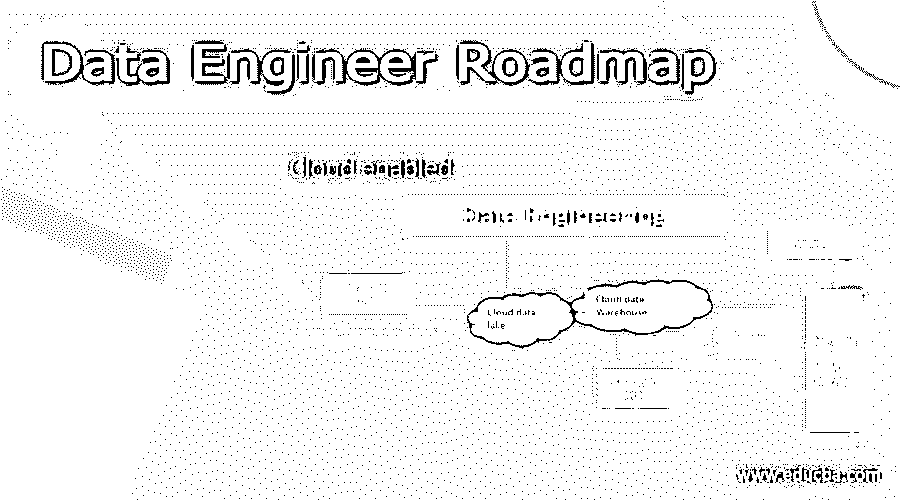
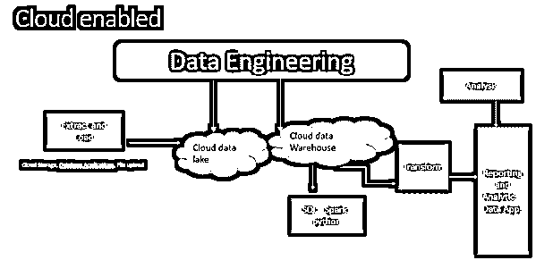

# 数据工程师路线图

> 原文：<https://www.educba.com/data-engineer-roadmap/>

## 什么是数据工程师路线图？

数据工程师开发和构建管道，使数据科学家能够从众多来源获取数据，并生成和提供大数据见解。为了将数据转换成可用的形式，数据工程师受到高度重视。他们使用既定的方法和统计工具来分析和解释结果。他们提供的信息在各个层面都被使用。

### 数据工程师是怎么做的？

数据工程师所做的是确保他们组织的干净的原始数据可以被其他人用来做出数据驱动的业务选择。数据工程发展很快，现在对它的需求越来越大。因为数据工程的首要目标是让数据科学家的生活更轻松。他们是把数据放在一起的人。没有它们，每天创建的大量数据对公司来说将毫无用处。

<small>Hadoop、数据科学、统计学&其他</small>

### 逐步指导路线—数据工程师路线图

用于收集和存储数据的架构由数据工程师设计和实现。他们还对数据进行预处理，并将其转换成可以使用的格式。概括地说，数据工程师构建数据管道并确保数据顺畅流动。

### 责任

数据工程师有相同的任务，不管他们专注于系统的特定领域。这主要是一个结合了计算机科学、工程和数据库知识和能力的技术角色。

1.架构设计:数据工程本质上是开发数据平台架构的过程。

2.创建与数据相关的工具和实例。首先，数据工程师是利用编程能力来创建、构建和维护集成工具、数据库、仓库和分析系统的开发人员。

3.数据管道的维护和测试。数据工程师将在开发过程中测试系统的可靠性和性能。

4.机器学习算法部署:数据科学家创建机器学习模型。将这些部署到生产环境中是数据工程师的责任。

5.提供数据访问工具:在其他情况下，这样的工具是不必要的，因为数据科学家可以使用数据湖这样的仓库类型直接从存储中获取数据。

#### 1.编程；编排

数据工程师必须精通至少一种编程语言。Python、Java 和 Scala 是数据工程专用编程语言的例子。

#### 2.大数据

人们应该熟悉这些大数据工具-

*   Hadoop 和 MapReduce 是两个经常互换使用的术语。
*   Spark 是一个 Apache 项目。
*   Apache 蜂巢
*   Pig Sqoop 是一个 Apache Pig 项目。

Apache Spark 是使用最广泛的并行处理引擎。

#### 3.数据仓库

ETL 操作是数据工程师的主要职责之一。因此，我们必须了解如何设计、构建和操作数据仓库。雪花、亚马逊红移、谷歌大查询是目前最顶尖的数据仓库工具。需要像 Panoply、Informatica 和 Talend 这样的技能。

#### 4.数据库

需要 SQL 知识。SQL 是最具挑战性的数据工程技术。此外，像数据库规范化或星型模式这样的策略也应该得到认可。数据工程师也知道有些数据库更适合分析，有些更适合事务(OLTP) (OLAP)。

#### 5.分布式的计算机系统

任何数据工程师的工作描述都会提到像 Hadoop (HDFS)这样的分布式文件系统。数据工程师在各种产品和系统方面拥有广泛的技术专业知识和经验。数据工程师知道如何利用技术解决涉及大量数据的挑战。

#### 6.云

Google 云平台、AWS、Azure 和 Apprenda 是一些可访问的云或内部系统。越来越多的应用程序工作负载正在迁移到各种云平台。因此，数据科学/工程社区必须了解这些云。

### 数据工程师职业和技能路线图

所需技能包括:

应精通 SQL、Python、R 等编程语言，了解仓储解决方案和 ETL(提取、转移、加载)工具，对机器学习和算法有基本了解。

软技能，如沟通和团队合作，应该包含在数据工程师的技能组合中。数据科学是一个高度协作的行业，数据工程师与各种利益相关者合作，从数据分析师到首席技术官。

总而言之，需要具备以下能力:

编程非常出色。
数据库概念的实践经验
操作系统知识
云计算知识调度的工作流程
数据处理技术掌握【Cassandra 和 MangoDB 等技术。
·Docker 和 Kubernetes 等基础设施。

**亚马逊网络服务(AWS)是云计算服务(AWS)**

大多数程序员利用 Amazon Web Services (AWS)变得更加敏捷、创新和可伸缩。数据工程师团队使用 AWS 创建自动化数据流。

**卡夫卡**

Kafka 是一个开源的实时数据处理软件平台。这意味着您可以使用它来创建企业所需的实时流媒体应用程序。基于 Kafka 的应用程序可以帮助发现和应用趋势。沟通和团队合作等软技能应该包含在数据工程师的技能组合中。数据科学是一个高度协作的行业，数据工程师与各种利益相关者合作，从数据分析师到首席技术官。

### 职业

该职位的工作列表数量同样增加了 50%以上。去年几乎翻了一倍。因为现在的数据比以往任何时候都多，而且还在以指数速度上升。随着数据变得更加复杂，这一功能将变得更加重要。随着对数据需求的增长，数据工程将变得更加重要。数据工程目前专注于旨在处理大数据、管理数据湖以及为 NoSQL 存储创建大型数据集成管道的计划。在这种情况下，由基础架构组件分配职责的专职数据工程师是理想的选择。

数据工程师的平均收入从 65，000 美元到 142，000 美元不等，取决于你的才能、职能和经验。在美国，一名数据工程师的平均年薪为 128001 美元，还有 5000 美元的现金奖励。

简单地说，职业生涯就像从数据工程师->高级 DE -> BI 架构师->数据架构师开始。

现代图表

### 结论

我们已经到达了旅程的终点。在这一点上，我们几乎成了数据工程师。然而，所教授的必须付诸实践。成为一名数据工程师最困难的方面是获得经验。根据研究，这是业内收入最高的人才之一，这种趋势将持续下去，或者我们应该说，适应和增加很快。

### 推荐文章

这是数据工程师路线图指南。在这里，我们讨论什么是数据工程师路线图，如何做数据工程师，责任，职业和技能。您也可以看看以下文章，了解更多信息–

1.  [什么是数据工程？](https://www.educba.com/what-is-data-engineering/)
2.  [数据工程师面试问题](https://www.educba.com/data-engineer-interview-questions/)
3.  [Databricks 面试问题](https://www.educba.com/databricks-interview-questions/)
4.  [系统工程](https://www.educba.com/system-engineering/)

