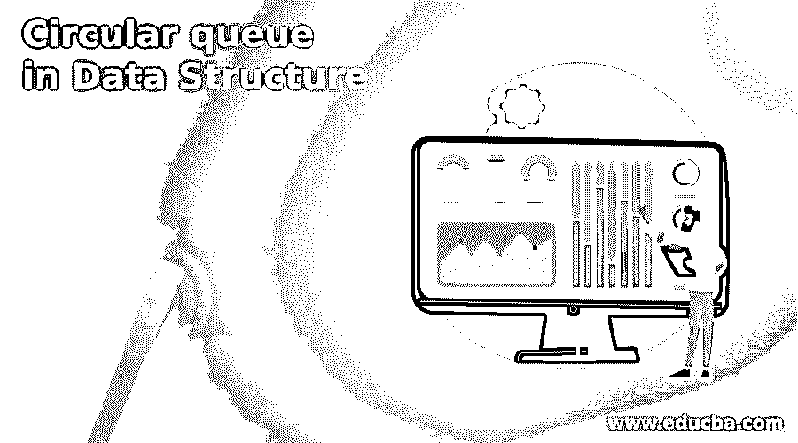

# 数据结构中的循环队列

> 原文：<https://www.educba.com/circular-queue-in-data-structure/>

## 数据结构中的循环队列介绍

循环队列是一种有助于线性存储数据的数据结构，类似于普通的简单队列，但其功能是将最后一个元素连接到第一个元素。假设队列的第一个位置为空，即使队列已满，这也有助于在队列中插入新元素。本文将学习循环队列、循环队列的应用和用法，学习可以在循环队列上执行的操作，以及使用 C 编程语言实现的示例。

### 循环队列的结构

对循环队列执行的操作是基于 FIFO 的，FIFO 代表先进先出原则，这意味着插入循环队列的第一个元素也将是第一个被移除的元素。因此，循环队列通常也被称为环形缓冲区。我们在队列中执行新元素插入(也称为入队操作)的队列末端称为后端位置，而我们执行删除操作的末端称为前端位置。下图显示了循环队列的工作方式以及数据在其中的存储方式。

<small>Hadoop、数据科学、统计学&其他</small>

循环队列现在包含五个元素，前面指向第 0 个元素，后面指向第 4 个索引元素。如果进行了插入，那么后面将增加 1，这意味着在完成队列操作时，后面=后面+ 1。万一我们要执行删除操作，那么 front 就加 1，也就是说 front = front + 1，第 0 个第个索引的元素就被删除了，也叫出列。

### 循环队列上的操作

可以对循环队列进行以下操作

*   **Rear–**该操作将检索循环队列的最后一个元素。
*   **Front–**该操作将有助于检索循环队列的第一个元素。
*   **enQueue(value)–**该操作将执行新值的插入，新值作为括号之间的参数提供给该 enQueue 函数。en 队列操作将总是从循环队列的后端执行。

在执行入队操作时，该算法将通过检查条件“后”是否等于队列-1 的大小以及“前”是否正好等于 0 或者队列“后”变满的条件是否等于“前-1”来检查队列是否已被占用或已满。当我们用 f 表示前部，用 r 表示后部时，情况如下所示

`((r==size-1 && f==0) || (r == front-1))`

则算法将显示队列已满，上述条件评估为真。如果条件的结果为 false，那么将从后面插入一个新元素，如果队列已经满了，则将后面的元素设置为 0，或者在另一种情况下将后面的元素加 1。

*   **出列()–**

该操作将导致从前端指向的元素中删除一个元素，从而导致循环队列中前端的值减 1。在执行删除时，该算法使用条件 front 正好等于-1，即 f == -1，来检查队列是否为空。如果条件评估为真，那么它将显示循环队列为空，如果不是，那么它将检查前面是否正好等于后面，如果是，则将前面的值设置为后面减 1，即 f= =r-1。如果不是，则检查前端是否等于大小减 1，即 f == r-1，如果结果为真，则将前端设置为 0，f= 0，并返回删除的元素值。

### 循环队列的实现

我们之前讨论的循环队列操作可以在任何编程语言中使用。让我们看看如何使用 C 编程语言实现循环队列。下面的程序实现了循环队列，函数的名字是自定义的。

`#include<bits/stdc++.h>
using namespace std;
struct CircularQueue
{
// Initialize the value of front and rear ends
int r, f;
// Specifications of Circular Queue
int size;
int *arr;
CircularQueue(int s)
{
f = r = -1;
size = s;
arr = new int[s];
}
void  insertInCircularQueueORenQueue(int value);
int  deleteFromCircularQueueORdeQueue();
void showQueue();
};
/* Function to create Circular queue */
void CircularQueue:: insertInCircularQueueORenQueue(int value)
{
if ((f == 0 && r == size-1) ||
(r == (f-1)%(size-1)))
{
printf("\nQueue is completely occupied or Full");
return;
}
else if (f == -1) /* Add First value*/
{
f = r = 0;
arr[r] = value;
}
else if (r == size-1 && f != 0)
{
r = 0;
arr[r] = value;
}
else
{
r++;
arr[r] = value;
}
}
int CircularQueue:: deleteFromCircularQueueORdeQueue()
{
if (f == -1)
{
printf("\nCircular Queue is Empty");
return INT_MIN;
}
int data = arr[f];
arr[f] = -1;
if (f == r)
{
f = -1;
r = -1;
}
else if (f == size-1)
f = 0;
else
f++;
return data;
}
void CircularQueue::showQueue()
{
if (f == -1)
{
printf("\nCircular Queue is Empty");
return;
}
printf("\nCircular queue currently contains the following elements : ");
if (r >= f)
{
for (int i = f; i <= r; i++)
printf("%d ",arr[i]);
}
else
{
for (int i = f; i < size; i++)
printf("%d ", arr[i]);
for (int i = 0; i <= r; i++)
printf("%d ", arr[i]);
}
}
int main()
{
CircularQueue q(5);
// Insert few elements in Queue
1\. insertInCircularQueueORenQueue(14);
2\. insertInCircularQueueORenQueue(22);
3\. insertInCircularQueueORenQueue(13);
4\. insertInCircularQueueORenQueue(-6);
// Show all the current elements present in the circular queue
q.showQueue();
// Delete the elements from the queue
printf("\nElement deleted from circular queue  = %d", q. deleteFromCircularQueueORdeQueue());
printf("\nElement deleted from circular queue  = %d", q. deleteFromCircularQueueORdeQueue());
q.showQueue();
1\. insertInCircularQueueORenQueue(9);
2\. insertInCircularQueueORenQueue(20);
3\. insertInCircularQueueORenQueue(5);
q.showQueue();
1 insertInCircularQueueORenQueue(20);
return 0;
}`

上述代码的输出如下所示

### 结论

循环队列是一种线性数据结构，其末端与起点相连，用于流量系统、内存管理和 CPU 调度。

### 推荐文章

这是一个数据结构中循环队列的指南。这里我们讨论可以在循环队列上执行的操作，以及一个例子。您也可以看看以下文章，了解更多信息–

1.  [DB2 数据类型](https://www.educba.com/db2-data-types/)
2.  [数据链路层服务](https://www.educba.com/data-link-layer-services/)
3.  [数据仓库软件](https://www.educba.com/data-warehouse-software/)
4.  [堆数据结构](https://www.educba.com/heap-data-structure/)

