# 数据结构中的队列

> 原文：<https://www.educba.com/deque-in-data-structure/>

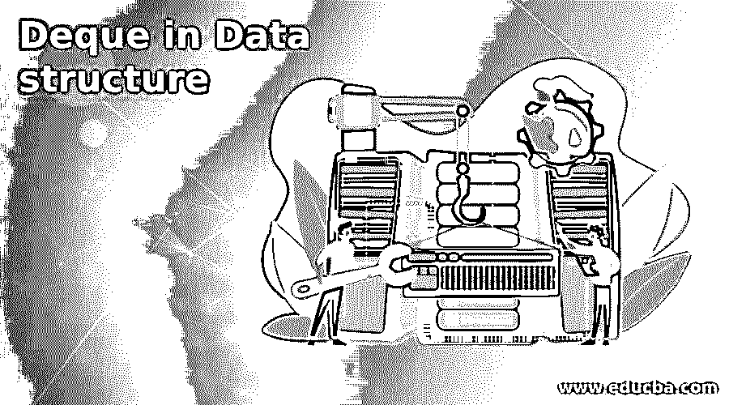

## 数据结构中的 Deque 简介

Deque 是数据结构的一种，也叫双端队列，在这种队列中，插入和删除操作既可以从前端执行，也可以从后端执行。通常，当我们谈论队列时，前端是所有删除操作都在其中进行，而所有插入操作都在后端进行。但是双端队列可以从两端执行删除和插入；这就是它有这个名字的原因。因此，Deque 实际上被认为是名为 queue 的数据结构的通用版本，并且是线性数据结构之一。在本文中，我们将研究 Deque 的工作原理及其实现。

### 数据结构中的队列工作

Deque 具有特殊的功能，它可以像堆栈和队列一样执行，因为对于应该考虑哪一端来执行插入和删除任务没有限制。当从同一端执行这两个任务时，会导致 LIFO 规则的行为，即后进先出，遵循堆栈数据结构。因此，我们可以使用 Deque 实现堆栈的功能。下图显示了 Deque 堆栈行为的正确表示

<small>Hadoop、数据科学、统计学&其他</small>

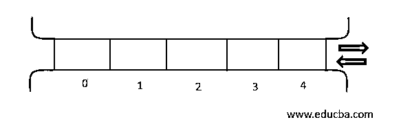

当我们从一端执行插入，从另一端执行删除时，该数据结构的行为是，首先插入的项也是最先删除的项，这与先进先出的 FIFO 规则相同。因此，当通过 dequee 执行这种功能时，它的行为就像一个队列数据结构，证明我们可以使用 dequee 实现队列。例如，下图描述了使用 Deque 的队列的行为。

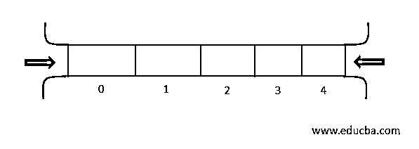

当使用双端队列时，可以实现两种类型的队列，即双端队列。它们是输入受限队列和输出受限队列。

#### 输入受限队列

输入受限队列是我们可以从队列的前端和后端执行删除操作的队列。然而，插入操作只能从其一端进行。下图描述了输入受限队列行为–

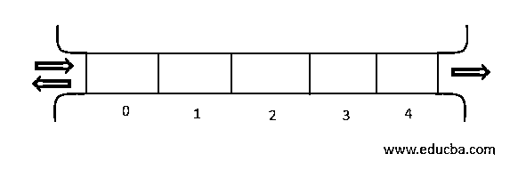

#### 输出受限队列

另一种类型的队列是输出受限队列，可以从任意一端插入，但只能从一端删除，如下图所示。

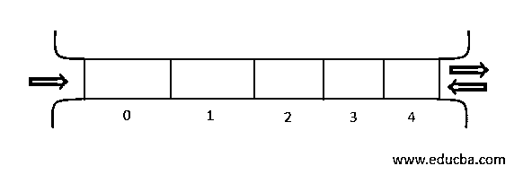

对双端队列(Deque)的操作--

我们可以在给定的队列数据结构上执行以下操作列表

*   从前端插入
*   从后端插入
*   从前端删除
*   从后端删除

除了插入和删除功能，还有许多其他功能，如

*   peek，它帮助我们获得当前由前端指向的元素，以及当前由后端指向的元素。
*   isFull()函数有助于确定特定大小是由给定 Deque 的所有元素完全占据的 Deque。如果 Deque 被完全占用，则返回 true，否则返回 false。
*   isEmpty()函数的工作方式与 isFull()函数相反，它确定队列的给定堆栈是否完全为空。如果为空，函数返回 true 如果其中有一个字符，则为 false。

### Deque 的实现

我们可以用两种方式实现双端队列数据结构，要么使用双向链表，要么使用循环数组数据结构。

#### 1.双向链表

双向链表在它保存的每个元素中存储两个东西。它包含元素的值和它所指向的下一个元素的地址，以及该元素之前的元素的地址。因此，命名为双向链表。下图显示了双向链表的示例

#### 2.圆形阵列

另一方面，循环数组就像普通数组一样，其中最后一个元素连接并链接到它保存的第一个元素。因此，每当我们试图在数组已满的情况下插入一个元素时，如果第一个位置为空，则该元素会被插入到第一个位置。这不会像普通数组那样导致溢出错误。下图大致描述了循环数组在长度为 5 的数组中的内部工作方式

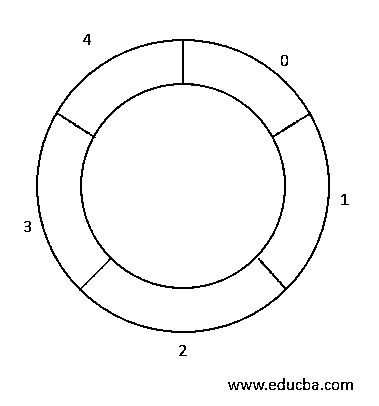

### 德克的应用

以下是我们使用 Deque 数据结构的最常见场景

*   它在多处理器调度中用于实现 steal 算法。
*   我们可以通过使用 Deque 实现一个堆栈和一个队列，这有助于使用相同的撤销和重做操作。
*   它被用来实现一个回文检查器，在这里我们必须检查字符串从两端开始是否相同。

### Deque 的实现

当那时创建了一个 Deque 时，前面和后面都指向-1。在队列中添加新元素的过程称为入队，而删除新元素的过程称为队列。

#### 1.排队操作

假设我们在 Deque 中插入了一个元素。因此，前面(f)将指向 0，后面(r)将指向 0，如下图所示。

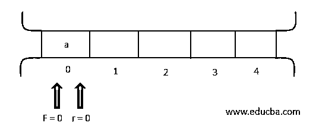

现在，如果我们想从后面插入元素，那么后面的值将变为 1，而前面的值仍为 0，如图所示

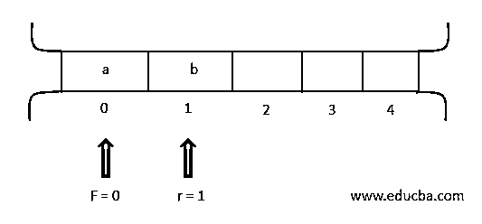

如果您想要从前面添加值，那么前面将减少 1，即 front = front -1，由于前面已经是 0，因此它将变为-1，这是不可能的，因此导致指向 Deque 的最后一个元素，在此添加元素，如下所示

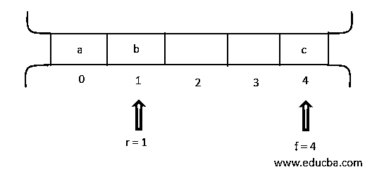

#### 2.德克操作

从前端的删除操作包括递增前端的值，即前端=前端+ 1，如图所示。如果前端已经达到了数组的最大长度，那么它将指向零，删除最后一个元素，如下所示

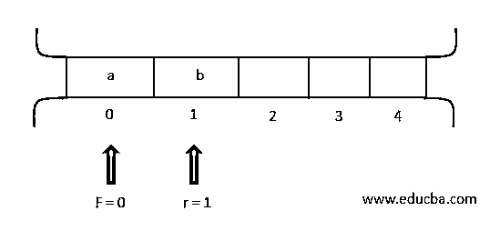

从后方的反队列包括将后方递减 1，即后方=后方-1，结果如下所示

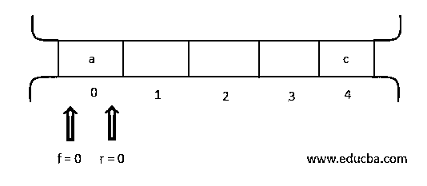

#### 3.实际实施

下面的代码实现了出列，其中我们创建了不同的函数来执行不同的出列操作，并从 main 函数中调用它们。功能的名称对于它们所执行的操作是不言自明的

`#define size 5
#include <stdio.h>
int sampleDeque[size];
int f=-1, r=-1;
void  insertFromFrontEnd(int x)
{
if((f==0 && r==size-1) || (f==r+1))
{
printf("Double Ended Queue is completely occupied ");
}
else if((f==-1) && (r==-1))
{
f=r=0;
sampleDeque[f]=x;
}
else if(f==0)
{
f=size-1;
sampleDeque[f]=x;
}
else
{
f=f-1;
sampleDeque[f]=x;
}
}
void  insertFromReartEnd(int x)
{
if((f==0 && r==size-1) || (f==r+1))
{
printf("Double Ended Queue is completely occupied");
}
else if((f==-1) && (r==-1))
{
r=0;
sampleDeque[r]=x;
}
else if(r==size-1)
{
r=0;
sampleDeque[r]=x;
}
else
{
r++;
sampleDeque[r]=x;
}
}
void show()
{
int i=f;
printf("\nAll the elements in a double ended queue i.e. Deque: ");
while(i!=r)
{
printf("%d ",sampleDeque[i]);
i=(i+1)%size;
}
printf("%d",sampleDeque[r]);
}
void  retrieveFrontValue()
{
if((f==-1) && (r==-1))
{
printf("Deque is empty");
}
else
{
printf("\nThe value of element pointed by front end is: %d", sampleDeque[f]);
}
}
void  retrieveRearValue()
{
if((f==-1) && (r==-1))
{
printf("Deque is empty");
}
else
{
printf("\nThe value of the element pointed by rear end is: %d", sampleDeque[r]);
}
}
void  deleteFromFrontEnd()
{
if((f==-1) && (r==-1))
{
printf("Deque is empty");
}
else if(f==r)
{
printf("\nThe deleted item is %d", sampleDeque[f]);
f=-1;
r=-1;
}
else if(f==(size-1))
{
printf("\nThe deleted item is %d", sampleDeque[f]);
f=0;
}
else
{
printf("\nThe deleted item is %d", sampleDeque[f]);
f=f+1;
}
}
void  deleteFromRearEnd()
{
if((f==-1) && (r==-1))
{
printf("\nNothing is there in Deque to display");
}
else if(f==r)
{
printf("\nThe removed item is %d", sampleDeque[r]);
f=-1;
r=-1;
}
else if(r==0)
{
printf("\nThe removed item is %d", sampleDeque[r]);
r=size-1;
}
else
{
printf("\nThe removed item is %d", sampleDeque[r]);
r=r-1;
}
}
int main()
{
insertFromFrontEnd(2);
insertFromFrontEnd(1);
insertFromReartEnd(3);
insertFromReartEnd(5);
insertFromReartEnd(8);
show();
retrieveFrontValue();
retrieveRearValue();
deleteFromFrontEnd();
deleteFromRearEnd();
show();
return 0;
}`

上述代码的输出如下所示:–

### 结论–数据结构中的队列

我们可以利用 Deque 数据结构来插入和删除它两端的元素，并且可以通过使用双向链表或循环数组来实现。

### 推荐文章

这是一个数据结构中的 Deque 指南。在这里，我们将讨论 Deque 的工作方式及其实现和输出。您也可以看看以下文章，了解更多信息–

1.  [c++中的 Deque](https://www.educba.com/deque-in-c-plus-plus/)
2.  [铁锈队列](https://www.educba.com/rust-queue/)
3.  [数据仓库软件](https://www.educba.com/data-warehouse-software/)
4.  [面板数据分析](https://www.educba.com/panel-data-analysis/)

