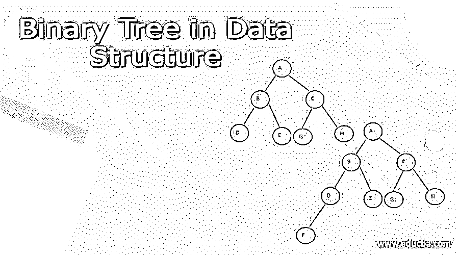
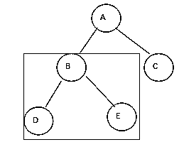
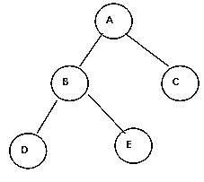
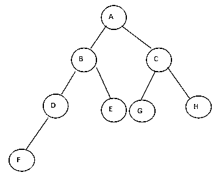
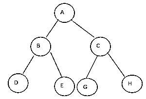
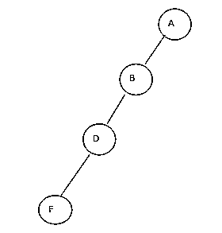
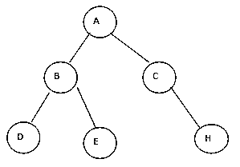

# 数据结构中的二叉树

> 原文：<https://www.educba.com/binary-tree-in-data-structure/>

## 数据结构中二叉树的定义

数据结构为用户提供了不同类型的树，我们可以根据用户的需求来使用它们。二叉树是数据结构中的一种树类型；这是一种特殊的树。在二叉树中，每个节点或每个顶点都有两个子节点或单个子节点，或者没有子节点。基本上，二叉树是数据结构中非常重要的一类，其中二叉树的节点最多有两个子节点。在二叉树中，左边称为左子节点，右边称为右子节点。

**语法:**

<small>Hadoop、数据科学、统计学&其他</small>

`struct b_node
{
int item;
struct b_node *left_node;
struct b_node *right_node;
};`

**解释**

在上面的语法中，我们表示一个二叉树，这里我们使用结构来表示包含两个指针的二叉树，这两个指针具有两个项目，一个用于左边的子节点，一个用于右边的子节点，如上面的语法所示。

### 二叉树在数据结构中是如何工作的？

现在让我们看看二叉树在数据结构中是如何工作的，如下所示。

在上图中显示了二叉树；如上图所示，树最多包含两个子节点。二叉树中使用的一些重要术语如下。

**路径:**路径用于表示节点的顺序，可以是左侧，也可以是右侧。

根:树的最顶端的节点我们称之为根节点，每棵树只有一个根节点，例如 A 就是根节点。

**Parent:** 我们可以把除了根节点之外的任何节点都看作是父节点，比如 B 就是父节点。

**子节点:**父节点树下包含子节点，例如 D，E 是 b 的子节点。

**叶:**在二叉树中，节点没有任何子节点，我们称该节点为叶节点，例如 D.
子树:二进制我们包含子树，例如在上面的二进制中，我们用正方形表示子树。

**Keys:** 用来表示一个节点的值，用来执行搜索和插入操作。
现在让我们看看二叉树的基本操作如下。

**插入操作:**

二叉树表示从插入操作开始。然后，我们将节点插入到适当的位置，节点的位置基于节点的键值。

**搜索操作:**

当我们需要在二叉树中搜索一个元素时，我们从根节点开始搜索，然后将项目值或元素值与键值进行比较。如果搜索值小于键值，那么我们在左侧执行搜索，如果搜索值大于键值，那么我们在右侧执行搜索。

**前序遍历:**

我们按照需求以预先排序的方式遍历节点。

**按顺序遍历:**

我们按照需求以有序的方式遍历节点。

**后序遍历:**

我们按照需求以后序方式遍历节点。

### 不同类型的二叉树

不同类型的二叉树如下。

**1。完全或严格或适当的二叉树**

完全二进制意味着如果每个节点应该有 0 或 2 个子节点，那么我们说这棵树是一个完全二进制树，完全二进制我们也可以称之为严格二进制树。完整二叉树的简单例子如下图所示。

**2。完整二叉树**

完全二叉树是这样一种树，其中除了最后一层之外，每个节点都被完全填充。在最后一层，每一个节点都应该和预期的一样左。在一个完整的二叉树中，节点应该从左边开始添加。完整的二叉树如下图所示。

**3。完美二叉树**

在一棵完美的二叉树中，如果所有的内部节点都有两个子节点，并且所有的叶子节点都有相同的级别，那么我们可以说这棵树是一棵完美的二叉树。我们用下图说明了完美的二进制。

**4。退化二叉树**

退化二叉树意味着所有内部节点只有一个子节点，要么在树的左侧，要么在树的右侧。我们用下图来说明退化的二叉树。

上面的树只有一个子节点，它也被称为右斜树。同样，我们可以画出左斜的树。

**5。平衡二叉树:**

平衡树意味着树的左右两边最多相差 1。我们用下图来说明平衡二进制。

### 例子

现在让我们来看看数据结构中二叉树的例子，如下所示。

`class B_Node:
def __init__(self, key_value):
self.left_B = None
self.right_B = None
self.val_B = key_value
def PreOrder_B(self):
print(self.val_B, end=' ')
if self.left_B:
self.left_B.PreOrder_B()
if self.right_B:
self.right_B.PreOrder_B()
def InOrder_B(self):
if self.left_B:
self.left_B.InOrder_B()
print(self.val_B, end=' ')
if self.right_B:
self.right_B.InOrder_B()
def PostOrder_B(self):
if self.left_B:
self.left_B.PostOrder_B()
if self.right_B:
self.right_B.PostOrder_B()
print(self.val_B, end=' ')
root = B_Node(4)
root.left_B = B_Node(3)
root.right_B = B_Node(5)
root.left_B.left_B = B_Node(1)
print("Pre-order is: ", end="")
root.PreOrder_B()
print("\nIn order is: ", end="")
root.InOrder_B()
print("\nPost order is: ", end="")
root.PostOrder_B()`

**解释**

在上面的例子中，我们使用 python 编程语言来实现数据结构中的二叉树。在这个例子中，我们实现了三种不同的操作:前序树遍历、有序树遍历和后序树遍历，如上面的程序所示。我们使用下面的快照来说明上述语句的最终输出。

### 结论

我们希望从这篇文章中你能学到数据结构中的二叉树。从上面的文章中，我们已经学习了二叉树的基本语法，我们也看到了二叉树的不同例子。从本文中，我们了解了如何以及何时在数据结构中使用二叉树。

### 推荐文章

这是一个数据结构中二叉树的指南。这里我们讨论定义，语法，二叉树如何在数据结构中工作？不同类型的二叉树，有代码实现的例子。您也可以看看以下文章，了解更多信息–

1.  [堆数据结构](https://www.educba.com/heap-data-structure/)
2.  [数据结构中的散列](https://www.educba.com/hashing-in-data-structure/)
3.  [数据结构中的 B+树](https://www.educba.com/b-plus-tree-in-data-structure/)
4.  [数据结构中的链表](https://www.educba.com/linked-list-in-data-structure/)

