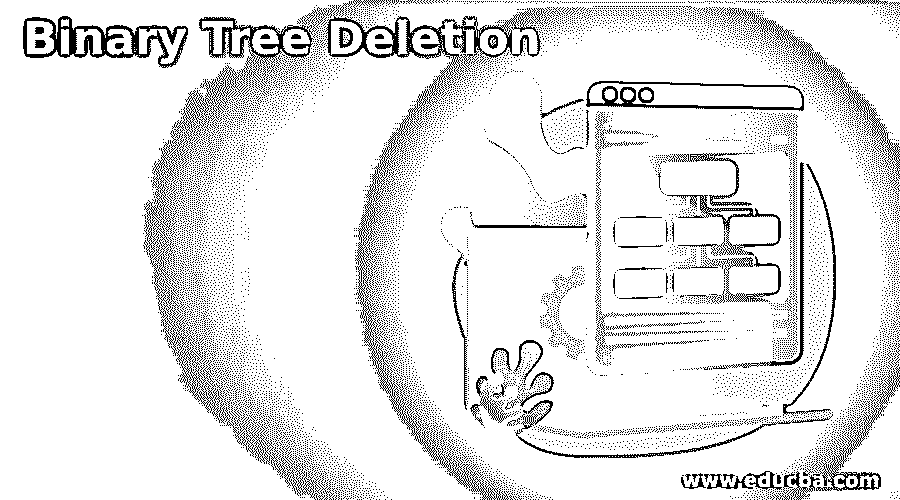

# 二叉树删除

> 原文：<https://www.educba.com/binary-tree-deletion/>

## 二叉树删除简介

二叉树删除被称为从二叉树中删除一个节点。从二叉树中删除一个节点会从最右边的底部开始收缩树。这意味着如果你从二叉树中删除一个节点，它将被最右边的底部节点所取代。这种删除与二叉查找树有些不同。与二叉查找树不同，二叉树没有任何顺序；这就是为什么我们从最右边的底部节点替换删除一个节点。要删除一个节点，首先，我们将从根节点开始，寻找最右边的底部节点。然后，我们将搜索我们想要删除的节点，并用最右边的底部节点替换它。最后，我们将删除最右边的底部节点。

**二叉树删除的语法**

<small>Hadoop、数据科学、统计学&其他</small>

下面给出了提到的语法:

`void deleteNode(Node *root, int data)
{
if(root == NULL)
{
Cout << “Tree is empty\n”;
return;
}
queue<Node*> q;
q.push(root);
while(!q.empty())
{
Node *temp = q.front();
q.pop();
if(temp->data == data)
{
Node *current = root;
Node *prev;
while(current->right != NULL)
{
prev = current;
current = current->right;
}
temp ->data = current->data;
prev->right = NULL;
free(current);
cout << “Deleted\n”;
return;
}
if(temp->left != NULL)
q.push(temp->left);
if(temp->right != NULL)
q.push(temp->right);
}
cout << “Node not found for deletion\n”;
}`

### 二叉树遍历

遍历是访问树中所有节点的过程。由于树是一种非线性数据结构，所以不存在唯一的遍历。

我们将考虑以下两种带有组的几种遍历算法:

*   深度优先遍历
*   广度优先遍历

有三种不同类型的深度优先遍历:

*   **pre oderer 遍历:**先访问父节点，再访问左右子节点。
*   **InOrder 遍历:**访问左边的子节点，然后是父节点和右边的子节点。
*   **后序遍历:**先访问左边的子节点，再访问右边的子节点，再访问父节点。

只有一种广度优先遍历:层次顺序遍历。这种遍历按照从上到下和从左到右的级别访问节点。

### 如何进行二叉树删除？

要执行二叉树删除，首先，我们将维护一个队列，并使用将根节点推入其中。然后，当 q 不为空时，我们将进行处理。假设我们保留两个指针，key_node 表示为 Node*，空指针和最后一个节点或最深节点。

现在，我们将选择一个元素，假设当前节点，当前节点将总是我们从队列中弹出的元素。我们将检查这个值是否与我们想要删除的键匹配。每个节点都有一些数据类型的数据，然后是左右指针。所以我们会将当前节点的这个数据与删除键进行比较；如果匹配，那么我们将更新 key_node。所以，如果当前节点数据等于键，那么键节点等于当前节点。当这个循环结束时，队列为空，并且每个节点都已被处理。因此，无论 last_node 的最后一个值是什么，它都将表示树的叶节点。

### 二叉树删除算法

下面给出了二叉树删除的算法:

算法 Bideletionseq(key)
{
//key 是要删除的节点

l = BTSearchseq(i，key)；
如果((A[2 * l]= = NULL)&&A[2 * l+1]= = NULL)那么
A[l]= NULL；
else
printf("节点不存在")；
}

算法 Bideletionlink(item)
{
//item 是要删除的数据
Parent = BTSearchlink(root，item)；
{
if(parent→lchild！= NULL & & parent→rchild！= NULL)
{
ptr 1 = parent→l child；
ptr 2 = parent→rchild；
if(ptr 1→child = = NULL&T23】ptr 1→r child = = NULL)
{
ptr 1→l child = NULL；
}
if(ptr 2→l child = = NULL&&ptr 2→r child = = NULL)那么
{
ptr 2→r child = NULL；
}
}
else
printf("不能删除")；
}

**举例:**

1
/
2 3
/
4 5
\
6

这是一棵二叉树，我们必须在有序遍历中删除数据为 3 的节点。

**c++中用于删除的代码:**

`#include<iostream>
#include<queue>
using namespace std;
struct Node{
int data;
Node *left;
Node *right;
Node(int val): data(val), left(NULL), right(NULL){}
~Node(){}
};
void inorder(Node *root){
if(!root){
return;
}
inorder(root->left);
std::cout<<root->data<<"\t";
inorder(root->right);
}
void remove_node(Node *root, Node *n){
if(root == NULL)
return;
if(root == n){
delete n;
root = NULL;
return;
}
if(root->left == n){
delete n;
root->left = NULL;
return;
}
if(root->right == n){
delete n;
root->right = NULL;
return;
}
remove_node(root->left, n);
remove_node(root->right, n);
}
Node* delete_node(Node *root, int key){
if(root == NULL)
return NULL;
if(!root->left && !root->right){
if(root->data == key){
delete root;
root = NULL;
return root;
}
return root;
}
std::queue<Node *>Q;
Q.push(root);
Node *key_node = NULL;
Node *curr_node = NULL;
while(!Q.empty()){
curr_node = Q.front();
Q.pop();
if(curr_node->data == key){
key_node = curr_node;
}
if(curr_node->left)
Q.push(curr_node->left);
if(curr_node->right)
Q.push(curr_node->right);
}
if(key_node){
key_node->data = curr_node->data;
remove_node(root, curr_node);
}
return root;
}
int main(){
Node *n1 = new Node(1);
Node *n2 = new Node(2);
Node *n3 = new Node(3);
Node *n4 = new Node(4);
Node *n5 = new Node(5);
Node *n6 = new Node(6);
n1->left = n2;
n1->right = n3;
n2->left = n4;
n3->left = n5;
n4->right = n6;
Node *root = n1;
inorder(root);
std::cout<<endl;
root = delete_node(root, 3);
inorder(root);
std::cout<<endl;
return 0;
}`

**输出:**

### 二叉树的优势

树木非常有用，而且经常被使用，因为它们有一些非常重要的优点:

*   首先，树反映了数据中的结构关系。
*   第二，树被用来表示层次结构。
*   第三，树提供了有效的插入和搜索。
*   最后，树是非常灵活的数据，允许移动。
*   用最少的努力绕过子树。

### 结论

在这篇文章之后，我们现在知道了二叉树，二叉树中的遍历理论意味着我们如何在二叉树中遍历。我们如何删除二叉树中的一个节点，它的语法，C++语言的代码，并给出一个例子来轻松理解二叉树中一个节点的删除。

### 推荐文章

这是一个二叉树删除的指南。这里我们讨论一下入门，如何进行二叉树删除？算法和优点。您也可以看看以下文章，了解更多信息–

1.  [C 语言中的二叉树程序](https://www.educba.com/binary-tree-program-in-c/)
2.  [二叉树的有序遍历](https://www.educba.com/inorder-traversal-of-binary-tree/)
3.  [数据结构的二叉树](https://www.educba.com/binary-tree-in-data-structure/)
4.  [树遍历技术](https://www.educba.com/tree-traversal-techniques/)

