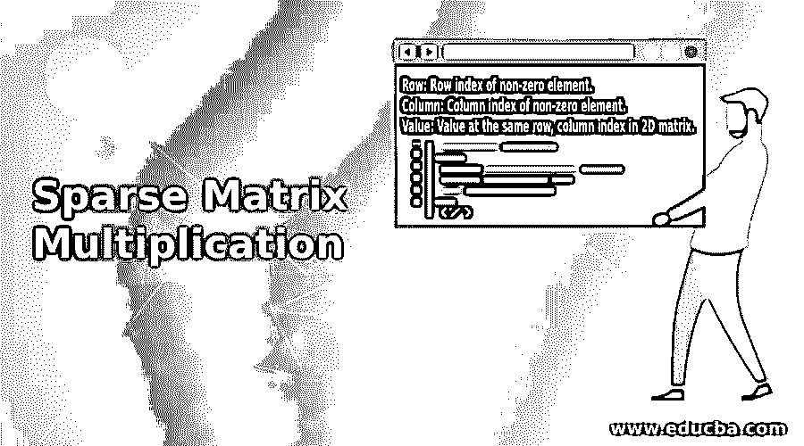
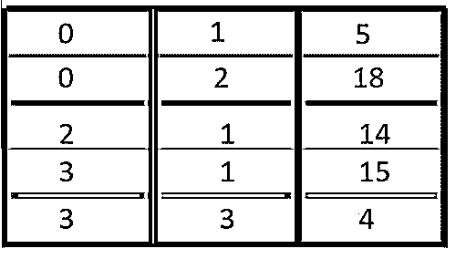
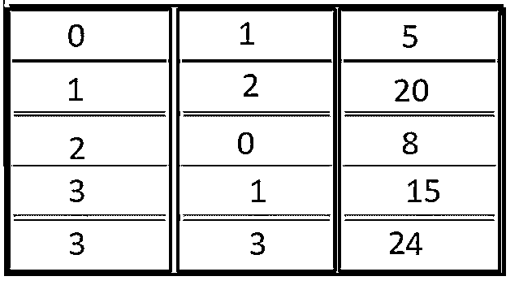

# 稀疏矩阵乘法

> 原文：<https://www.educba.com/sparse-matrix-multiplication/>

## 稀疏矩阵乘法简介

以下文章提供了稀疏矩阵乘法的概述。稀疏矩阵是大部分元素为零的矩阵。存储矩阵的所有元素会导致内存的浪费。因此，最好只存储现有矩阵中非零元素的数据。例如，假设有一个矩阵 A，它的大部分元素都是 0。因此，为了存储所有的矩阵，最好只存储那些非零元素。使用这种方式存储矩阵减少了空间，并且执行操作花费的时间更少。其中一个操作是两个矩阵相乘，我们把两个稀疏矩阵相乘。

### 稀疏矩阵乘法的语法

对于大部分元素为零的两个矩阵相乘，稀疏矩阵乘法具有更好的时间复杂度和空间复杂度。在稀疏乘法中，它限制了处理时间和空间的使用；为了存储非零元素，而不是在矩阵中存储较少数量的非零元素，我们使用以下两种表示法。

<small>Hadoop、数据科学、统计学&其他</small>

**1。数组表示:**一个数组表示，在这里我们需要更频繁地访问元素。由于数组存储，因此基于索引的元素非常有用。2D 数组转换为 1D 数组，其中 3 列表示。

*   **行:**非零元素的行索引。
*   **列:**非零元素的列索引。
*   **值:**位于 2D 矩阵中同一行、列索引处的值。

**2。链表表示:**在链表中，矩阵中插入和删除操作的频率更多，因为与数组相比，在链表中删除和插入元素更容易。

每个节点有四个字段，如下所示:

*   **Row:** 矩阵中非零元素的行索引。
*   **列:**矩阵中非零元素的列索引。
*   **Value:** 矩阵中(行，列)位置的非零元素的值。
*   **下一个节点:**引用下一个节点。

### 如何进行稀疏矩阵乘法？

*   稀疏矩阵是一种二维矩阵，其中零元素比非零元素大。与稀疏矩阵相乘需要大量的存储空间和时间，并且很难执行任何进一步的操作。所以要用更少的时间和空间存储将这些矩阵相乘，我们可以直接将两个约简的稀疏矩阵相乘。
*   假设我们有两个矩阵，都包含大部分元素 0，对这些矩阵的乘法需要大量的时间，这意味着时间复杂度很高，而且存储 3 个矩阵也需要很大的空间，所以最好将这些矩阵转换为稀疏矩阵的简化形式，并将它们相乘，得到的结果矩阵也是稀疏矩阵的简化形式，这种乘法称为稀疏矩阵乘法。
*   我们也可以用与上述表示相同的方式存储结果乘法矩阵。

### 稀疏矩阵乘法示例

下面给出了稀疏矩阵乘法的例子:

让我们用一个例子来说明稀疏矩阵乘法的概念。

考虑下面 4 行 4 列的二维矩阵。

所以在这里，我们可以看到，矩阵中 4 * 4 = 16 个元素中只有 5 个元素非零。这说明我们只需要将这 5 个元素存储在内存中。所以我们只存储非零元素的位置和它们的值。

对于乘法，我们再取一个 4*4 大小的稀疏矩阵。

所以，这里我们可以看到 5 个元素有非零值。

要增加它们，我们必须遵循以下步骤:

**第一步:**首先我们要取第二个矩阵的转置。矩阵的转置是将所有的行转换成列，列转换成行。所以这里我们只存储非零元素。所以我们必须用列替换行，用行替换列。

**第二步:**所以，在这两个矩阵相乘的一个结式矩阵中，设 x 是第一个矩阵的一行，y 是第二个矩阵的转置的一行，我们得到结式[x][y]。因为 resultant[x][y]是所有值的总和，在第一个矩阵中的列和第二个矩阵的转置中的列相同的那些值相乘后得到。

**第三步:**设 x=0，y = 0；在第一个矩阵中，有两个值，其中第一行是 0，第二个矩阵中是 1。因此，如果它们的列也是相同的，那么我们将两者相乘，找到另一对。因此，在该示例中，在第一个矩阵中，0，2 值是 18，而在第二个矩阵中，0，2 是 5。所以我们将两者相乘，找到另一对，但是正如我们所看到的，没有另一对的列是相同的。因此，结果[0][0]是 144。

**第四步:**对于每 0 < =x <行和 0 < =y <列，按照第三步，其中结果[x][y]是结果矩阵。

**代码:**

`struct matrix {
int row; //To store row no.
int col; //To store col no
int value; // element value
};
// Print the sparse matrix
void printMatrix(matrix a[100], int k) {
for (int i=0; i<k;i++) {
cout << a[i].row <<" "<< a[i].col <<" "<< a[i].value << endl;
}
}
// Sort the sparse matrix
bool compareMatrix( struct matrix a, struct matrix b ) {
if (a.row < b.row) {
return true;
}
if (a.row > b.row) {
return false;
}
if (a.col < b.col) {
return true;
}
return false;
}
// Transpose of a sparse Matrix
void transpose(matrix a[100], matrix b[100], int row,int col, int n) {
for (int i=0;i<n;i++) {
b[i].row = a[i].col;
}
for (int i=0;i<n;i++) {
b[i].col = a[i].row;
}
for (int i=0;i<n;i++) {
b[i].value = a[i].value;
}
sort(b,b+n,compareMatrix);
cout << "Transpose of sparse matrix is: -" << endl;
printMatrix(b, n);
}
void multiply(matrix a[100], matrix transposeB[100], matrix resultant[100], int n1, int n2, int rows, int cols) {
int i = 0;
int j = 0;
int k = 0;
int temp = 0;
while( i<rows || j<cols ) {
int a1 = a[i].row;
int b1 = transposeB[j].row;
int tempi = i;
int tempj = j;
while( a[tempi].row==a1 ) {
tempj=j;
while( transposeB[tempj].row == b1) {
if(a[tempi].col == transposeB[tempj].col ) {
temp = temp + (a[tempi].value * transposeB[tempj].value);
}
tempj++;
}
tempi++;
}
if(temp != 0) {
resultant[k].row=a[i].row;
resultant[k].col=transposeB[j].row;
resultant[k].value=temp;
k++;
}
temp=0;
while(j<cols && b1==transposeB[j].row) {
j++;
}
if(b1==transposeB[j].row) {
while(i<rows && a1==a[i].row) {
i++;
j=0;
}
if(a1==a[i].row){
break;
}
}
}
cout << "Multiplication of sparse matrix is: -" << endl;
printMatrix(resultant,k);
}
int main() {
int row1=4, col1=4;
int row2=4, col2=4;
int n1=5,n2=5;
matrix a[n1]={
0,1,5,
0,2,18,
2,1,14,
3,1,15,
3,3,4
};
matrix b[n2] = {
0,1,5,
1,2,20,
2,0,8,
3,1,15,
3,3,24
};
matrix transposeb[n2];
matrix resultant[100];
transpose(b, transposeb, row2, col2, n2);
multiply( a, transposeb, resultant, n1, n2, row1, col2);
}`

**输出:**

### 结论

稀疏矩阵乘法是以较少的时间复杂度执行两个矩阵相乘的解决方案。然而，结果矩阵的大多数元素值也是 0，所以最好以同样的方式存储结果矩阵。因此，我们可以通过只存储非零元素来节省大量空间。

### 推荐文章

这是一个稀疏矩阵乘法的指南。这里我们讨论一下入门，如何进行稀疏矩阵乘法？还有例子。您也可以看看以下文章，了解更多信息–

1.  [MATLAB 中的稀疏矩阵](https://www.educba.com/sparse-matrix-in-matlab/)
2.  [Matlab 反斜杠](https://www.educba.com/matlab-backslash/)
3.  [奈奎斯特 Matlab](https://www.educba.com/nyquist-matlab/)
4.  [如何使用 Matlab？](https://www.educba.com/how-to-use-matlab/)

