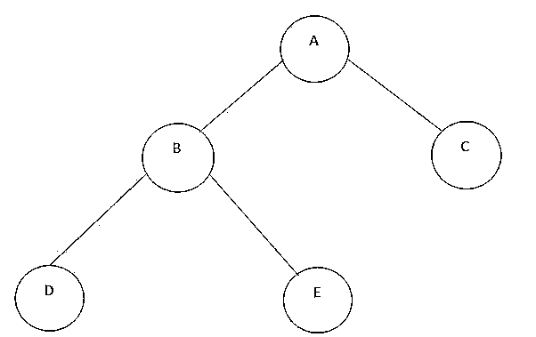
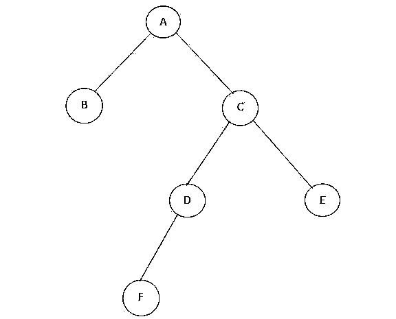

# 二叉树的前序遍历

> 原文：<https://www.educba.com/preorder-traversal-of-binary-tree/>

## 二叉树的前序遍历简介

二叉树的前序遍历是一种先访问根节点，再访问左子树，再访问右子树的遍历方法。与数组和链表、线性数据结构不同，由于二叉树的层次性，我们有几种遍历二叉树的方法。这些树遍历算法分为两种类型，即深度优先算法和广度优先算法。深度优先算法，向下遍历树。Preorder、Inorder、Postorder 实际上都是深度优先的遍历算法。前序遍历将制作树的副本，并用于获取表达式的前缀。

### 二叉树的前序遍历是如何工作的？

*   在前序遍历中，首先访问根节点，然后是左子树，最后是右子树。
*   不像其他数据结构，如数组、队列、堆栈等。只有一种遍历方式，树有三种遍历方式，即，有序、前序和后序遍历。

让我们考虑一个用于前序遍历的二叉树的例子。

<small>Hadoop、数据科学、统计学&其他</small>

*   我们将在上述二叉树上执行深度优先遍历；深度首先由前序、中序和后序组成；我们将在这里看到前序遍历。
*   前序(根，左子树，右子树):A B D E C。
*   得到 Preorder 的步骤很简单，首先访问根节点，即 A，然后遍历到根的左节点，即 B，因为节点 B 有子节点，遍历到子树的左节点，即 d。
*   因为节点 D 没有其他子树，所以移到右边的节点，即 e
*   因为节点 E 没有其他子树，所以移动到顶部并检查根节点是否有任何其他右节点，即 c。
*   因此前序遍历将按照[A，B，D，E，C]移动。

### 前序遍历算法

下面给出了前序遍历的算法:

*   **第一步:**访问根节点。
*   **第二步:**遍历左侧子树，即递归遍历。
*   **第三步:**遍历右子树，即递归遍历。
*   **步骤 4:** 重复步骤 2 和 3，直到访问完所有节点。

二叉树前序遍历可以递归实现，也可以通过任何编程语言使用堆栈数据结构实现。

让我们再看一个实现前序遍历的二叉树。

**前序遍历:** A，B，C，D，F，E

*   打印的第一个元素是 A，遍历左边的子树，左边的根节点是 b。
*   根节点 B 没有子树；因此，我们移到右边的子树，即 c。
*   根节点 C 的左子树只有左节点，即 D，它有带有另一个左节点的子树，即 f
*   因为没有右边的子树，所以移到顶部，在那里你可以找到任何右边的子树。这是 e。
*   因此，一棵树被打印成 A，B，C，D，F，e。

### 二叉树前序遍历的优缺点

下面给出了提到的优点和缺点:

#### 优势:

*   前序遍历用于创建二叉树的副本。
*   它用于获取表达式的前缀。
*   二叉树遍历在树平衡的情况下提供快速搜索、插入和删除。
*   在前序遍历中，在访问左子树和右子树之前打印根节点值。
*   也是深度优先算法的一部分，顺序是根节点>左子树>右子树；因此，它也被称为 NLR 算法。
*   作为深度优先算法的一部分，前序遍历与广度优先算法相比将使用更少的存储空间。

#### 缺点:

*   前序遍历在遍历树时效果很好。然而，由于它是深度优先算法，搜索图可能会陷入无限循环，因为深度优先算法永远以循环的方式搜索图。
*   遍历时不可能得到最短路径。
*   在前序遍历中，复制节点和值可以得到树的完整副本。

### 结论

至此，我们将结束“二叉树的前序遍历”这一主题。我们已经看到什么是前序遍历及其算法。还实现了几个示例来实际说明前序遍历算法。二叉树的遍历有两种类型，广度优先遍历和深度优先遍历。深度优先遍历包括前序、中序和后序遍历。其中，我们在这里看到了前序遍历。我们也列出了二叉树中前序遍历的优缺点。

### 推荐文章

这是一个二叉树前序遍历的指南。在这里我们分别讨论它的介绍、工作原理、算法和优缺点。您也可以看看以下文章，了解更多信息–

1.  数据结构中的 B 树
2.  [数据结构中的 B+树](https://www.educba.com/b-plus-tree-in-data-structure/)
3.  数据挖掘中的决策树
4.  数据结构中的 AVL 树

