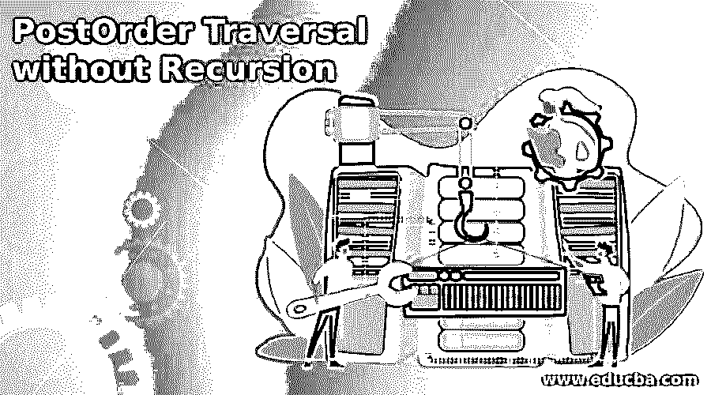
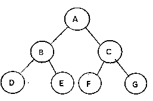

# 无递归的后序遍历

> 原文：<https://www.educba.com/postorder-traversal-without-recursion/>

## 无递归的后序遍历简介

无递归的后序遍历是一种遍历方法，首先访问左边的子树，然后是右边的子树，最后是根节点。与数组和链表不同，作为线性数据结构，由于二叉树的层次性，我们有几种遍历二叉树的方法。它也被称为迭代后序遍历，用于删除二叉树中的节点。

没有递归的后序遍历比有序和前序遍历更复杂，但是使用两个栈可以很容易地完成后序遍历。遍历二叉树包括以某种方式遍历二叉树的所有节点。由于树不是线性数据结构的一部分，从一个给定的节点可能有一个以上的下一个节点。

<small>Hadoop、数据科学、统计学&其他</small>

**语法:**

后序遍历没有特定的语法，但它只是用户编码的方式，即算法或流程图。

### 无递归的后序遍历算法

创建一个空堆栈。

当根节点不为空时，遵循以下步骤。

*   将根节点的右子节点推入堆栈，然后推入根节点。
*   将根节点设置为根节点的左子节点。

从堆栈中弹出一个项目，并将其设置为根节点。

*   如果从堆栈中弹出的项有一个右子节点，并且在顶部有一个右子节点，则从堆栈中移除该右子节点。将根节点推回，并将根节点设置为根节点的右子节点。
*   否则打印根节点的值并将根节点设置为 NULL。

重复这些步骤，直到堆栈为空。

让我们考虑一个例子，使用没有递归的后序遍历，使用 1 个堆栈。

#### 后序遍历是如何完成的？

对于上面的例子，我们将手动进行后序遍历，而不使用递归。

**第一步:**由于 A 的右子存在，C 会被推送到堆栈，然后 A。

**栈:** C，现在把一个
移到子的左边。

**第二步:**由于 B 的右子存在，E 会被推到栈中，然后 B。

**堆栈:** C，A，E，B
现在移动到左边的孩子。

**第三步:**由于 D 的右子不存在，D 将被推到堆栈中。

**堆栈:** C，A，E，B，D
移动到左边的孩子。

**第四步:**由于当前节点为空，从堆栈中弹出 D，作为 D 的右子，不存在。将当前节点设置为空值。

**堆栈:** C，A，E，B

**第五步:**当当前节点为空时，从栈中弹出 B，当右子 B 等于栈中的顶元素时，从栈中弹出 E，将 B 推送到栈中。

**堆栈:** C，A，B

**第六步:**由于 E 的右子不存在，将 E 移至 stack，移至左子。

**堆栈:** C，A，B，E

**第七步:**由于当前节点为空，从堆栈中弹出 E，由于 E 的右子不存在，打印 E，将当前节点设置为空。

**堆栈:** C，A，B

**步骤 8:** 由于当前节点为空，从堆栈中弹出 B。因为 B 的右子元素不等于堆栈中的顶部元素。打印出 B 并将当前节点设置为空值。

**栈:** C，A

**第九步:**由于当前节点为空，从堆栈中弹出一个。当 A 的右子元素等于顶部元素堆栈时，从堆栈中弹出 C，将 A 推送到堆栈中，并将当前节点移动到 A 的右子元素，即 C。

**堆栈:** A

**第十步:**重复以上步骤，打印出 F，G，c，弹出 A，打印出来。

### 无递归的后序遍历示例

下面是没有递归的后序遍历的例子:

现在，让我们使用任何编程语言来实现它。

使用 Java 实现无递归的后序遍历。

**代码:**

`import java.util.Stack;
class PostOrderNode
{
int val;
PostOrderNode leftNode, rightNode;
public PostOrderNode(int keyVal)
{
val = keyVal;
leftNode = rightNode = null;
}
}
class Main
{
public static void iterativePostOrder (PostOrderNode rootNode)
{
Stack<PostOrderNode> stack = new Stack();
stack.push(rootNode);
Stack<Integer> out = new Stack();
while (!stack.empty())
{
PostOrderNode currentNode = stack.pop();
out.push(currentNode.val);
if (currentNode.leftNode != null) {
stack.push(currentNode.leftNode);
}
if (currentNode.rightNode != null) {
stack.push(currentNode.rightNode);
}
}
while (!out.empty()) {
System.out.print(out.pop() + " ");
}
}
public static void main(String[] args)
{
PostOrderNode rootNode = new PostOrderNode(25);
rootNode.leftNode = new PostOrderNode(35);
rootNode.rightNode = new PostOrderNode(45);
rootNode.leftNode.leftNode = new PostOrderNode(55);
rootNode.leftNode.rightNode = new PostOrderNode(65);
rootNode.rightNode.leftNode = new PostOrderNode(75);
rootNode.rightNode.rightNode = new PostOrderNode(85);
iterativePostOrder(rootNode);
}
}`

**输出:**

这里，按照程序，只使用了一个堆栈，后序遍历是在没有任何递归的情况下完成的，即迭代模式。

### 结论

通过这个例子，我们已经知道后序遍历是如何在没有递归的情况下完成的，也就是说，是以迭代的方式。我们现在可以结束主题“无递归的后序遍历”。我们已经看到了什么是后序遍历，以及如何通过一个手动解决的实例来实现它。我们也看到过为后序遍历编写的 Java 程序，没有任何递归，以迭代的方式使用堆栈。

### 推荐文章

这是一个没有递归的后序遍历指南。这里我们分别讨论引言、算法和例子。您也可以看看以下文章，了解更多信息–

1.  [数据结构中的堆栈](https://www.educba.com/stack-in-data-structure/)
2.  [数据结构中的树遍历](https://www.educba.com/tree-traversal-in-data-structure/)
3.  [堆数据结构](https://www.educba.com/heap-data-structure/)
4.  [数据结构中的散列](https://www.educba.com/hashing-in-data-structure/)

