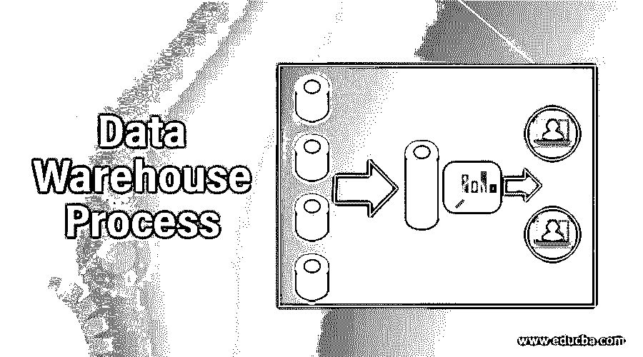

# 数据仓库过程

> 原文：<https://www.educba.com/data-warehouse-process/>

## 数据仓库过程介绍

数据仓库是一个数据汇编、组织和结构化管理过程，它涉及到对给定数据执行的一系列活动。这个过程可以由各种数据源处理，这仅仅意味着数据可以是异构的。它可以定义为一种方法，将从多个来源收集的数据转换为易于使用的事实/数字的类似结构化形式，并将其构建为可供业务专业人员在分析和决策过程中使用。数据仓库也有“决策支持系统”、“商业智能解决方案”、“分析应用”、“管理信息系统”、“执行信息系统”等名称。

### 数据仓库架构的类型

数据仓库架构可以基于两种不同的流程原型来构建，如下所示:

<small>Hadoop、数据科学、统计学&其他</small>

*   集中式架构
*   分布式体系结构

#### 1.集中式架构

顾名思义，集中式数据仓库流程体系结构是系统中一个独立的单元，专门用于数据仓库处理。这是构建数据仓库系统的传统方法，这种体系结构是中小型组织的首选模型。与大型组织相比，中小型组织处理的数据量要少得多。

这种架构在结构上更简单，因此涉及的组件数量更少。该模型中的主要组件是多个数据源、集中式数据仓库和从集中式数据仓库接收已处理数据的客户端单元。这个数据仓库可以处理各种各样的数据源，其中可以包含任何类型或形式的数据，因为这是任何数据仓库系统的共同属性。

对于存储空间有限、硬件设备较少、资金有限、技术支持专业人员较少的组织来说，这种模式被认为是一种高效的体系结构。完整的数据仓库过程发生在一个物理位置，这最大限度地减少了中小型组织无法处理的通信延迟。

这种类型的数据仓库架构的结果被用作商业智能源输入。商业智能流程包括将数据仓库的已处理数据作为创建分析结果的输入，并为从系统中提取的数据生成报告。业务堆栈持有者将进一步使用这些结果和报告来构建业务流，并做出有意义的决策来成功运营业务。

#### 2.分布式体系结构

分布式数据仓库流程体系结构由相同的系统实现大纲组成。分布式数据仓库系统与集中式数据仓库系统的主要区别在于，仓库的组件不是以集中式形式存在的。相反，它是分布式的，数据源可以在不同的位置或系统单元，数据处理可以以分散的方式进行，等等。

这种类型的体系结构也可以应用于较大的组织，因为分布式的性质可以帮助处理大量的数据，以便进行分析和生成报告。该模型可以克服集中式数据仓库流程体系结构的缺点，因此被视为集中式模型的替代选择。

在这种类型的体系结构中，所有的活动都被分配到不同的功能单元中。分布式处理包括以下活动，如从异构数据源收集数据、处理收集的数据、组织处理后的数据并将其放入数据仓库系统、从数据仓库中检索信息、利用结果进行分析处理、创建报告，以及最终将生成的结果用于业务决策。

任何分布式数据仓库体系结构都可以管理成五种不同类型的配置，例如:

*   客户机-服务器体系结构
*   三层架构
*   n 层架构
*   集群架构
*   对等架构

##### 客户机-服务器体系结构

客户机-服务器体系结构有两个组件，客户机和服务器，其中数据收集、转换和加载由客户机单元执行，而服务器处理数据仓库系统开发，处理仓库的内容和总体数据管理。

##### 三层架构

三层体系结构包含作为一层的客户机、作为一层的服务器以及作为第三层的其余连接系统。第三层单元可用于实现客户机系统和服务器系统之间的通信。

##### n 层架构

n-Tier 只不过是一个多层体系结构，其中客户机-服务器体系结构与其他中间单元相连，如下游应用程序、中间件结构以及多个客户机和服务器单元。

##### 集群架构

在集群系统中，系统中的每个节点负责自己的活动，如果不与其他节点协作，这些节点就不能独立工作。这允许实体作为网络连接，并通过利用分配给每个节点的相应资源来并行处理。

##### 对等架构

在对等体系结构中，每个节点都能够完成所有的活动，包括客户端、服务器、数据处理等。职责可以在节点之间共享，因此每个单元被称为数据仓库系统中的“对等体”。

### 数据仓库过程的优势

以下是数据仓库流程体系结构的优点，

*   一个设计良好的数据仓库系统可以在决策过程中带来更高的性能。
*   在生成商业智能解决方案方面非常高效。
*   控制由于受管制的数据处理而造成的时间浪费。
*   无数据冗余，数据质量提高，输出数据一致可靠。

### 结论

数据仓库过程是数据科学技术中的基本活动，因为它在商业智能模型和商业决策过程中起着至关重要的作用。随着数据仓库的应用被观察到出现在诸如银行、零售、技术、国防等商业领域，它被观察到是一种正在发展的数据管理技术。

### 推荐文章

这是一个数据仓库过程指南。在这里，我们还将讨论数据仓库体系结构的介绍和类型以及优点。您也可以看看以下文章，了解更多信息–

1.  [数据仓库模式](https://www.educba.com/data-warehouse-schema/)
2.  [数据仓库测试](https://www.educba.com/data-warehouse-testing/)
3.  [数据仓库的好处](https://www.educba.com/benefits-of-data-warehouse/)
4.  [数据仓库 vs 数据集市](https://www.educba.com/data-warehouse-vs-data-mart/)

