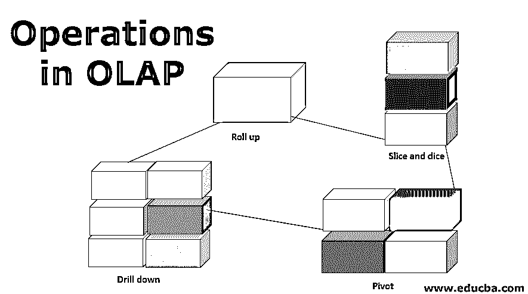

# 在 OLAP 的业务

> 原文：<https://www.educba.com/operations-in-olap/>

## OLAP 业务简介

OLAP 帮助分析不同的摘录，并从不同的角度查看业务数据。通常需要对聚合和连接数据进行分组。这个结构基本上被称为 OLAP 立方体。OLAP 立方体是一种为正确的数据分析而优化的数据结构。它主要由可称为维度的数字事实组成，同时 OLAP 立方体被称为“超立方体”，这将允许用户使用基本的 OLAP 操作(如下钻、上滚、切片、切块和旋转)对所需数据执行多维分析查询。数据仓库应该从各种数据源和格式中提取数据。然后根据用户需求清理和转换这些数据。然后，它被加载到 OLAP 服务器，在那里进行进一步的分析。

### OLAP 的业务类型

有四种[类型的 OLAP](https://www.educba.com/types-of-olap/) 操作可以执行。以下这些领域:

<small>Hadoop、数据科学、统计学&其他</small>

1.  到达
2.  向下钻
3.  切片和切块
4.  在枢轴上转动

让我们一个一个地看看这个

#### 1.到达

汇总也可以被认为是数据的集合。被分割的数据被合并，然后被进一步使用。这可以通过以下方法完成。

*   减少维度。
*   通过使用概念层次，一个系统的分组是基于一个特定的顺序或水平。

**例子**

对于给定的数据集，可以使用上卷维度技术。通过利用层次的概念，完成了降维。这是通过组合任意轴上的数据来实现的。上面的例子有四个城市的奖牌。其中两个城市来自亚洲，另外两个来自欧洲。如果要在这里进行汇总操作，那么可以将亚洲公司和欧洲公司合并在一起。

**输出:**

这表示较详细的数据到较不详细的数据。

#### 2.向下钻

向下钻取只是将数据进一步分成更小的部分。这个维度也可以应用于数据立方体。在这里，维度被扩展。这里的扩展只不过是给当前数据增加了新的维度。如果有已有的数据，那么就意味着当前的维度可以扩展。这种扩展可以沿着数据立方体的任何轴发生。

该过程可以通过以下方式完成

*   分割时沿着预期的层次结构向下。
*   增加当前数据集的维度。

考虑下面的例子，其中有四个国家 C1、C2、C3 和 C4。这四个国家每个季度的人口是按该国的面积划分的。为了深入研究，我们可以看到有两个国家来自亚洲(C1 和 C2)，另外两个来自欧洲(C3 和 C4)。如果要执行向下钻取，可以通过扩展国家、城市、地区等区域来完成。像这样，可以碎片化，伸手看到每个国家，城市，区，甚至最小的村庄的面积。

#### 3.切片和切块

为了执行切片操作，有必要从单个多维数据集中提取数据。该提取物用于形成新的立方体。如果有多于一个维度的数据，也可以提取它。这可以从同一个数据立方体中完成，这可能从一个大的立方体中产生不同的立方体。继续以四个国家 C1、C2、C3 和 C4 为例，其中 C1 和 C2 来自亚洲，C3 和 C4 来自欧洲。接着，dice 操作通过从当前多维数据集中选择两个或更多维度来创建子多维数据集。假设有四家公司 C1、C2、C3 和 C4，其中 C1 和 C2 来自亚洲，C3 和 C4 来自欧洲。通过从不同维度中选择两个参数，可以容易地执行骰子操作。这些可以是人口、面积或地理位置。这里唯一的区别是，您选择了两个或多个维度，这将导致创建该子多维数据集。

#### 4.在枢轴上转动

旋转数据立方体的方向，以检查数据可能具有的其他视图，这是在执行透视操作时所做的事情。为了从不同的角度查看数据，它会旋转数据。它将提供数据的替代表示。一旦在切片操作后获得了子多维数据集，那么透视视图将为它提供一个新视图。假设有四家公司 C1、C2、C3 和 C4，其中 C1 和 C2 来自亚洲，C3 和 C4 来自欧洲。通过旋转数据立方体的一个维度，我们可以轻松地执行旋转操作。比如说，你可以把国家的面积从 X 轴改为 Y 轴，把每平方公里的人口从 Y 轴改为 X 轴，这样就有了不同的视角。

这四个操作有助于提高查询性能。

### 结论

任何 OLAP 系统的核心都是被称为度量的数字事实。这些措施可以进一步分为几个方面。然后将测量值放置在形成向量空间的交叉点上。OLAP 立方体是一个矩阵界面，将有助于做投影操作，如聚合。因此，多维数据集元数据创建了一个星型模式或[雪花模式](https://www.educba.com/snowflake-schema/)，然后在关系数据库中使用。

然后将度量划分为事实和维度，在此基础上创建新的表，并执行不同的操作，如数据的清理和转换。OLAP 客户端包括 Excel、web 应用程序、仪表板等程序。因此，优化的数据有助于确定任何业务中的不同模式和趋势。OLAP 有助于实现这一目标，并使分析更容易。

这将有助于从不同的角度看待商业。不同的企业使用 OLAP 魔方。因此，分析操作使得分析数据和预测模式变得更加容易，毫不费力且准确。

### 推荐文章

这是一份 OLAP 行动指南。这里我们讨论 OLAP 的简介和四种类型的操作。您也可以浏览我们推荐的其他文章，了解更多信息——

1.  什么是 OLAP？
2.  [DevOps 工具](https://www.educba.com/devops-tools/)
3.  [SAS 替代方案](https://www.educba.com/sas-alternatives/)
4.  [什么是 ETL 测试？](https://www.educba.com/what-is-etl-testing/)
5.  [Oracle 中的相交向导](https://www.educba.com/intersect-in-oracle/)

