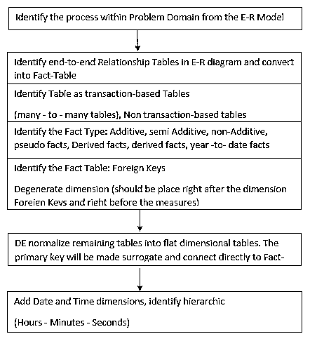

# 什么是星型模式？

> 原文：<https://www.educba.com/what-is-star-schema/>

## 星型模式介绍

星型模式是一种用于创建和实现数据仓库系统的模式架构结构，其中只有一个事实表和多个与之相连的维度表。它的外形结构像一颗星星。这是一种有效的数据仓库模式类型，它可以使用简单的查询来访问系统中的数据，以获取用于分析和报告生成目的的逻辑内容。

### 如何创建星型架构？

在这里，用户将通过转换实体关系模型来创建星型模式。实体关系模型过于复杂，无法解释功能量和属性，因此将其简化为如下维度星型模式:

<small>Hadoop、数据科学、统计学&其他</small>

*   从实体关系视图中找到企业流程，并理解模型，模型可以拆分成几个维度的模型。实体关系由业务数据组成。
*   找到解释公司程序的实体关系中的多对多表，并将它们转换为维度模型现实表。该表包含由事实表和维度表组成的数据，维度表包含数值和唯一键属性。
*   这一过程背后的思想是区分基于交换的信息表或删除信息的表。所以有必要设计多对多的关系。例如，在 ERP 数据库中，交换表中有发票明细。更新和刷新的详细信息是基于 exchange 的表。现在比较这两个表，可以得出数据是真正静态的。
*   现实表是一个维度模型的表示，它显示了有限测量之间的多对多网络。这导致现实表中的外键共享多对多的可数关系。该表的大部分属于基于交换的表
*   设计星型模式的最后一步是将驻留表反规范化为度量表。强制钥匙是制作一把复制钥匙。这个关键依赖于现实表，这有助于更好地理解。从实体关系设计中找到日期和时间，并填写维度表。日期被保存为日期和时间戳。日期维度列表示年、月、日期或时间。

**举例:**时间维度表有 TIMEID、Quartername、QuarterNo、MonthName、MonthNo、DayName、DayofMonth、DayOfWeek，这些都可以作为维度表的重要标准。同样，所有表都有唯一的 id 和属性。SQL 等查询语言可以应用于数据挖掘、数据仓库和数据分析。

**多维数据集定义的语法:**

`Define cube (cube-name)(dimension-list): (measure-list)`

部署多维数据集来处理不同级别的警报，并且响应查询的响应时间最短。它是一种预建设计，适用于需要的情况。星型模式的创建是非常容易和有效的应用和适应性太强。完成事实表和维度表是强制性的，它以星形形式形成，可以使用 SQL 查询或运行代码来形成。这种设计是为了更好地理解和容易获取数据。

### 星型模式的特征

**1。** Star schema 提供快速汇总和计算功能，例如每月月底的总销售额和收入。通过构建合适的查询，可以根据需求过滤这些细节和过程。

**2。**具备从规范化数据中过滤数据的能力，提供数据仓库需求。规范化表格的相关信息堆叠在“多维”选项卡中。为每个事实表生成一个唯一的键来标识每一行。

**3。**事实表是对特定事件的度量，包括有限数值，由与维度表相关的外键组成。该表由原子级别的事实值构成，并允许一次存储多个记录。事实表有三种不同的类型。

**4。**交易事实表包含关于特定事件的数据，例如假期事件、销售事件。

**5。**记录给定时期的事实，如每个季度末的账户信息。

**6。**一段时间内快速聚集的表称为累积快照表。

**7。**维度表提供详细的属性数据，记录在事实表中。尺寸表可以具有不同的特征。维度表主要用作时间和日期维度表、产品和采购订单维度表、员工和帐户详细信息维度表、地理和位置维度表。这些表被分配了一个整数数据类型，即重复主键。

**8。**用户可以根据需要设计自己的表格。例如，如果他需要一个带有产品和客户键、日期和时间键、收入生成键的销售维度表。假设商人用关键属性(如颜色、购买商品的日期、促销关键字和客户关键字)构建了一个产品维度表。

### 优势

*   它由简单的逻辑和查询组成，易于从事务流程中提取数据。
*   它有一个动态隐含的通用报告逻辑。
*   星型架构可以提高报告应用程序的性能。
*   星型模式通过提供联机事务处理应用的多维数据集来构建多维数据集并使其有效工作。

### 不足之处

*   它具有高度的完整性和高度的非规范化状态。如果用户未能更新这些值，整个流程将被折叠。保护和安全不可靠到极限。它不像分析模型那样灵活，也不能将其有效支持扩展到许多关系。
*   星型模式部署在数据库中，以控制数据的快速恢复。使用查询来选择需求，而不是搜索整个数据库。过滤和选择的数据可以应用于不同的情况。因此，这个星型模式是一个容易采用的简单模型。

### 推荐文章

这是一个什么是星型模式的指南？在这里，我们讨论星型模式的介绍及其特点和优缺点。您也可以浏览我们推荐的其他文章，了解更多信息——

1.  [事实表概述](https://www.educba.com/what-is-fact-table/)
2.  [星型模式与雪花型模式|主要差异](https://www.educba.com/star-schema-vs-snowflake-schema/)
3.  [数据仓库建模与类型](https://www.educba.com/data-warehouse-modeling/)
4.  [AWS 数据管道](https://www.educba.com/aws-data-pipeline/)

