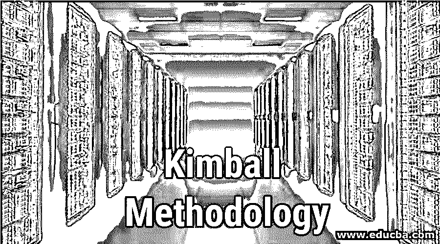

# 金博尔方法论

> 原文：<https://www.educba.com/kimball-methodology/>

## 金博尔方法简介

Kimball 方法只不过是一组预定义的过程和实践，通过应用自底向上的方法来开发、设计和维护数据仓库。使用 Kimball 方法的最大好处是，与其他方法相比，可以更快地完成数据库设计、开发和构建，实施和维护的成本更低，开发时间更短，因为这是预先计划的实践，等等。

### 什么是金博尔方法论？

Kimball 是用于设计和开发数据仓库的一组已定义的方法、过程和技术。它也有不同的名称，如自下而上的方法、Kimball 的维度建模和 Kimball 的数据仓库生命周期模型。

<small>Hadoop、数据科学、统计学&其他</small>

在我们继续之前，让我们先了解几个术语:

数据集市:它是一个特定的数据仓库，旨在回答特定的问题。多个数据集市存在于不同的领域。

**数据仓库:**它是一个企业范围的存储库，包含整个组织的信息。

Kimball 遵循一种不同的方法，首先创建维度数据集市。然后，从各种源中识别和提取数据源并加载。星形图式是三维造型不可或缺的因素。一个模型中可以存在多个这样的模式。为了以集成的方式组织数据，Kimball 建议维度表必须与各种数据集市中的不同表共享。这有助于我们理解，在所有的事实中，单个数据可以以类似的方式使用。

### 金博尔方法是如何工作的？

Kimball 方法的重点是识别关键业务流程以及我们需要为数据仓库提供的后续业务解决方案。Kimball 方法利用维度模型(如星型和雪花型模式)将数据组织成各种业务分类数据，以便快速实现业务流程。现在从架构的角度来看，Kimball 认为没有必要将数据集市从现有的多维数据仓库中分离出来。

最后，Kimball 专注于提供可以从数据仓库直接访问的分析系统。换句话说，Kimball 提出了一种体系结构，其中分析系统可以直接使用数据仓库中的数据。实现 Kimball 数据仓库架构花费的时间相对较少。由于抽象是更高层次的抽象，我们只考虑使用星型或雪花模式的数据仓库设计。

而在基于 Kimball 的设计的情况下，维护是困难的，因为可能存在冗余数据，并且修改需要额外的任务。Kimball 的初始成本很低，因为我们只需要规划数据仓库，后续阶段的成本保持不变。它需要一个通用团队来实现。所涉及的资源需要知道如何使用 ER 建模，而不需要将它们解耦到各种数据集市中。同样，对于基于 Kimball 的数据仓库，数据集成需求集中在单个业务领域。基于 Kimball 的设计，维护很困难，因为可能存在冗余数据。

### 金博尔方法的优势

1.  实现 Kimball 数据仓库架构花费的时间相对较少，因为抽象层次更高。
2.  Kimball 的初始成本很低，因为我们只需要规划数据仓库，后续阶段的成本保持不变。
3.  基于 Kimball 的数据仓库可以快速建立。
4.  金博尔需要一个多面手团队来实施。
5.  在 Kimball 方法中，数据集成需求集中在单个业务领域。

### 结论

Kimball 架构需要数据源、数据暂存、ETL 功能和数据集市。需要捕获业务需求，并且它们都需要数据的时间属性来促进历史数据。Kimball 恰好是面向过程的，因为它关注的是业务过程。Kimball 更喜欢非规范化的数据模型，因此，我们发现 Kimball 架构中存在冗余数据模型。基于 Kimball 的数据仓库更容易设计和实现。我们必须适应变化和数据仓库级别。通过 Kimball，我们获得了一个数据仓库存储，我们需要根据业务流程合理地利用它。

### 推荐文章

这是金博尔方法论的指南。在这里，我们讨论金博尔方法的介绍，金博尔方法及其优势。您也可以浏览我们推荐的文章，了解更多信息——

1.  [介绍数据仓库的好处](https://www.educba.com/benefits-of-data-warehouse/)
2.  [数据仓库的类型](https://www.educba.com/types-of-data-warehouse/)
3.  [数据仓库与数据集市|八大对比](https://www.educba.com/data-warehouse-vs-data-mart/)
4.  [具有特性的数据仓库工具](https://www.educba.com/data-warehouse-tools/)

