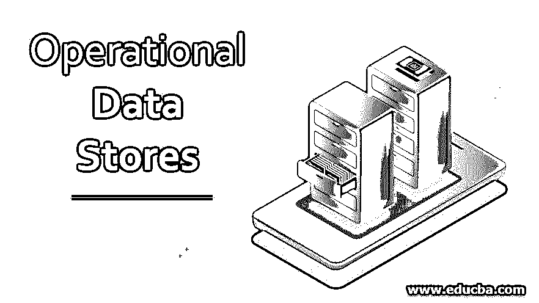
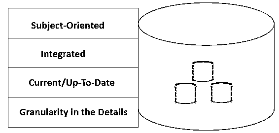
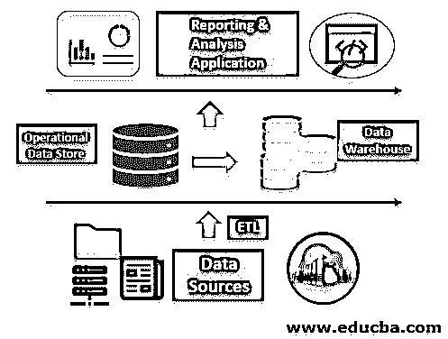

# 操作数据存储

> 原文：<https://www.educba.com/operational-data-stores/>

## 运营数据存储简介

操作数据存储是一种数据库，它充当从连接到给定数据仓库系统的不同来源收集的数据的中央存储库。It 部门同意将来自多个来源的数据(可以有任何来源配置)合并成单一格式，以便业务决策流程可以访问。

ODS 提供了所有当前数据和相关交易的专门视图，以便于分析和报告过程。在 ODS 中，数据被清理以避免垃圾或重复，验证冗余，并确保数据遵守业务/项目设定的系统规则。这是保存最近功能中使用的所有数据的位置，然后这些数据被重新定位到数据仓库的永久存储系统或数据仓库的档案中。

<small>Hadoop、数据科学、统计学&其他</small>

### 运营数据存储的实施

可以集成任意数量的数据源来创建可操作的数据存储。要使集成数据源系统成为合格的操作数据存储，它应该遵守以下原则:

#### 1.面向主题

对于讨论中的某个特定领域，操作数据存储应该基于业务提出的明确的功能需求来设计和构建。

#### 2.完整的

来自给定应用程序的多个数据源的所有数据都经过一组 [ETL 过程](https://www.educba.com/etl-process/)流程，其中包括清理垃圾数据以减少冗余，将所有数据转换为单一格式，并根据业务/客户的数据控制和规律性策略将整个记录集加载到 ODS 上。

#### 3.当前/最新的

ODS 中的数据应该是最新的，以便涵盖与数据仓库相联系的应用程序的所有当前功能，并显示与数据仓库系统相联系的每个来源的数据的现有状态。

#### 4.细节中的粒度

它主要用于支持可操作的业务功能/需求，因此规则的实现方式必须保持详细描述执行这些功能所需的业务的综合水平，这一点很重要。

下面是如何将操作数据存储放置在数据仓库系统中以适应业务需求和功能要求的示例，

ODS 的构造方式通常包括不能进一步细分的低级或完全规范化的数据，以及在当前或最近功能中捕获的过去/旧操作的部分记录。然而，数据仓库系统可以保存更大量的数据，用于在更少的定期时间内执行功能操作。因此，操作数据存储充当过渡数据库，作为数据仓库系统的组织和处理数据的来源之一。

ODS 旨在对少量数据进行相对简单的查询，而不是对从数据仓库系统中检索大量数据进行有问题的查询。ODS 类似于计算机的 ROM(只读存储器),仅用于存储最近的信息或当前的处理信息。[数据仓库](https://www.educba.com/what-is-data-warehouse/)类似于计算机的 RAM(随机存取存储器),可以作为相对稳定的数据/信息的长期存储单元。ODS 的一些必要功能行为包括以下特征，

*   它包含快速、可配置、易于访问的实时综合数据。
*   由于数据和操作被压缩，它占用的空间更少。
*   [SQL](https://www.educba.com/what-is-sql/) 支持方便地访问实时数据。
*   对行动和评审的简单系统管理。
*   系统中所有集成应用的灵活连接。
*   这使得处理大量数据事务不成问题，因为它不涉及大量的历史数据。
*   由于预计大小很小，备份和恢复过程可以毫不费力地进行。
*   ODS 以表格形式为当前数据提供输入，以图表形式提供趋势。

### 运营数据存储的优势

与整个数据仓库系统相比，它是一个有益的数据库。以下是其有利性质的理由:

*   ODS 只提供对当前的、细分的、非汇总的、不太复杂的数据的访问，这些数据可以在不使用操作系统的情况下以合适的方式进行查询。
*   当报告和分析工具需要更接近实时操作的数据时，当从各自的源系统接收到数据时，可以从操作数据存储中查询该数据，而不是选择从数据仓库系统中的其他数据库源进行更长时间的转换和加载操作。
*   ODS 是一个安全的选择，因为它不包含所有的历史数据和操作，这使它能够抵御任何网络攻击或数据隐私黑客攻击。
*   当考虑到业务提供的复杂需求时，这是一个实际可行的结构设计选项，以便为分析和报告流程生成输入，从而做出业务决策。
*   在遇到麻烦时，如环境故障或数据库需要重启时，ODS 大大减少了总周转时间，这意味着对业务或应用程序堆栈持有者的压力更小。
*   为了从 ODS 获取数据，查询不需要复杂或多级连接，有条件的简单查询就足够了，因为它保存适度详细的操作数据。

### 结论

总之，对于接受来自多个数据源的数据的中央数据库系统来说，在依次执行一系列 ETL 操作以将所有这些数据组织成单一格式之后，操作数据存储是一种选择。ODS 存储当前或最近的数据和相关操作，而数据仓库系统存储所有历史数据和操作。ODS 不断地将旧数据输入数据仓库系统，连续地将旧数据存档。从 ODS 获取的结果用于为业务决策实践创建分析和报告。

### 推荐文章

这是操作数据存储的指南。在这里，我们讨论操作数据存储的引入和实现及其优点。你也可以看看下面的文章来了解更多-

1.  [数据可视化工具的种类](https://www.educba.com/best-data-visualization-tools/)
2.  [数据挖掘聚类分析](https://www.educba.com/data-mining-cluster-analysis/)
3.  [数据仓库模式的类型](https://www.educba.com/data-warehouse-schema/)
4.  [三层数据仓库架构](https://www.educba.com/three-tier-data-warehouse-architecture/)

