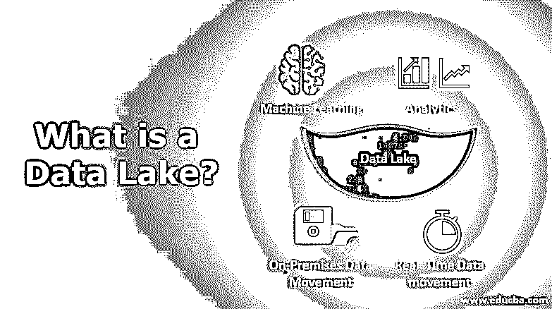
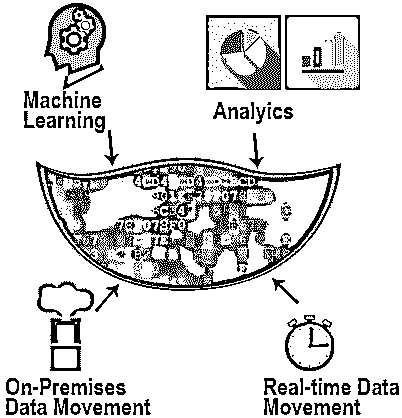

# 什么是数据湖？

> 原文：<https://www.educba.com/what-is-a-data-lake/>

## 数据湖简介

它是一个单点存储系统，可以容纳来自各种数据源的任何格式的关系数据；然后，这可用于生成用于分析和报告目的的数据。从数据源中提取数据后，没有必要对数据进行标准化或结构化。它可以保存来自任何来源的标准化或非标准化、结构化或非结构化、已处理或未处理的数据，而不管存储在数据湖中的数据的预期结果如何。

<small>Hadoop、数据科学、统计学&其他</small>

### 为什么我们需要数据湖？

通过构建一个湖，数据科学家可以看到未经提炼的数据视图。

使用它的原因如下:

*   从他们的数据中产生商业利益的公司成功地超越了他们的同行。在 Aberdeen 的一项调查中，建立数据湖的公司比类似公司的有机收入增长业绩高出 9%。这些领导者能够通过新的来源(如日志文件、点击流数据、社交媒体和湖中的互联网连接)执行新型分析，如机器学习。
*   它支持实时输入数据。从多个资源收集数据，然后以原始格式移动到湖中。因此，湖提供了更高的数据可伸缩性。此外，通过对数据进行索引、抓取和编目，您可以知道湖中有什么类型的数据。
*   它支持管理数据的可用性、可用性、安全性和完整性的数据治理。
*   它可以帮助研发团队测试他们的假设，改进假设，并评估结果。
*   没有可用的筒仓结构。
*   它为客户提供了 360 度的视角和可靠的分析。

随着数据量、数据质量和元数据的增加，分析的质量也会提高。

*   Hadoop 等存储引擎使得存储不同的信息变得很容易。没有必要将带有湖的数据建模到公司范围的方案中。
*   分析的质量也随着数据量、数据质量和元数据的增加而提高。
*   它提供了业务灵活性。
*   利用[机器学习和人工智能](https://www.educba.com/machine-learning-vs-artificial-intelligence/)进行盈利预测是可能的。

### Hadoop、AWS 和 Azure 上的数据湖架构

它有两个组成部分:存储和计算。存储和计算可以位于现场或云中。这导致以多种可能的组合来设计一个数据湖体系结构。

#### 1.Hadoop

分布式服务器 Hadoop 集群解决了大数据存储问题。MapReduce 是 Hadoop 编程模型，用于在服务器集群中将信息划分和处理为更小的子集。

#### 2.自动警报系统

其解决方案的 AWS 产品范围非常全面。亚马逊 S3 是存储功能解决方案的核心。这些允许我们将大量数据转移到 S3 的数据摄取工具是 Kinesis Stream、Kinesis Firehose、雪球和 Direct Connect。除了亚马逊 S3， [NoSQL 数据库](https://www.educba.com/what-is-nosql-database/)，迪纳摩数据库，和弹性搜索提供了一个简化的查询过程。AWS 提供大量产品，初始学习曲线很陡。然而，该解决方案的综合功能广泛应用于商业智能应用。

#### 3.蔚蓝的

微软提供了数据湖。Azure 有一个分析和存储层，称为 Azure Store (ADLS ),分析层有 Azure Analytics 和 HDInsight 这两个组件。ADLS 标准是在 HDFS 建造的，可以无限存储。它可以用单个文件保存大小超过 1pb 的数万亿个文件。Azure Store 使数据存储和保护成为可能，并且可以以任何格式扩展。

### 利益

以下是一些要点:

*   提供无限的数据类型值。
*   快速适应变化。
*   长期拥有成本降低。
*   它的主要优点是集中了各种内容来源。
*   来自世界各地不同部门的用户可以灵活地访问数据。
*   提供经济的可扩展性和灵活性。

### 风险

*   一段时间后，它可能会失去相关性和势头。
*   设计的时候风险更大。
*   这也增加了存储和产品的成本。
*   安全和访问控制是最大的风险。有时，数据可以在没有监管的情况下放在湖里，因为有些数据可能需要保护和管理。

### 推荐文章

这是什么是数据湖的指南？在这里，我们讨论了基本概念、体系结构、我们为什么需要它，以及它们的好处和风险。您也可以浏览我们推荐的其他文章，了解更多信息——

1.  [现代数据集成](https://www.educba.com/modern-data-integration/)
2.  [什么是数据分析](https://www.educba.com/what-is-data-analytics/)
3.  [什么是数据泄露？](https://www.educba.com/what-is-data-breach/)
4.  [数据湖 vs 数据仓库|差异](https://www.educba.com/data-lake-vs-data-warehouse/)

