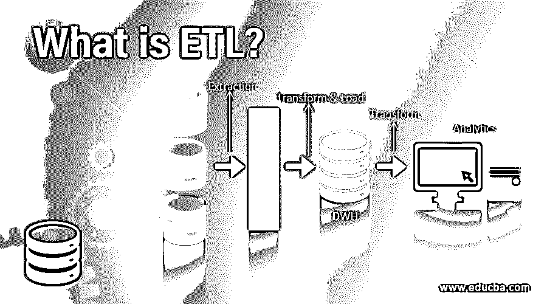

# 什么是 ETL？

> 原文：<https://www.educba.com/what-is-etl/>

## 什么是 ETL？

ETL 代表提取、转换和加载。它是一个由几个函数组成的编程工具，这些函数从指定的关系数据库源系统中提取数据，然后通过应用各种方法将获得的数据转换成所需的形式。然后，它将结果数据加载或写入目标数据库。

因此，ETL 是一种数据同化过程，用于从多个数据源收集数据，并将其转换为一种通用格式，以构建数据仓库或数据库或任何数据存储系统，顾名思义，使用三个步骤，即提取、转换和加载，其中提取意味着根据需要从所有数据源收集数据， 转换是指将来自具有多种格式的多个来源的数据转换成可用于分析和报告目的的单一通用格式，加载是指将所有转换后的数据存储到数据库或数据仓库系统中。

<small>Hadoop、数据科学、统计学&其他</small>

### ETL 定义

它是数据仓库中的一个过程，用于从数据库或源系统中提取数据，并在转换后将数据放入数据仓库。它是三个数据库功能的组合，即提取、转换和加载。

*   **提取:**这是从单个或多个数据库中读取数据的过程，其中源可以是同构的或异构的。从不同来源获取的所有数据都被转换成相同的数据仓库格式，并被传递以执行转换。
*   **转换:**这是将提取的数据转换成输出所需的形式或适合放入另一个数据库的形式的过程。
*   **Load:** 这是将所需输出写入目标数据库的过程。

### 理解 ETL

市场上有很多 ETL 工具。但是很难为你的项目选择一个合适的。

下面描述了一些 ETL 工具:

**1。Hevo:** 它是一个高效的云数据集成平台，可以将来自云存储、SaaS、数据库等不同来源的数据实时导入数据仓库。它可以处理大数据，同时支持 ETL 和 ELT。

**2。QuerySurge:** 它是一个测试解决方案，用于自动化测试大数据和数据仓库。它提高了数据质量，加快了数据交付周期。它支持在不同平台上进行测试，比如 Amazon、Cloudera、IBM 等等。

**3。Oracle:** Oracle 数据仓库是数据的集合，这个数据库用来存储和检索数据或信息。它帮助多个用户高效地访问相同的数据。它支持虚拟化，并允许连接到远程数据库。

**4。Panoply:** 它是一个数据仓库，可以自动化数据收集、数据转换和数据存储。它可以连接到任何工具，如 Looker，Chartio 等。

**5。MarkLogic:** 它是一个数据仓库解决方案，使用一系列特性使数据集成更容易、更快。它为文档中的元素指定了复杂的安全性规则。它有助于导入和导出配置信息。它还允许用于灾难恢复的数据复制。

**6。亚马逊红移:**它是一个数据仓库工具。性价比高，使用方便简单。没有安装成本，提高了数据仓库集群的可靠性。此外，其数据中心完全配备了气候控制。

7 .**。Teradata Corporation:** 它是唯一一个大规模并行处理的商业数据仓库工具。它可以轻松高效地管理大量数据。也和亚马逊红移一样简单划算。它完全适用于并行架构。

### 使用 ETL

当数据增加时，处理数据的时间也会增加。有时您的系统只停留在一个过程上，然后您想提高 ETL 的性能。

以下是一些提高 ETL 性能的技巧:

**1。纠正瓶颈:**检查最重的进程使用的资源数量，然后耐心地重写瓶颈所在的代码，以提高效率。

**2。划分大表:**您必须将大表划分成物理上更小的表。这将改善访问时间，因为在这种情况下索引树是浅的，并且可以在数据记录上使用快速元数据操作。

**3。仅相关数据:**数据必须是批量采集的，但采集的数据不一定都是有用的。因此，必须将相关数据与不相关或无关的数据分离开来，以增加处理时间并提高 ETL 性能。

**4。并行处理:**您应该尽可能运行并行处理而不是串行处理，这样可以优化处理并提高效率。

**5。增量加载数据:**尝试增量加载数据，即只加载更改，而不是再次加载整个数据库。这似乎很难，但并非不可能。这无疑提高了效率。

**6。缓存数据:**访问缓存数据比从硬盘访问数据更快更高效，所以数据必须缓存。高速缓冲存储器的大小更小，因此只有少量的数据将存储在其中。

7 .**。使用集合逻辑:**在您的 ETL 代码中将基于行的游标循环转换为基于集合的 SQL 语句。这将加快处理速度，提高效率。

### ETL 的优势

下面是提到的优点:

*   使用方便
*   基于 GUI(图形用户界面)并提供可视化流程
*   更适合复杂的规则和转换
*   内置错误处理功能
*   高级清洁功能
*   节约成本
*   创造更高的收入
*   提高性能
*   同时加载不同的目标
*   根据需要执行数据转换

### 必需的 ETL 技能

下面给出了所需的技能:

*   结构化查询语言
*   解决问题的能力
*   脚本语言，如 Python
*   创造力
*   组织技能
*   知道如何参数化作业
*   ETL 工具和软件的基本知识

### 为什么我们需要 ETL？

*   通过分析数据帮助做出决策
*   它可以处理传统数据库无法处理的复杂问题
*   它提供了一个公共的数据仓库
*   将不同来源的数据加载到目标数据库中
*   数据仓库会根据数据源的变化自动更新
*   验证数据转换、计算和聚合规则
*   比较源系统和目标系统数据
*   提高生产力

### ETL 范围

随着数据呈指数级增长，ETL 有着光明的前景，因此 ETL 专业人员的工作机会也在不断增加。作为 ETL 开发人员，一个人可以有很好的职业生涯。像大众、IBM、德勤和更多的顶级跨国公司都在从事 ETL 项目，因此需要大规模的 ETL 专业人员。

### 这项技术将如何帮助你的职业发展？

在美国，ETL 开发人员的平均年薪约为 127，135 美元。目前，一名 ETL 开发人员的工资从 97，000 美元到 134，500 美元不等。

### 结论

如果你想从事数据方面的工作，那么你可以选择 ETL developer 或者其他与 ETL 相关的概要文件作为你的职业。由于数据的增加，其需求也在增加。所以对数据库和数据仓库技术感兴趣的人必须学习 ETL。

### 推荐文章

这是一个什么是 ETL 的指南？在这里，我们分别讨论了 ETL 的基本概念、需求、范围、所需技能和优势。您也可以浏览我们推荐的其他文章，了解更多信息——

1.  [什么是预测分析？](https://www.educba.com/what-is-predictive-analytics/)
2.  [人工智能的优势](https://www.educba.com/advantages-of-artificial-intelligence/)
3.  【JavaScript 如何工作
4.  [数据可视化工具](https://www.educba.com/data-visualization-tools/)

