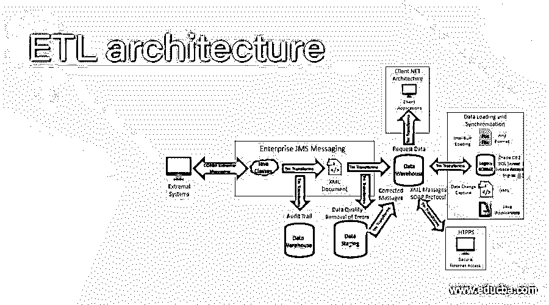
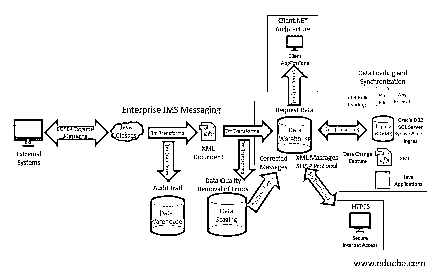

# ETL 架构

> 原文：<https://www.educba.com/etl-architecture/>

## ETL 架构介绍

从数据源收集数据、转换数据以实现预期目标，然后发送到预期目标的方法是提取、转换、加载或“ETL”。高效的 ETL 基础设施对于任何希望将其信息转化为资产、做出数据驱动的决策或跟上云数据共享的公司都非常重要。“原始”形式的数据，换句话说，最初创建或报告时的状态，通常不足以实现组织的预期目标。在使用数据之前，必须采取一系列步骤，通常称为 ETL。在这个主题中，我们将学习 ETL 架构。

### ETL 的体系结构

提取、转换和加载由 ETL 定义。在当今的数据仓库世界中，人们使用 E-MPAC-TL 这个词，即收集、跟踪、剖析、分析、清理、转换和加载。这意味着 ETL 依赖于数据和元数据的一致性。

<small>Hadoop、数据科学、统计学&其他</small>

1.  #### extraction, lineage

主要目标是尽快且不太方便地从源网络获得这些源的数据。这也注意到，对于源日期/时间戳、数据库日志表和 hybrid 视情况而定，应选择最合适的提取方法。

2.  #### conversion and loading

数据必须全部被转换和加载以合并数据，然后将合并的数据移动到显示区域，在那里最终用户观众将使用前端软件。在这种情况下，应该关注 ETL 工具的特性及其更有效的使用。没有必要使用 ETL 方法。数据必须尽可能集中，而不是在大中型数据仓库环境中进行个性化处理。ETL 应该将各种源到目标创建活动的时间最小化，这些活动构成了传统 ETL 工作的主要部分。

3.  #### monitoring

数据监控使得检查 ETL 周期中移动的数据成为可能，这有两个关键目标。首先应该审查数据。在对输入数据的检查之间应该有一个适当的平衡，并且不要在完成太多检查时减慢整个 ETL 周期。在 Ralph Kimbal 中用于筛选方法的内部方法可以应用于此。这种方法可以基于一组预定义的元数据业务规则可靠地捕获所有错误，并通过简单的星形方案方便记录这些错误，该方案允许查看数据质量随时间的变化。第二，要以 ETL 效率为中心。该元数据可以链接到所有大小和事实表以及审计方面。

4.  #### Quality assurance

质量保证是一种可以根据不同阶段之间的要求进行计算的方法，可以检查数值的完整性；在 ETL 的不同阶段之间，我们仍然有相同数量的记录或特定行为的总数吗？这些数据将被存储为元数据。最后，应该预见整个 ETL 周期中的数据历史，包括错误记录。

5.  #### Data analysis

这用于处理源统计数据。目的是理解数据分析的起源。数据分析将使用分析技术，通过分析和验证数据和格式，以及通过检测和验证数据源中的冗余数据，来分析信息的内容、结构和一致性。使用正确的工具来自动化这一过程至关重要。它提供了大量的信息。

6.  #### Data analysis

数据分析用于解释分析数据的影响。数据质量问题，包括缺失数据、不正确数据、无效信息、限制问题、亲子问题，包括孤立数据、重复数据，在检查数据集时更容易发现。必须准确记录该评估的结果。数据处理应该成为处理数据源和数据仓库团队之间未解决问题的联系工具。映射源非常依赖于源分析的一致性。

7.  #### Source analysis

目标不仅应该是源，还应该是环境，以便获得源文档。源应用程序的未来取决于数据的当前来源、相应的数据模型/元数据存储库以及源所有者对源模型和业务规则的有效实现。为了检测可能影响数据存储和相关 ETL 过程的变更，与数据源所有者定期召开会议非常重要。

8.  #### cleaning

根据规则元数据的集合，可以纠正此部分中发现的错误。在这种情况下，必须区分已被全部或部分拒绝的记录和人工纠正问题或通过纠正不准确的数据字段、修改数据格式等来修复数据。

### 推荐文章

这是一个 ETL 架构的指南。这里我们已经讨论了什么是 ETL 架构及其组件，以及它们的工作原理。您也可以看看以下文章，了解更多信息–

1.  [ETL 流程](https://www.educba.com/etl-process/)
2.  [ETL 测试工具](https://www.educba.com/etl-testing-tool/)
3.  [ETL 面试问题](https://www.educba.com/etl-interview-questions/)
4.  [计算机化 ETL 工具](https://www.educba.com/informatica-etl-tools/)

