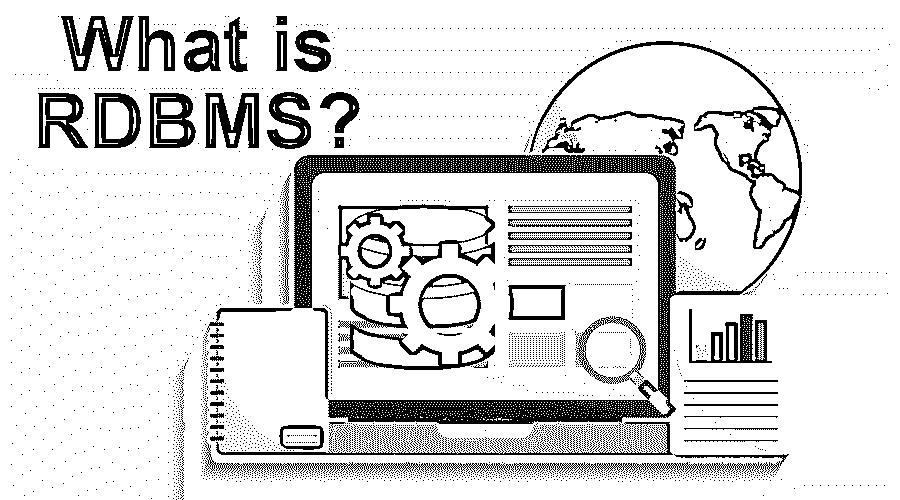

# 什么是 RDBMS？

> 原文：<https://www.educba.com/what-is-rdbms/>

## RDBMS 简介

扩展为关系数据库管理系统的 RDBMS 是一种以组织良好的复合排列方式存储数据的数据库，包括行和列，这使得数据处理(如获取、查看、更新、删除和操作表的内容)变得容易，因为每个表中的所有数据都与系统中其他表的内容保持关系，并且数据库系统中的所有表都与具有相似属性的表相关联。

### RDBMS 如何工作？

关系数据库管理系统以表格的形式存储数据。它包含 N 个表，每个表都有自己唯一的主键。表格由[行和](https://www.educba.com/excel-row-vs-excel-column/)列组成。该行被称为记录或水平实体。该记录保存有关单个条目的信息。该列称为字段或垂直实体。字段保存有关特定字段的信息。当用户启动查询时，它会显示特定查询的结果。在数据库中创建任何表或数据之前，它会检查约束。

<small>Hadoop、数据科学、统计学&其他</small>

以下是约束条件列表:

*   **Not Null:** 用于保证每一列都不应该有空值，即空单元格。
*   **唯一:**用于确保每一列都包含唯一的数据。
*   **Check:** 用于确保一列或一行中的每一项都满足指定的条件。
*   **主键:**用来标识表格的每一行。主键必须是唯一的。它不得包含空值。一个表只能包含一个主键。它链接两个或多个表。
*   **外键:**链接两个表。它保存在一个表中，该表引用位于另一个表中的主键。换句话说，它在包含主键的两个表之间建立了关系。使用这两个键，表可以相互链接。
*   **数据完整性:**在创建数据之前检查数据的完整性。

下面是检查数据完整性的类别列表:

*   **实体完整性:**用于保证表中没有重复的行。
*   **参照完整性:**保证与其他表重新链接的行不能被删除。
*   **域完整性:**根据文件格式、取值范围等特定条件确保表中数据的录入。
*   **自定义完整性:**保证表中的完整性满足自定义条件。

### RDBMS 的优势

下面是提到的优点:

*   可维护性:它提供了简单的易用性。它允许数据库管理员轻松地维护、控制和更新数据库中的数据。有了 RDBMS，数据备份变得容易了。RBDMS 的自动化工具自动完成这些任务。
*   灵活性:RDBMS 的这一特性节省了大量时间，因为在一个地方更新数据就足够了。例如，假设您有来自学生的数据，并且您必须更新一个学生的详细信息。在这种情况下，您只需更新主表中细节，而不是在每个文件中更新它；它会自动更新数据库中每个文件的信息。
*   **数据结构:**由于 RDBMS 是以表格的形式存储数据，所以用户很容易理解。数据以结构化的方式组织，并通过启动查询来匹配条目。
*   **特权:**RDBMS 的这个特性允许[数据库管理员](https://www.educba.com/careers-in-database-administration/)控制数据库上的活动。管理员可以向用户授予特定的访问权限，而不是授予所有的访问权限。管理员也可以停止用户访问。

### 我们为什么需要它？

让我们看看为什么我们需要 RDBMS:

*   **数据安全:** RDBMS 提供数据安全。数据将是安全的，当程序崩溃的授权码，其他安全层。
*   **容错:**通过复制数据库来提供容错，在系统因为突然断电、意外关机等原因崩溃时有所帮助。它还提供并发访问。
*   **易用性:**在使用 RDBMS 时，通过使用表将数据存储在列和行中，访问和管理数据变得很容易。
*   **可扩展性:**可以统一处理任意数量的数据。在 RDBMS 中，索引用于排序数据和提高性能。

### 为什么要用？

由于以下原因，我们应该使用 RDBMS:

*   在关系数据库管理系统中，所有的数据都以表的形式存储。
*   在表中，所有数据都以行和列的形式存储，这有利于数据的高效管理。
*   为了存储敏感数据，它提供了一个虚拟表创建特性。
*   用于唯一标识每一行的主键。
*   [使用外键](https://www.educba.com/foreign-key-in-sql/)将列与两个或多个表链接。
*   高速检索数据提供了索引创建功能。
*   提供多用户访问，即系统可以由多个用户操作。

这些就是关系数据库管理系统在世界范围内被广泛使用的原因。

### 这项技术将如何帮助你的职业发展？

关系数据库管理系统是世界上使用最广泛的数据库系统。随着这项技术在许多领域的普及和使用，学习这项技术将有助于你在组织中获得一个好的工作职位，并帮助你与他人竞争，站在市场的顶端。

### 推荐文章

这是什么是 RDBMS 的指南？这里我们讨论了 RDBMS 的工作原理、需求、工作、职业发展和优势。您也可以阅读以下文章，了解更多信息——

1.  [什么是 C++中的模板类？](https://www.educba.com/what-is-template-class-in-c-plus-plus/)
2.  [MuleSoft 完整指南](https://www.educba.com/what-is-mulesoft/)
3.  什么是探索性测试？
4.  [什么是 Oracle 数据库](https://www.educba.com/what-is-oracle-database/)

