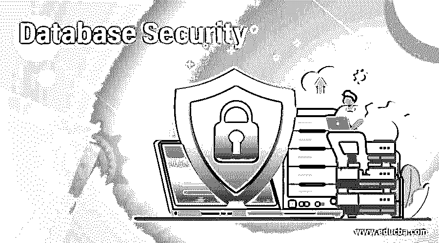

# 数据库安全

> 原文：<https://www.educba.com/database-security/>

## 数据库安全性介绍

数据库安全可以定义为对数据库增加保护的概念，包括系统内部各种元素处理的数据。将这一功能添加到一个系统的主要目的是为了保持保密性、数据质量和维护数据完整性，该系统访问链接数据库和数据库管理系统的可能性较高。这种类型的安全措施通常应用于较大的数据库，因为缺少这种措施会导致可能的数据泄漏或易受黑客攻击，这可以很容易地用于渗透到连接的系统中。

### 数据库安全的最大好处

对于拥有多个相互关联的数据库和数据库管理系统的组织来说，数据库安全性是一个重要的组成部分，这些数据库和数据库管理系统与组织应用程序的功能元素一起工作。为数据库系统安装的安全预防措施有助于防止许多可能的严重违规后果。

<small>Hadoop、数据科学、统计学&其他</small>

以下是为数据库执行安全元素的一些有益特征，

*   数据库可以安全防范安全漏洞和黑客活动，如防火墙入侵、病毒传播和勒索软件。这有助于保护公司的敏感信息，无论如何都不能与外人共享。
*   阻止恶意软件、传染性文件等攻击，以及可能对不安全的数据库系统造成的其他感染。
*   保证保护服务器系统免受任何可能导致数据处理或数据检索失败的实质性损害。
*   该系统有助于避免关于配置、链接文件和不准确程序的脚本的数据失真造成的数据故障。
*   这一特性与数据库用户和来自业务领域的管理专业人员的承诺相一致，以保持准确积累的感知数据，以便恰当地利用这些信息。
*   当数据库的安全性符合公司的政策和条款时，应用程序就不会有出错的风险，因为它还可以通过提高成本效益来保护组织。
*   尽管将安全属性添加到现有数据库会增加业务成本，但它有助于确保这些费用是一项投资而不是损失。

### 数据库安全控制

数据库安全性具有各种控制能力，以便通过遵循安全协议来防止数据库暴露机密信息。

下面是用于实现这些方面的一些这样的控制机制，

*   **固化和持续监控:**数据库安全的基本结构设计为数据库管理系统或数据库提供了补充方法。对系统的持续和稳定的更新有助于保持数据库系统的可靠性，以遵循作为安全预防措施的一部分的安全措施和安排。这可以通过保持系统的刚性，没有任何漏洞，并时刻关注系统的运行来实现。
*   **DBMS 系统组成:**成功操作数据库系统的一个重要部分是数据库管理系统的配置集。配置应该包括管理活动和特权，比如访问处理活动。因此，配置设置中的任何管理不当都会导致数据库保护的严重削弱。当在应用程序上设置数据库安全系统时，这些措施是内置的，并且配置过程很容易。
*   **坚固性:**该方法包括多种认证特征，即使用用户名和密码等相应的授权参数来确认其他人员访问系统的做法。这让数据库的安全性保持完整，并有助于保持系统保护到位。
*   **准入标准:**采用数据库安全特性的一个主要效果是对系统或人员获取数据库系统中包含的信息做出有价值的约束。对访问权限的限制有助于保持系统的有序和整洁。并且，当添加到数据库系统时，这一方面可以增强数据库的安全质量。
*   **定期检查:**定期、按计划的频率对数据库进行不间断的监督，在为数据库系统提供更好的安全性方面起着重要作用。通过在一定程度上保持整个系统的干净，它有助于识别不当行为，防止可能的故障，减少数据库管理的一般崩溃。
*   **为备份制作映像和副本:**为同一个系统制作映像和多个副本可以确保不会破坏一个功能完整的数据库。这些备份有助于保持安全协议。通过将副本和映像存储在不同的位置，如果系统崩溃或崩溃，人们总是可以回到以前的版本。这是一种数据恢复过程，属于数据库安全特性。它还有助于恢复丢失的数据，清除污染数据，避免黑客攻击等。
*   **加密:**加密是最常用的数据保护类型，这种方法可以很容易地应用于数据内容或数据库本身。这个过程伴随着一系列责任，如处理加密密钥、保护加密单元、监督备份源、维护准入控制规则等。
*   **应用安全:**数据库和应用安全建设、安装和维护需要屏蔽常见的黑客/系统攻击，这些黑客/系统攻击的目的是为了充分利用信息。因此，它也可以涵盖应用程序安全性，直到数据库级别。

### 数据库安全工具

以下是一些常用的 DS 工具，

*   MSSQLMask
*   IBM Guardium
*   水肺
*   六层
*   始终加密
*   AppDetectivePro
*   Nmap
*   protected 宝石
*   Zenmap
*   BSQL 黑客
*   Imperva SecureSphere
*   SQLRecon
*   Oracle Audit Vault
*   门蒂斯套房
*   扫描仪
*   DB 防御

### 结论

是创建和维护数据库系统的重要组成部分，这些数据库系统由更大的应用程序表面中的多个系统访问。它保护数据库免受一些潜在威胁，如数据丢失、非法访问权限、网络钓鱼、恶意软件和勒索软件等网络攻击、配置问题等。

### 推荐文章

这是一个数据库安全指南。在这里，我们讨论数据库安全性的介绍，安全控制和工具的主要好处。您也可以浏览我们的其他相关文章，了解更多信息——

1.  [关系数据库](https://www.educba.com/relational-database/?source=leftnav)
2.  [数据库管理系统中的标准化](https://www.educba.com/normalization-in-dbms/?source=leftnav)
3.  [什么是 DBMS？](https://www.educba.com/what-is-dbms/?source=leftnav)
4.  [数据库管理系统在行业中的作用](https://www.educba.com/database-management-system/?source=leftnav)

